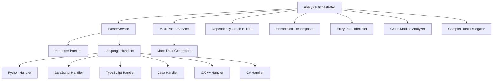

# Application - codeMRI.ASTService

## 1. Overview (For Everyone)
The `codeMRI.ASTService` module provides comprehensive Abstract Syntax Tree (AST) parsing and analysis capabilities for multiple programming languages. It serves as the core parsing engine for code analysis, enabling detailed code understanding through AST generation, dependency mapping, and metric extraction. The module supports both real-time parsing using tree-sitter parsers and a mock parser for testing scenarios.

Key problems it solves:
- Multi-language code parsing without language-specific implementations
- Automated extraction of code metrics and dependencies
- Identification of code structure and entry points
- Cross-module reference detection
- Complex file analysis with enhanced processing capabilities

Primary capabilities:
- Parse code for 7+ languages (Python, JavaScript, TypeScript, Java, C, C++, C#)
- Generate detailed ASTs with position information
- Calculate code metrics (complexity, nesting, function counts)
- Build dependency graphs and identify reusable components
- Detect code entry points and hierarchical structure
- Extract attributes, annotations, and decorators
- Handle dynamic imports across languages
- Perform repository-wide analysis with architectural decomposition
- Delegate complex files for enhanced analysis

## 2. User Guide (For End Users)
### How to Use Features
```javascript
const ParserService = require('./src/services/parserService');
const AnalysisOrchestrator = require('./src/services/analysisOrchestrator');
const parser = new ParserService();
const orchestrator = new AnalysisOrchestrator();

// Parse single file
const result = await parser.parseCode(code, 'python', 'file.py');

// Analyze entire repository
const files = [
    { filePath: 'app.py', content: pythonCode, language: 'python' },
    { filePath: 'utils.js', content: jsCode, language: 'javascript' }
];
const analysis = await orchestrator.analyzeRepository(files);

// Get supported languages
const languages = parser.getSupportedLanguages();
```

### Configuration Options
- **Language Selection**: Specify language when parsing (python, javascript, typescript, java, c, cpp, csharp)
- **Mock Mode**: Use MockParserService for testing without real parsers
- **Raw AST Access**: Request raw tree-sitter nodes via `returnRawNode` parameter
- **Complexity Thresholds**: Configure in AnalysisOrchestrator for delegation:
  - Cyclomatic complexity: 10
  - Nesting depth: 5
  - Lines of code: 200
  - Function count: 20

### Common Use Cases
1. **Repository Analysis**: Analyze entire codebases for dependencies and structure
2. **Code Metrics**: Calculate complexity and maintainability metrics
3. **Entry Point Detection**: Identify main functions, API endpoints, and application entry points
4. **Dependency Mapping**: Build graphs of module dependencies and imports
5. **Architectural Decomposition**: Identify layers, modules, and reusable components
6. **Complex File Processing**: Automatically delegate complex files for enhanced analysis

## 3. Technical Architecture (For Developers)
### Architectural Pattern
- **Service Pattern**: ParserService and MockParserService provide parsing capabilities
- **Strategy Pattern**: Language-specific parsing strategies via tree-sitter
- **Factory Pattern**: Dynamic parser initialization for each language
- **Orchestrator Pattern**: AnalysisOrchestrator coordinates multi-phase repository analysis

### Metrics
- **Cohesion**: 0.00 (Low cohesion due to multi-language support)
- **Coupling**: 0.00 (Minimal external coupling)
- **Complexity**: 694.0 (High complexity from language-specific logic)

### Class/Component Structure


### Key Public Interfaces
- `ParserService.parseCode(code, language, filePath, returnRawNode)`
- `ParserService.getSupportedLanguages()`
- `ParserService.extractAttributes(node, language)`
- `ParserService.extractDecorators(node, language)`
- `ParserService.isDynamicImport(node, language)`
- `MockParserService.parseCode(code, language, filePath)`
- `AnalysisOrchestrator.analyzeRepository(files, options)`
- `AnalysisOrchestrator.getAnalysisStatus(analysisId)`
- `AnalysisOrchestrator.cancelAnalysis(analysisId)`

## 4. Operations & Deployment (For DevOps)
### External Dependencies
- **tree-sitter**: Core parsing library
- **Language Parsers**: 
  - tree-sitter-python
  - tree-sitter-javascript
  - tree-sitter-typescript
  - tree-sitter-java
  - tree-sitter-c
  - tree-sitter-cpp
  - tree-sitter-c-sharp
- **lodash**: For utility functions in AnalysisOrchestrator
- **uuid**: For generating unique analysis IDs

### Configuration
- **Environment Variables**: None required
- **Settings Files**: None (configuration handled in code)
- **Package Dependencies**: Listed in package.json
- **Complexity Thresholds**: Configurable in AnalysisOrchestrator constructor

### Troubleshooting and Logs
- **Parser Initialization Failures**: Check language-specific parser installation
- **Unsupported Language Errors**: Verify language string matches supported list
- **Syntax Errors**: Handled gracefully with error messages in parse results
- **Memory Issues**: Large files are automatically delegated for enhanced processing
- **Analysis Timeouts**: Monitor activeTasks in AnalysisOrchestrator for stuck analyses
- **Log Messages**: Console logs for parser initialization status and analysis phases

## 5. API Reference
### ParserService Methods
#### `parseCode(code, language, filePath, returnRawNode)`
Parses code string into AST and extracts metrics
- **Parameters**:
  - `code` (string): Source code to parse
  - `language` (string): Programming language
  - `filePath` (string): Optional file path
  - `returnRawNode` (boolean): Return raw tree-sitter node
- **Returns**: Promise resolving to analysis object with:
  - Serialized AST
  - Code metrics
  - Dependency graph
  - Entry points
  - Hierarchical structure
  - Attributes and decorators
  - Dynamic imports

#### `extractAttributes(node, language)`
Extracts attributes/annotations from AST nodes
- **Parameters**:
  - `node` (AST node): Tree-sitter node
  - `language` (string): Programming language
- **Returns**: Array of attribute names

#### `extractDecorators(node, language)`
Extracts decorators from AST nodes
- **Parameters**:
  - `node` (AST node): Tree-sitter node
  - `language` (string): Programming language
- **Returns**: Array of decorator names

#### `isDynamicImport(node, language)`
Checks if node represents a dynamic import
- **Parameters**:
  - `node` (AST node): Tree-sitter node
  - `language` (string): Programming language
- **Returns**: Boolean indicating if it's a dynamic import

### AnalysisOrchestrator Methods
#### `analyzeRepository(files, options)`
Performs comprehensive repository analysis
- **Parameters**:
  - `files` (array): Array of file objects with content, language, and filePath
  - `options` (object): Optional configuration object
- **Returns**: Promise resolving to analysis object with:
  - Global dependency graph
  - Hierarchical structure
  - Entry points
  - Cross-module references
  - Enhanced results for complex files
  - Repository metrics

#### `getAnalysisStatus(analysisId)`
Retrieves status of ongoing analysis
- **Parameters**:
  - `analysisId` (string): Unique analysis identifier
- **Returns**: Analysis object with current status and results

#### `cancelAnalysis(analysisId)`
Cancels an ongoing analysis
- **Parameters**:
  - `analysisId` (string): Unique analysis identifier
- **Returns**: Boolean indicating if cancellation was successful

### Analysis Results Structure
```javascript
{
  id: "uuid",
  status: "completed|failed|cancelled",
  startTime: "ISO timestamp",
  endTime: "ISO timestamp",
  results: {
    parseResults: [...],
    globalDependencyGraph: {
      nodes: [...],
      edges: [...],
      metrics: {...}
    },
    hierarchicalStructure: {
      modules: [...],
      layers: [...],
      components: [...]
    },
    entryPoints: {
      total: number,
      byType: {...},
      byLanguage: {...}
    },
    crossModuleReferences: [...],
    enhancedResults: {
      complexFiles: [...],
      enhancedAnalyses: [...]
    },
    metrics: {
      totalFiles: number,
      totalLines: number,
      totalComplexity: number,
      supportedLanguages: [...],
      processingTime: number
    }
  }
}

<details>
<summary>Relevant source files</summary>

- [codeMRI.ASTService/src/services/mockParserService.js](/var/folders/9d/5x7df5dx5zxcjnl4dbxzfqw00000gn/T/codeMRI_982cf0c472d443648edb9ca4f0587557/blob/main/codeMRI.ASTService/src/services/mockParserService.js)
- [codeMRI.ASTService/tests/unit/realParserService.test.js](/var/folders/9d/5x7df5dx5zxcjnl4dbxzfqw00000gn/T/codeMRI_982cf0c472d443648edb9ca4f0587557/blob/main/codeMRI.ASTService/tests/unit/realParserService.test.js)
- [codeMRI.ASTService/tests/unit/analysisOrchestrator.test.js](/var/folders/9d/5x7df5dx5zxcjnl4dbxzfqw00000gn/T/codeMRI_982cf0c472d443648edb9ca4f0587557/blob/main/codeMRI.ASTService/tests/unit/analysisOrchestrator.test.js)
- [codeMRI.ASTService/tests/unit/parserService.test.js](/var/folders/9d/5x7df5dx5zxcjnl4dbxzfqw00000gn/T/codeMRI_982cf0c472d443648edb9ca4f0587557/blob/main/codeMRI.ASTService/tests/unit/parserService.test.js)
- [codeMRI.ASTService/src/services/parserService.js](/var/folders/9d/5x7df5dx5zxcjnl4dbxzfqw00000gn/T/codeMRI_982cf0c472d443648edb9ca4f0587557/blob/main/codeMRI.ASTService/src/services/parserService.js)
- [codeMRI.ASTService/tests/integration/astService.test.js](/var/folders/9d/5x7df5dx5zxcjnl4dbxzfqw00000gn/T/codeMRI_982cf0c472d443648edb9ca4f0587557/blob/main/codeMRI.ASTService/tests/integration/astService.test.js)
- [codeMRI.ASTService/src/services/analysisOrchestrator.js](/var/folders/9d/5x7df5dx5zxcjnl4dbxzfqw00000gn/T/codeMRI_982cf0c472d443648edb9ca4f0587557/blob/main/codeMRI.ASTService/src/services/analysisOrchestrator.js)
</details>
