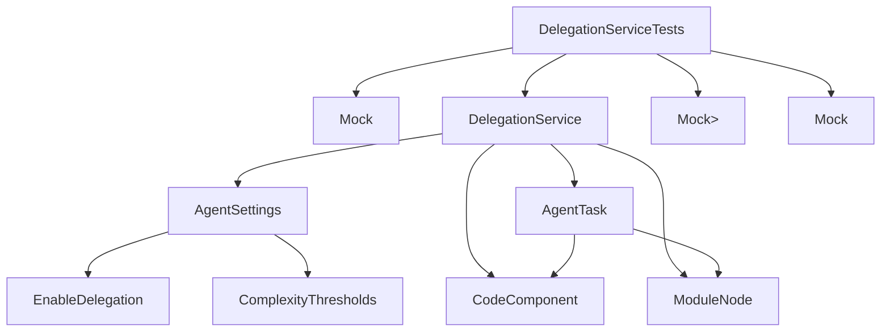

# Application - codeMRI.Agents.Tests

## 1. Overview (For Everyone)

The `codeMRI.Agents.Tests` module is a comprehensive test suite for the DelegationService component within the codeMRI Agents system. Its primary purpose is to ensure the reliability and correctness of task delegation logic, which determines when complex code analysis tasks should be distributed across multiple agents for parallel processing.

Key problems it solves:
- Validates that delegation decisions are made correctly based on complexity thresholds
- Ensures task splitting works properly for hierarchical code structures
- Guarantees that delegation can be safely disabled when needed
- Verifies that custom and default threshold configurations work as expected

Primary capabilities:
- Unit testing of delegation decision logic
- Validation of task splitting for module nodes
- Testing of configuration-driven behavior
- Mock-based isolation testing for service dependencies

## 2. User Guide (For End Users)

### How to Use the Test Features

The test suite is designed for developers and QA engineers to validate the DelegationService functionality. Tests are executed using the NUnit test runner.

### Configuration Options

The tests use mock configurations of `AgentSettings` to test different scenarios:
- `EnableDelegation`: Boolean flag to enable/disable delegation
- `ComplexityThresholds`: Dictionary with keys:
  - `"ComplexityScore"`: Threshold for code complexity (default: 8)
  - `"LineCount"`: Threshold for line count (default: 500)

### Common Use Cases

1. **Testing Delegation Disabled**: Verify no delegation occurs when feature is disabled
2. **Testing Complexity-Based Delegation**: Validate delegation when complexity exceeds thresholds
3. **Testing Line Count-Based Delegation**: Validate delegation when line count exceeds thresholds
4. **Testing Custom Thresholds**: Ensure custom threshold values are respected
5. **Testing Default Fallback**: Verify default thresholds apply when none are configured
6. **Testing Task Splitting**: Validate module nodes are correctly split into sub-tasks

## 3. Technical Architecture (For Developers)

### Architectural Pattern
Test-Driven Development with NUnit framework, employing Mock objects for dependency isolation.

### Metrics
- **Cohesion**: 0.00 (Test module)
- **Coupling**: 0.00 (Test module)
- **Complexity**: 11.0

### Class/Component Structure

```
DelegationServiceTests
├── Mock<ILogger<DelegationService>>
├── DelegationService (System Under Test)
└── Test Methods
    ├── ShouldDelegate_ReturnsFalse_WhenDelegationIsDisabled()
    ├── ShouldDelegate_ReturnsFalse_WhenComplexityBelowThreshold()
    ├── ShouldDelegate_ReturnsTrue_WhenComplexityExceedsThreshold()
    ├── ShouldDelegate_ReturnsTrue_WhenLineCountExceedsThreshold()
    ├── ShouldDelegate_UsesCustomThresholds()
    ├── ShouldDelegate_UsesDefaultValues_WhenThresholdsNotSet()
    ├── ShouldDelegate_ReturnsFalse_WhenPayloadIsNotCodeComponent()
    └── SplitTask_SplitsModuleNodeIntoSubTasks()
```

### Important Public Interfaces

- `DelegationService.ShouldDelegate(AgentTask task, object context)`: Determines if a task should be delegated
- `DelegationService.SplitTask(AgentTask originalTask)`: Splits a task containing a ModuleNode into sub-tasks

### Mermaid Component Diagram



## 4. Operations & Deployment (For DevOps)

### External Dependencies
None detected. The test module uses mock objects for all external dependencies.

### Configuration
The tests configure the system in-memory using:
- Mock `IOptions<AgentSettings>` for settings injection
- Mock `ILogger<DelegationService>` for logging
- Mock `AgentMessageBus` for message handling

### Troubleshooting and Logs
- Test failures are reported through the NUnit test runner
- Mock logger captures any log messages during test execution
- All test assertions provide clear failure messages indicating expected vs actual values

## 5. API Reference

### Key Methods Being Tested

#### DelegationService.ShouldDelegate
```csharp
bool ShouldDelegate(AgentTask task, object context)
```
Determines whether a task should be delegated based on:
- Delegation enabled flag in settings
- Complexity score threshold
- Line count threshold
- Payload type (must be CodeComponent)

#### DelegationService.SplitTask
```csharp
IEnumerable<AgentTask> SplitTask(AgentTask originalTask)
```
Splits a task containing a ModuleNode into multiple sub-tasks:
- Creates one sub-task per child node
- Preserves original task type
- Adds ParentId metadata to sub-tasks
- Copies metadata from original task

<details>
<summary>Relevant source files</summary>

- [codeMRI.Agents.Tests/Unit/DelegationServiceTests.cs](/var/folders/9d/5x7df5dx5zxcjnl4dbxzfqw00000gn/T/codeMRI_982cf0c472d443648edb9ca4f0587557/blob/main/codeMRI.Agents.Tests/Unit/DelegationServiceTests.cs)
</details>
