# Application - codeMRI.Agents

## 1. Overview (For Everyone)
The codeMRI.Agents module is a multi-agent system designed to automate code analysis and documentation generation. It provides a framework for coordinating specialized agents that can analyze code components, delegate complex tasks, and generate comprehensive documentation.

### Key Problems It Solves
- **Complex Code Analysis**: Breaks down large codebases into manageable components for analysis
- **Automated Documentation**: Generates structured documentation including architecture diagrams and component interactions
- **Task Delegation**: Intelligently delegates tasks based on complexity thresholds to optimize processing
- **Real-time Telemetry**: Provides visibility into agent activities and task lifecycle events

### Primary Capabilities
- Multi-agent coordination with role-based task routing
- Intelligent task delegation based on complexity metrics
- Hierarchical documentation generation with visual artifacts
- Event-driven communication via message bus
- Comprehensive telemetry and logging

## 2. User Guide (For End Users)

### How to Use the Features

#### Documentation Generation
The system automatically generates documentation through a pipeline:
1. **Analysis Phase**: Agents analyze the codebase structure
2. **Decomposition**: The system breaks down modules into hierarchical components
3. **Documentation Creation**: Each component is documented with structure diagrams and interaction sequences
4. **Wiki Assembly**: All pages are compiled into a cohesive wiki structure

#### Configuration Options
The module supports configuration through `AgentSettings`:
- **EnableDelegation**: Boolean flag to enable/disable task delegation
- **ComplexityThresholds**: Dictionary of thresholds for delegation decisions
  - `ComplexityScore`: Threshold for component complexity (default: 8)
  - `LineCount`: Threshold for line count (default: 500)

### Common Use Cases
1. **Large Repository Documentation**: Automatically generate documentation for large codebases
2. **Component Analysis**: Get detailed analysis of individual components
3. **Architecture Visualization**: Generate Mermaid diagrams showing system architecture and interactions

## 3. Technical Architecture (For Developers)

### Architectural Pattern
- **Agent-Based Architecture**: Multiple specialized agents coordinate to complete tasks
- **Event-Driven Communication**: Uses message bus for agent communication
- **Pipeline Pattern**: Documentation generation follows a structured pipeline

### Metrics
- **Cohesion**: 0.00 (Low cohesion - multiple responsibilities)
- **Coupling**: 0.00 (Low coupling - well-abstracted interfaces)
- **Complexity**: 70.0 (High complexity due to orchestration logic)

### Class/Component Structure and Key Relationships

```mermaid
graph TD
    subgraph "Core Services"
        AgentCoordinator[AgentCoordinator]
        DelegationService[DelegationService]
        AgentMessageBus[AgentMessageBus]
        AgentTelemetryService[AgentTelemetryService]
    end
    
    subgraph "Pipeline"
        DocumentationGenerationPipeline[DocumentationGenerationPipeline]
    end
    
    subgraph "External Interfaces"
        IAgent[IAgent]
        IAgentCoordinator[IAgentCoordinator]
        IAgentTelemetryService[IAgentTelemetryService]
        IDocumentationGenerationPipeline[IDocumentationGenerationPipeline]
    end
    
    AgentCoordinator --> DelegationService
    AgentCoordinator --> AgentMessageBus
    AgentTelemetryService --> AgentMessageBus
    DocumentationGenerationPipeline --> IAgentCoordinator
    DocumentationGenerationPipeline --> IVisualSynthesisService
    DocumentationGenerationPipeline --> IEnhancedDependencyGraphService
    DocumentationGenerationPipeline --> IHierarchicalDecompositionService
    DocumentationGenerationPipeline --> IWikiGenerationService
    
    AgentCoordinator -.-> IAgent
    AgentTelemetryService -.-> IAgentTelemetryService
    DocumentationGenerationPipeline -.-> IDocumentationGenerationPipeline
```



### Important Public Interfaces

#### IAgentCoordinator
```csharp
public interface IAgentCoordinator
{
    void RegisterAgent(IAgent agent);
    IAgent? GetAgentForTask(AgentTask task);
    Task<AgentResult> CoordinateTaskAsync(AgentTask task, CancellationToken cancellationToken);
}
```

#### IAgentTelemetryService
```csharp
public interface IAgentTelemetryService
{
    void TrackAgentActivity(string agentId, string activity, Dictionary<string, object>? metadata = null);
    void TrackDelegation(string fromAgent, string toAgent, string reason, string taskId);
    void TrackTaskLifecycle(string taskId, string agentRole, string eventType, bool success, Dictionary<string, object>? metadata = null);
}
```

#### IDocumentationGenerationPipeline
```csharp
public interface IDocumentationGenerationPipeline
{
    Task<WikiStructure> GenerateDocumentationAsync(string repositoryPath, DocumentationOptions options);
    Task<WikiPage> GenerateComponentDocumentationAsync(CodeComponent component, RepositoryStructure context);
    Task<List<WikiPage>> GenerateOverviewPagesAsync(RepositoryStructure structure, List<CodeComponent> components);
}
```

## 4. Operations & Deployment (For DevOps)

### External Dependencies
- **None detected**: The module operates without external database or API dependencies
- **Microsoft.Extensions.Logging**: For structured logging
- **Microsoft.Extensions.Options**: For configuration management

### Configuration
Environment variables and settings files:
```json
{
  "AgentSettings": {
    "EnableDelegation": true,
    "ComplexityThresholds": {
      "ComplexityScore": 8,
      "LineCount": 500
    }
  }
}
```

### Troubleshooting and Logs

#### Common Issues
1. **Task Delegation Failures**: Check if `EnableDelegation` is true and thresholds are appropriate
2. **Agent Not Found**: Verify agents are properly registered with the coordinator
3. **Documentation Generation Errors**: Check component analysis results for completeness

#### Key Log Messages
- `"Agent Activity: {AgentId} - {Activity}"`: General agent activity
- `"Task Delegation: {TaskId} - From {FromAgent} to {ToAgent}"`: Delegation events
- `"Task Lifecycle: {TaskId} - {AgentRole} - {EventType}"`: Task state changes
- `"Starting agent-based documentation generation for: {RepoPath}"`: Pipeline initiation

## 5. API Reference (If applicable)

### Key Methods

#### DelegationService
```csharp
public bool ShouldDelegate(AgentTask task, object context)
public List<AgentTask> SplitTask(AgentTask originalTask)
```

#### AgentMessageBus
```csharp
public async Task PublishAsync(AgentMessage message)
public void Subscribe(string messageType, Func<AgentMessage, Task> handler)
public void Unsubscribe(string messageType, Func<AgentMessage, Task> handler)
```

#### DocumentationGenerationPipeline
```csharp
public async Task<WikiStructure> GenerateDocumentationAsync(string repositoryPath, DocumentationOptions options)
public async Task<WikiPage> GenerateComponentDocumentationAsync(CodeComponent component, RepositoryStructure context)
```

### Message Types
- `AgentMessageTypes.All`: Wildcard for all message types
- `AgentMessageTypes.AgentStatus`: Agent status updates
- `AgentMessageTypes.TaskDelegated`: Task delegation notifications
- `AgentMessageTypes.TaskStarted`: Task initiation
- `AgentMessageTypes.TaskCompleted`: Task completion
- `AgentMessageTypes.TaskFailed`: Task failure notifications

<details>
<summary>Relevant source files</summary>

- [codeMRI.Agents/Services/DelegationService.cs](/var/folders/9d/5x7df5dx5zxcjnl4dbxzfqw00000gn/T/codeMRI_982cf0c472d443648edb9ca4f0587557/blob/main/codeMRI.Agents/Services/DelegationService.cs)
- [codeMRI.Agents/Services/AgentTelemetryService.cs](/var/folders/9d/5x7df5dx5zxcjnl4dbxzfqw00000gn/T/codeMRI_982cf0c472d443648edb9ca4f0587557/blob/main/codeMRI.Agents/Services/AgentTelemetryService.cs)
- [codeMRI.Agents/Services/DocumentationGenerationPipeline.cs](/var/folders/9d/5x7df5dx5zxcjnl4dbxzfqw00000gn/T/codeMRI_982cf0c472d443648edb9ca4f0587557/blob/main/codeMRI.Agents/Services/DocumentationGenerationPipeline.cs)
- [codeMRI.Agents/Services/AgentMessageBus.cs](/var/folders/9d/5x7df5dx5zxcjnl4dbxzfqw00000gn/T/codeMRI_982cf0c472d443648edb9ca4f0587557/blob/main/codeMRI.Agents/Services/AgentMessageBus.cs)
- [codeMRI.Agents/Services/AgentCoordinator.cs](/var/folders/9d/5x7df5dx5zxcjnl4dbxzfqw00000gn/T/codeMRI_982cf0c472d443648edb9ca4f0587557/blob/main/codeMRI.Agents/Services/AgentCoordinator.cs)
</details>
