# Application - codeMRI.Core.Tests

## 1. Overview (For Everyone)
The `codeMRI.Core.Tests` module is a comprehensive test suite for the core services of the codeMRI application. It ensures the reliability and correctness of documentation generation, code decomposition, dependency analysis, quality evaluation, reference management, language processing, architectural pattern recognition, and requirement evaluation functionalities. The tests validate audience-specific content generation, progress reporting, language detection, hierarchical structuring, synthesis capabilities, multi-judge evaluation, diagram generation, cross-language dependency analysis, architectural layer determination, and pattern detection across multiple scenarios.

## 2. User Guide (For End Users)
This module is intended for developers and QA engineers to verify the functionality of the core services. It does not provide end-user features but ensures that the underlying services work as expected. Tests can be run using a test runner compatible with NUnit.

## 3. Technical Architecture (For Developers)
### Architectural Pattern
- **Test-Driven Development**: Uses NUnit and Moq for unit testing.
- **Mocking Pattern**: Extensive use of Moq to isolate dependencies.

### Metrics
- **Cohesion**: 0.00 (indicative of test suite structure)
- **Coupling**: 1.00 (high coupling to core services)
- **Complexity**: 215.0 (due to extensive test scenarios)

### Class/Component Structure
- **WikiGenerationServiceAudienceTests**: Validates audience-specific documentation generation and diagram inclusion.
- **CodeWikiOrchestratorProgressTests**: Ensures progress reporting during wiki generation.
- **HierarchicalDecompositionLanguageTests**: Tests language detection and entry point identification.
- **DocumentationSynthesisServiceTests**: Verifies synthesis of parent pages and content cleaning.
- **CodeWikiOrchestratorTests**: Tests caching, hierarchical section building, and page generation.
- **HierarchicalDecompositionProgressTests**: Validates progress reporting in decomposition.
- **DefaultEvaluationPromptBuilderTests**: Tests prompt building for evaluation.
- **HierarchicalDecompositionServiceTests**: Validates recursive partitioning, directory-based grouping, and quality metrics.
- **RubricGenerationServiceTests**: Tests JSON parsing and rubric generation.
- **EnhancedDependencyGraphServiceTests**: Validates graph construction, analysis, performance, and rich dependency processing from AST.
- **ReferenceManagementServiceTests**: Tests component registration, link resolution, and content enrichment.
- **EvaluationMetricsSystemWithJudgesTests**: Tests multi-judge consensus, reliability, and score aggregation.
- **WikiGenerationServiceTests**: Tests page generation, diagram inclusion, and content handling.
- **UnifiedLanguageProcessingTests**: Tests rich dependency graph processing from AST (part of EnhancedDependencyGraphServiceTests).
- **DocumentationJudgeServiceTests**: Tests multi-judge evaluation, JSON parsing, score clamping, and error handling.
- **JudgeAgentServiceTests**: Tests requirement evaluation, response parsing, score extraction, and error handling.
- **ArchitecturalPatternServiceTests**: Tests layer determination and pattern recognition (Layered, Microservices, EventDriven, CleanArchitecture, MVC).

### Important Public Interfaces
- `IWikiGenerationService`: For generating documentation pages.
- `IHierarchicalDecompositionService`: For decomposing code hierarchically.
- `IDocumentationSynthesisService`: For synthesizing parent pages.
- `IEnhancedDependencyGraphService`: For building and analyzing dependency graphs.
- `IRubricGenerationService`: For generating evaluation rubrics.
- `IReferenceManagementService`: For managing component references and link resolution.
- `DocumentationJudgeService`: For evaluating documentation requirements with multiple judges.
- `IJudgeAgent`: For evaluating requirements against documentation.
- `ArchitecturalPatternService`: For determining architectural layers and recognizing patterns.

### Mermaid Component Diagram

```mermaid
graph TD
    A[WikiGenerationServiceAudienceTests] --> B[WikiGenerationService]
    C[CodeWikiOrchestratorProgressTests] --> D[CodeWikiOrchestrator]
    E[HierarchicalDecompositionLanguageTests] --> F[HierarchicalDecompositionService]
    G[DocumentationSynthesisServiceTests] --> H[DocumentationSynthesisService]
    I[CodeWikiOrchestratorTests] --> D
    J[HierarchicalDecompositionProgressTests] --> F
    K[DefaultEvaluationPromptBuilderTests] --> L[DefaultEvaluationPromptBuilder]
    M[HierarchicalDecompositionServiceTests] --> F
    N[RubricGenerationServiceTests] --> O[RubricGenerationService]
    P[EnhancedDependencyGraphServiceTests] --> Q[EnhancedDependencyGraphService]
    R[ReferenceManagementServiceTests] --> S[ReferenceManagementService]
    T[EvaluationMetricsSystemWithJudgesTests] --> U[EvaluationMetricsSystem]
    V[WikiGenerationServiceTests] --> B
    W[UnifiedLanguageProcessingTests] --> Q
    X[DocumentationJudgeServiceTests] --> Y[DocumentationJudgeService]
    Z[JudgeAgentServiceTests] --> AA[IJudgeAgent]
    BB[ArchitecturalPatternServiceTests] --> CC[ArchitecturalPatternService]
```

## 4. Operations & Deployment (For DevOps)
### External Dependencies
- None detected (tests are self-contained with mocked dependencies).

### Configuration
- No specific configuration required. Tests use mock setups.

### Troubleshooting and Logs
- **Test Failures**: Check test output for Moq verification failures or assertion errors.
- **Mock Setup Issues**: Ensure all dependencies are properly mocked in test setups.
- **Progress Reporting**: Verify progress handlers are correctly set up in tests.
- **Diagram Generation**: Confirm diagram service mocks are configured for interactive and static diagrams.
- **File System Operations**: Tests may create temporary files; ensure cleanup in teardown.
- **AST Parsing**: Verify AST service mocks return valid `DependencyGraphData` for rich graph processing.
- **Judge Evaluation**: Ensure LLM client mocks handle various response formats (JSON, markdown, plain text) and error conditions.
- **Architectural Pattern Recognition**: Validate component type and edge configurations for pattern detection tests.

## 5. API Reference (If applicable)
This module does not expose any public APIs as it is a test suite.

Relevant source files

- [codeMRI.Core.Tests/Services/WikiGenerationServiceAudienceTests.cs](/var/folders/9d/5x7df5dx5zxcjnl4dbxzfqw00000gn/T/codeMRI_982cf0c472d443648edb9ca4f0587557/blob/main/codeMRI.Core.Tests/Services/WikiGenerationServiceAudienceTests.cs)
- [codeMRI.Core.Tests/Services/CodeWikiOrchestratorProgressTests.cs](/var/folders/9d/5x7df5dx5zxcjnl4dbxzfqw00000gn/T/codeMRI_982cf0c472d443648edb9ca4f0587557/blob/main/codeMRI.Core.Tests/Services/CodeWikiOrchestratorProgressTests.cs)
- [codeMRI.Core.Tests/Services/HierarchicalDecompositionLanguageTests.cs](/var/folders/9d/5x7df5dx5zxcjnl4dbxzfqw00000gn/T/codeMRI_982cf0c472d443648edb9ca4f0587557/blob/main/codeMRI.Core.Tests/Services/HierarchicalDecompositionLanguageTests.cs)
- [codeMRI.Core.Tests/Services/DocumentationSynthesisServiceTests.cs](/var/folders/9d/5x7df5dx5zxcjnl4dbxzfqw00000gn/T/codeMRI_982cf0c472d443648edb9ca4f0587557/blob/main/codeMRI.Core.Tests/Services/DocumentationSynthesisServiceTests.cs)
- [codeMRI.Core.Tests/Services/CodeWikiOrchestratorTests.cs](/var/folders/9d/5x7df5dx5zxcjnl4dbxzfqw00000gn/T/codeMRI_982cf0c472d443648edb9ca4f0587557/blob/main/codeMRI.Core.Tests/Services/CodeWikiOrchestratorTests.cs)
- [codeMRI.Core.Tests/Services/HierarchicalDecompositionProgressTests.cs](/var/folders/9d/5x7df5dx5zxcjnl4dbxzfqw00000gn/T/codeMRI_982cf0c472d443648edb9ca4f0587557/blob/main/codeMRI.Core.Tests/Services/HierarchicalDecompositionProgressTests.cs)
- [codeMRI.Core.Tests/Services/DefaultEvaluationPromptBuilderTests.cs](/var/folders/9d/5x7df5dx5zxcjnl4dbxzfqw00000gn/T/codeMRI_982cf0c472d443648edb9ca4f0587557/blob/main/codeMRI.Core.Tests/Services/DefaultEvaluationPromptBuilderTests.cs)
- [codeMRI.Core.Tests/Services/HierarchicalDecompositionServiceTests.cs](/var/folders/9d/5x7df5dx5zxcjnl4dbxzfqw00000gn/T/codeMRI_982cf0c472d443648edb9ca4f0587557/blob/main/codeMRI.Core.Tests/Services/HierarchicalDecompositionServiceTests.cs)
- [codeMRI.Core.Tests/Services/RubricGenerationServiceTests.cs](/var/folders/9d/5x7df5dx5zxcjnl4dbxzfqw00000gn/T/codeMRI_982cf0c472d443648edb9ca4f0587557/blob/main/codeMRI.Core.Tests/Services/RubricGenerationServiceTests.cs)
- [codeMRI.Core.Tests/Services/EnhancedDependencyGraphServiceTests.cs](/var/folders/9d/5x7df5dx5zxcjnl4dbxzfqw00000gn/T/codeMRI_982cf0c472d443648edb9ca4f0587557/blob/main/codeMRI.Core.Tests/Services/EnhancedDependencyGraphServiceTests.cs)
- [codeMRI.Core.Tests/Services/ReferenceManagementServiceTests.cs](/var/folders/9d/5x7df5dx5zxcjnl4dbxzfqw00000gn/T/codeMRI_982cf0c472d443648edb9ca4f0587557/blob/main/codeMRI.Core.Tests/Services/ReferenceManagementServiceTests.cs)
- [codeMRI.Core.Tests/Services/EvaluationMetricsSystemWithJudgesTests.cs](/var/folders/9d/5x7df5dx5zxcjnl4dbxzfqw00000gn/T/codeMRI_982cf0c472d443648edb9ca4f0587557/blob/main/codeMRI.Core.Tests/Services/EvaluationMetricsSystemWithJudgesTests.cs)
- [codeMRI.Core.Tests/Services/WikiGenerationServiceTests.cs](/var/folders/9d/5x7df5dx5zxcjnl4dbxzfqw00000gn/T/codeMRI_982cf0c472d443648edb9ca4f0587557/blob/main/codeMRI.Core.Tests/Services/WikiGenerationServiceTests.cs)
- [codeMRI.Core.Tests/Services/UnifiedLanguageProcessingTests.cs](/var/folders/9d/5x7df5dx5zxcjnl4dbxzfqw00000gn/T/codeMRI_982cf0c472d443648edb9ca4f0587557/blob/main/codeMRI.Core.Tests/Services/UnifiedLanguageProcessingTests.cs)
- [codeMRI.Core.Tests/Services/DocumentationJudgeServiceTests.cs](/var/folders/9d/5x7df5dx5zxcjnl4dbxzfqw00000gn/T/codeMRI_982cf0c472d443648edb9ca4f0587557/blob/main/codeMRI.Core.Tests/Services/DocumentationJudgeServiceTests.cs)
- [codeMRI.Core.Tests/Services/JudgeAgentServiceTests.cs](/var/folders/9d/5x7df5dx5zxcjnl4dbxzfqw00000gn/T/codeMRI_982cf0c472d443648edb9ca4f0587557/blob/main/codeMRI.Core.Tests/Services/JudgeAgentServiceTests.cs)
- [codeMRI.Core.Tests/Services/ArchitecturalPatternServiceTests.cs](/var/folders/9d/5x7df5dx5zxcjnl4dbxzfqw00000gn/T/codeMRI_982cf0c472d443648edb9ca4f0587557/blob/main/codeMRI.Core.Tests/Services/ArchitecturalPatternServiceTests.cs)

