# Application - codeMRI.Core

## 1. Overview (For Everyone)
The codeMRI.Core module is the central engine for automated documentation generation from source code repositories. It analyzes code structure, relationships, and architectural patterns to produce comprehensive technical documentation tailored for different audiences.

Key problems it solves:
- Eliminates manual documentation maintenance by automatically generating docs from code
- Provides consistent, up-to-date documentation that evolves with the codebase
- Bridges the gap between code structure and human-readable documentation
- Supports multiple stakeholder perspectives (developers, users, DevOps)
- Automates cross-referencing and linking between documentation components
- Provides objective quality assessment through multi-judge evaluation system

Primary capabilities:
- Hierarchical decomposition of codebases into logical modules
- Automated wiki page generation with cross-references
- Quality metrics analysis (cohesion, coupling, complexity)
- Multi-audience documentation (technical, user, operational)
- Progress tracking and parallel processing for large repositories
- Architectural pattern recognition (Microservices, Event-Driven, Clean Architecture, MVC, Layered)
- Advanced dependency graph analysis with PageRank and centrality measures
- Intelligent reference management and content enrichment
- C4 model diagram generation for system context visualization
- Multi-judge consensus evaluation for documentation quality
- Interactive diagram generation (sequence, component, data flow) with zoom, filter, and export controls
- Industry benchmarking and quality recommendations
- Ingestion job management for asynchronous processing
- Enhanced page generation with human context ingestion (READMEs, docs/ folders)
- Content cleaning and normalization for LLM-generated documentation
- Consensus rubric generation using multiple models for objective evaluation

## 2. User Guide (For End Users)
### How to Use the Features
The module is primarily used programmatically through the CodeWikiOrchestrator service:

```csharp
var orchestrator = new CodeWikiOrchestrator(
    decompositionService,
    graphService,
    rubricService,
    judgeService,
    wikiGenerationService,
    synthesisService,
    wikiRepo,
    progressService,
    telemetryService,
    options,
    logger
);

var wikiStructure = await orchestrator.GenerateAdvancedWikiAsync(
    repositoryPath: "/path/to/repo",
    repositoryInfo: new RepositoryInfo { Name = "MyProject" },
    progress: progress,
    cancellationToken: cancellationToken
);
```

### Configuration Options (User-facing)
- **MaxDegreeOfParallelism**: Controls concurrent processing (configured via CodeWikiOptions)
- **JudgeModel**: Selects the evaluation model for documentation quality
- **AudienceType**: Choose between Developer, User, DevOps, or All audiences
- **Language**: Documentation language (default: English)
- **MaxTokensPerModule**: Controls module decomposition size (default: 32768)
- **DocumentationModel**: Model used for content generation
- **IndustryBenchmarks**: Reference metrics for quality comparison

### Common Use Cases
1. **Repository Documentation Generation**: Generate complete documentation for a new repository
2. **Incremental Updates**: Update documentation for specific modules after code changes
3. **Quality Assessment**: Evaluate existing documentation quality using the Judge service
4. **Multi-Audience Publishing**: Generate different documentation views for different stakeholders
5. **Architectural Analysis**: Automatically identify and document architectural patterns
6. **Cross-Reference Management**: Automatically link related components across documentation
7. **System Context Visualization**: Generate C4 model diagrams for high-level system overview
8. **Quality Benchmarking**: Compare documentation quality against industry standards
9. **Consensus Evaluation**: Use multiple judges to ensure objective quality assessment
10. **Interactive Documentation**: Generate interactive diagrams with zoom, filter, and export capabilities
11. **Asynchronous Processing**: Manage large repositories through ingestion jobs
12. **Enhanced Context Documentation**: Generate documentation enriched with README files and docs/ folder content
13. **Content Normalization**: Automatically clean and structure LLM-generated documentation output

## 3. Technical Architecture (For Developers)
### Architectural Pattern: Orchestrator Pattern with Service Decomposition
The module follows an orchestrator pattern where CodeWikiOrchestrator coordinates multiple specialized services:
- **HierarchicalDecompositionService**: Analyzes code structure
- **EnhancedDependencyGraphService**: Builds component relationships with advanced graph analysis
- **RubricGenerationService**: Creates evaluation criteria with consensus generation
- **DocumentationJudgeService**: Assesses documentation quality with multi-judge consensus
- **WikiGenerationService**: Creates individual pages with enhanced context and interactive diagrams
- **DocumentationSynthesisService**: Creates overview pages
- **ProgressService**: Tracks operation progress with scaling support
- **ReferenceManagementService**: Manages cross-references and linking
- **ArchitecturalPatternService**: Recognizes architectural patterns
- **RoslynCSharpAnalyzer**: Performs detailed C# code analysis
- **EvaluationMetricsSystem**: Provides comprehensive quality metrics
- **DefaultEvaluationPromptBuilder**: Builds structured evaluation prompts
- **IngestionJobManager**: Manages asynchronous processing jobs

### Metrics
- **Cohesion**: 0.02 (very low - indicates distributed responsibilities)
- **Coupling**: 0.82 (high - services are tightly interconnected)
- **Complexity**: 861.0 (high - complex algorithms for decomposition, graph analysis, pattern recognition, quality evaluation, and interactive diagram generation)

### Class/Component Structure and Key Relationships

```mermaid
graph TD
    CodeWikiOrchestrator --> IHierarchicalDecompositionService
    CodeWikiOrchestrator --> IEnhancedDependencyGraphService
    CodeWikiOrchestrator --> IDocumentationJudgeService
    CodeWikiOrchestrator --> IRubricGenerationService
    CodeWikiOrchestrator --> IDocumentationSynthesisService
    CodeWikiOrchestrator --> IWikiGenerationService
    CodeWikiOrchestrator --> IWikiRepository
    CodeWikiOrchestrator --> IProgressService
    CodeWikiOrchestrator --> IAgentTelemetryService
    
    HierarchicalDecompositionService --> IEnhancedDependencyGraphService
    HierarchicalDecompositionService --> IArchitecturalPatternService
    HierarchicalDecompositionService --> IProgressService
    
    DocumentationSynthesisService --> ILLMClient
    EnhancedDependencyGraphService --> IASTServiceClient
    EnhancedDependencyGraphService --> IComponentIdentificationService
    ReferenceManagementService --> IWikiRepository
    JudgeAgentService --> ILLMClient
    
    DocumentationJudgeService --> IEvaluationPromptBuilder
    EvaluationMetricsSystem --> IJudgeAgent
    WikiGenerationService --> IDiagramGenerator
    WikiGenerationService --> IReferenceManagementService
    IngestionJobManager --> ICodeWikiOrchestrator
    RubricGenerationService --> ILLMClient
```


### Important Public Interfaces
- **ICodeWikiOrchestrator**: Main interface for wiki generation workflow
- **IWikiGenerationService**: Generates wiki pages with enhanced context, interactive diagrams, and content cleaning
- **IProgressService**: Reports progress with scaling support
- **IArchitecturalPatternService**: Recognizes architectural patterns
- **IReferenceManagementService**: Manages cross-references between components
- **IAgentTelemetryService**: Tracks agent activities and metrics
- **IEvaluationPromptBuilder**: Builds prompts for documentation evaluation
- **IDocumentationJudgeService**: Evaluates documentation quality with multi-judge consensus
- **IEvaluationMetricsSystem**: Provides comprehensive quality metrics and benchmarking
- **IIngestionJobManager**: Manages asynchronous documentation generation jobs
- **IVisualSynthesisService**: Generates visual artifacts and diagrams
- **IRubricGenerationService**: Generates evaluation rubrics with consensus support

## 4. Operations & Deployment (For DevOps)
### External Dependencies
- **None detected**: The module operates without external database or API dependencies

### Configuration
Environment variables and settings:
- **CodeWikiOptions.MaxDegreeOfParallelism**: Controls concurrent operations
- **CodeWikiOptions.JudgeModel**: Model selection for documentation evaluation
- **CodeWikiOptions.MaxTokensPerModule**: Controls module decomposition size
- **CodeWikiOptions.DocumentationModel**: Model for content generation
- **IndustryBenchmarks**: Reference metrics for quality comparison

### Troubleshooting and Logs
Common issues and solutions:
1. **High Memory Usage**: Adjust MaxDegreeOfParallelism and MaxTokensPerModule for large repositories
2. **Slow Processing**: Check repository size and consider incremental updates
3. **Generation Failures**: Review logs for file access issues or LLM service problems
4. **Pattern Recognition Issues**: Verify naming conventions match expected patterns
5. **Judge Evaluation Failures**: Check LLM service availability and model configuration
6. **Diagram Generation Timeouts**: Adjust timeout settings for large graphs
7. **Ingestion Job Failures**: Monitor job status and repository access permissions
8. **Interactive Diagram Issues**: Check JavaScript console for diagram initialization errors
9. **Content Cleaning Problems**: Verify LLM output format and markdown parsing
10. **Rubric Generation Failures**: Check model availability and prompt structure

Key log messages to monitor:
- "Starting CodeWiki Advanced Workflow for {Repo}"
- "Phase X: [PhaseName]" (tracks workflow progress)
- "Evaluation Complete. Average Score: {Score}"
- "Failed to read file {FilePath}" (file access issues)
- "Built graph with {NodeCount} nodes and {EdgeCount} edges"
- "PageRank converged after {Iteration} iterations"
- "Starting multi-judge consensus evaluation for page: {PageTitle} with {JudgeCount} judges"
- "Documentation quality evaluation completed with overall score: {Score}"
- "Warning: No content available for page '{PageTitle}'. Skipping detailed generation."
- "Generating consensus rubric using {ModelCount} models"
- "Failed to generate rubric with model: {ModelName}"

## 5. API Reference (If applicable)
### Key Methods

#### CodeWikiOrchestrator.GenerateAdvancedWikiAsync
```csharp
Task<WikiStructure> GenerateAdvancedWikiAsync(
    string repositoryPath,
    RepositoryInfo repositoryInfo,
    IProgress<ProgressInfo>? progress = null,
    CancellationToken cancellationToken = default)
```
Generates a complete wiki structure for a repository.

#### IWikiGenerationService.GeneratePageAsync
```csharp
Task<WikiPage> GeneratePageAsync(
    string pageTitle,
    List<string> filePaths,
    Dictionary<string, string> fileContents,
    string language = "English",
    string? repoPath = null,
    string? remoteUrl = null,
    string? branch = null)
```
Generates a wiki page with interactive diagrams, cross-references, and cleaned content.

#### IWikiGenerationService.GenerateEnhancedPageAsync
```csharp
Task<WikiPage> GenerateEnhancedPageAsync(
    ModuleNode module,
    List<WikiPage>? relatedPages,
    ModulePageContext context,
    Dictionary<string, string> fileContents,
    string language = "English",
    AudienceType audience = AudienceType.Developer,
    string? repoPath = null,
    string? remoteUrl = null,
    string? branch = null)
```
Generates an enhanced wiki page with human context ingestion and audience-specific content.

#### IDocumentationJudgeService.EvaluateRequirementsAsync
```csharp
Task<List<RequirementAssessment>> EvaluateRequirementsAsync(
    List<RubricRequirement> requirements,
    WikiStructure documentationStructure,
    List<string> models,
    CancellationToken cancellationToken = default)
```
Evaluates documentation requirements using multiple judges for consensus.

#### IRubricGenerationService.GenerateConsensusRubricAsync
```csharp
Task<EvaluationRubric> GenerateConsensusRubricAsync(
    WikiStructure documentationStructure,
    RepositoryInfo repositoryInfo,
    List<string> modelNames,
    CancellationToken cancellationToken = default)
```
Generates a consensus evaluation rubric using multiple models.

#### IIngestionJobManager.StartJobAsync
```csharp
Task<IngestionJob> StartJobAsync(
    string repositoryPath,
    RepositoryInfo repositoryInfo,
    AudienceType audience = AudienceType.Developer,
    bool forceRegenerate = false)
```
Starts an asynchronous documentation generation job.

#### IReferenceManagementService.EnrichContentWithLinks
```csharp
string EnrichContentWithLinks(
    string content,
    string sourceComponentId)
```
Enriches documentation content with intelligent cross-reference links.

#### IDiagramGenerator.GenerateInteractiveDiagramAsync
```csharp
Task<InteractiveDiagram> GenerateInteractiveDiagramAsync(
    EnhancedDependencyGraph graph,
    string entryPointId,
    DiagramOptions options = null)
```
Generates an interactive diagram with zoom, filter, and export capabilities.

<details>
<summary>Relevant source files</summary>

- [codeMRI.Core/Services/CodeWikiOrchestrator.cs](/var/folders/9d/5x7df5dx5zxcjnl4dbxzfqw00000gn/T/codeMRI_982cf0c472d443648edb9ca4f0587557/blob/main/codeMRI.Core/Services/CodeWikiOrchestrator.cs)
- [codeMRI.Core/Interfaces/IWikiGenerationService.cs](/var/folders/9d/5x7df5dx5zxcjnl4dbxzfqw00000gn/T/codeMRI_982cf0c472d443648edb9ca4f0587557/blob/main/codeMRI.Core/Interfaces/IWikiGenerationService.cs)
- [codeMRI.Core/Services/ProgressService.cs](/var/folders/9d/5x7df5dx5zxcjnl4dbxzfqw00000gn/T/codeMRI_982cf0c472d443648edb9ca4f0587557/blob/main/codeMRI.Core/Services/ProgressService.cs)
- [codeMRI.Core/Interfaces/IArchitecturalPatternService.cs](/var/folders/9d/5x7df5dx5zxcjnl4dbxzfqw00000gn/T/codeMRI_982cf0c472d443648edb9ca4f0587557/blob/main/codeMRI.Core/Interfaces/IArchitecturalPatternService.cs)
- [codeMRI.Core/Services/HierarchicalDecompositionService.cs](/var/folders/9d/5x7df5dx5zxcjnl4dbxzfqw00000gn/T/codeMRI_982cf0c472d443648edb9ca4f0587557/blob/main/codeMRI.Core/Services/HierarchicalDecompositionService.cs)
- [codeMRI.Core/Services/DocumentationSynthesisService.cs](/var/folders/9d/5x7df5dx5zxcjnl4dbxzfqw00000gn/T/codeMRI_982cf0c472d443648edb9ca4f0587557/blob/main/codeMRI.Core/Services/DocumentationSynthesisService.cs)
- [codeMRI.Core/Services/PromptTemplates.cs](/var/folders/9d/5x7df5dx5zxcjnl4dbxzfqw00000gn/T/codeMRI_982cf0c472d443648edb9ca4f0587557/blob/main/codeMRI.Core/Services/PromptTemplates.cs)
- [codeMRI.Core/Interfaces/IAgentTelemetryService.cs](/var/folders/9d/5x7df5dx5zxcjnl4dbxzfqw00000gn/T/codeMRI_982cf0c472d443648edb9ca4f0587557/blob/main/codeMRI.Core/Interfaces/IAgentTelemetryService.cs)
- [codeMRI.Core/Services/ReferenceManagementService.cs](/var/folders/9d/5x7df5dx5zxcjnl4dbxzfqw00000gn/T/codeMRI_982cf0c472d443648edb9ca4f0587557/blob/main/codeMRI.Core/Services/ReferenceManagementService.cs)
- [codeMRI.Core/Services/ArchitecturalPatternService.cs](/var/folders/9d/5x7df5dx5zxcjnl4dbxzfqw00000gn/T/codeMRI_982cf0c472d443648edb9ca4f0587557/blob/main/codeMRI.Core/Services/ArchitecturalPatternService.cs)
- [codeMRI.Core/Services/JudgeAgentService.cs](/var/folders/9d/5x7df5dx5zxcjnl4dbxzfqw00000gn/T/codeMRI_982cf0c472d443648edb9ca4f0587557/blob/main/codeMRI.Core/Services/JudgeAgentService.cs)
- [codeMRI.Core/Services/RoslynCSharpAnalyzer.cs](/var/folders/9d/5x7df5dx5zxcjnl4dbxzfqw00000gn/T/codeMRI_982cf0c472d443648edb9ca4f0587557/blob/main/codeMRI.Core/Services/RoslynCSharpAnalyzer.cs)
- [codeMRI.Core/Services/EnhancedDependencyGraphService.cs](/var/folders/9d/5x7df5dx5zxcjnl4dbxzfqw00000gn/T/codeMRI_982cf0c472d443648edb9ca4f0587557/blob/main/codeMRI.Core/Services/EnhancedDependencyGraphService.cs)
- [codeMRI.Core/Services/DefaultEvaluationPromptBuilder.cs](/var/folders/9d/5x7df5dx5zxcjnl4dbxzfqw00000gn/T/codeMRI_982cf0c472d443648edb9ca4f0587557/blob/main/codeMRI.Core/Services/DefaultEvaluationPromptBuilder.cs)
- [codeMRI.Core/Interfaces/IEnhancedDependencyGraphService.cs](/var/folders/9d/5x7df5dx5zxcjnl4dbxzfqw00000gn/T/codeMRI_982cf0c472d443648edb9ca4f0587557/blob/main/codeMRI.Core/Interfaces/IEnhancedDependencyGraphService.cs)
- [codeMRI.Core/Interfaces/IVisualSynthesisService.cs](/var/folders/9d/5x7df5dx5zxcjnl4dbxzfqw00000gn/T/codeMRI_982cf0c472d443648edb9ca4f0587557/blob/main/codeMRI.Core/Interfaces/IVisualSynthesisService.cs)
- [codeMRI.Core/Interfaces/ICodeWikiOrchestrator.cs](/var/folders/9d/5x7df5dx5zxcjnl4dbxzfqw00000gn/T/codeMRI_982cf0c472d443648edb9ca4f0587557/blob/main/codeMRI.Core/Interfaces/ICodeWikiOrchestrator.cs)
- [codeMRI.Core/Interfaces/IDocumentationJudgeService.cs](/var/folders/9d/5x7df5dx5zxcjnl4dbxzfqw00000gn/T/codeMRI_982cf0c472d443648edb9ca4f0587557/blob/main/codeMRI.Core/Interfaces/IDocumentationJudgeService.cs)
- [codeMRI.Core/Interfaces/IRubricGenerationService.cs](/var/folders/9d/5x7df5dx5zxcjnl4dbxzfqw00000gn/T/codeMRI_982cf0c472d443648edb9ca4f0587557/blob/main/codeMRI.Core/Interfaces/IRubricGenerationService.cs)
- [codeMRI.Core/Interfaces/IASTServiceClient.cs](/var/folders/9d/5x7df5dx5zxcjnl4dbxzfqw00000gn/T/codeMRI_982cf0c472d443648edb9ca4f0587557/blob/main/codeMRI.Core/Interfaces/IASTServiceClient.cs)
- [codeMRI.Core/Interfaces/IIngestionJobManager.cs](/var/folders/9d/5x7df5dx5zxcjnl4dbxzfqw00000gn/T/codeMRI_982cf0c472d443648edb9ca4f0587557/blob/main/codeMRI.Core/Interfaces/IIngestionJobManager.cs)
- [codeMRI.Core/Services/DocumentationJudgeService.cs](/var/folders/9d/5x7df5dx5zxcjnl4dbxzfqw00000gn/T/codeMRI_982cf0c472d443648edb9ca4f0587557/blob/main/codeMRI.Core/Services/DocumentationJudgeService.cs)
- [codeMRI.Core/Interfaces/IDocumentationSynthesisService.cs](/var/folders/9d/5x7df5dx5zxcjnl4dbxzfqw00000gn/T/codeMRI_982cf0c472d443648edb9ca4f0587557/blob/main/codeMRI.Core/Interfaces/IDocumentationSynthesisService.cs)
- [codeMRI.Core/Services/JudgeResponse.cs](/var/folders/9d/5x7df5dx5zxcjnl4dbxzfqw00000gn/T/codeMRI_982cf0c472d443648edb9ca4f0587557/blob/main/codeMRI.Core/Services/JudgeResponse.cs)
- [codeMRI.Core/Interfaces/IReferenceManagementService.cs](/var/folders/9d/5x7df5dx5zxcjnl4dbxzfqw00000gn/T/codeMRI_982cf0c472d443648edb9ca4f0587557/blob/main/codeMRI.Core/Interfaces/IReferenceManagementService.cs)
- [codeMRI.Core/Interfaces/IHierarchicalDecompositionService.cs](/var/folders/9d/5x7df5dx5zxcjnl4dbxzfqw00000gn/T/codeMRI_982cf0c472d443648edb9ca4f0587557/blob/main/codeMRI.Core/Interfaces/IHierarchicalDecompositionService.cs)
- [codeMRI.Core/Interfaces/IProgressService.cs](/var/folders/9d/5x7df5dx5zxcjnl4dbxzfqw00000gn/T/codeMRI_982cf0c472d443648edb9ca4f0587557/blob/main/codeMRI.Core/Interfaces/IProgressService.cs)
- [codeMRI.Core/Services/EvaluationMetricsSystem.cs](/var/folders/9d/5x7df5dx5zxcjnl4dbxzfqw00000gn/T/codeMRI_982cf0c472d443648edb9ca4f0587557/blob/main/codeMRI.Core/Services/EvaluationMetricsSystem.cs)
- [codeMRI.Core/Services/WikiGenerationService.cs](/var/folders/9d/5x7df5dx5zxcjnl4dbxzfqw00000gn/T/codeMRI_982cf0c472d443648edb9ca4f0587557/blob/main/codeMRI.Core/Services/WikiGenerationService.cs)
- [codeMRI.Core/Services/RubricGenerationService.cs](/var/folders/9d/5x7df5dx5zxcjnl4dbxzfqw00000gn/T/codeMRI_982cf0c472d443648edb9ca4f0587557/blob/main/codeMRI.Core/Services/RubricGenerationService.cs)
</details>
