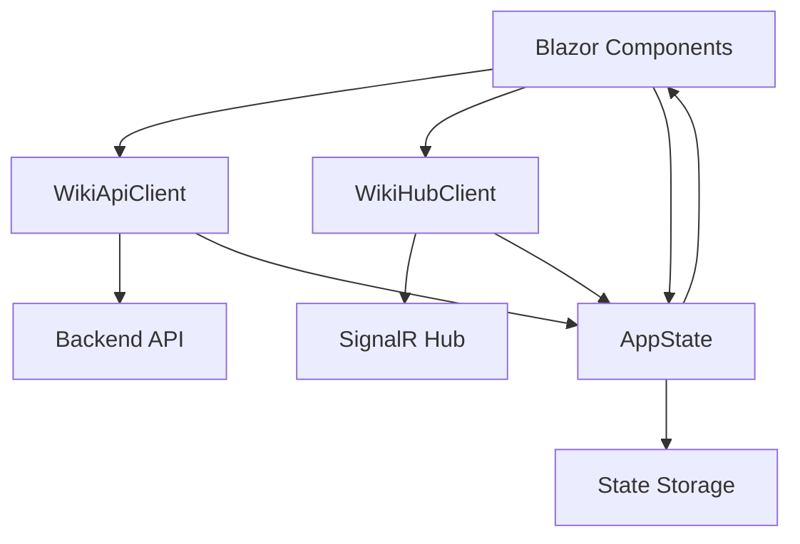

# Application - codeMRI.Frontend

## 1. Overview (For Everyone)
The codeMRI.Frontend module is a Blazor web application that serves as the user interface for the codeMRI system. It provides a real-time, interactive interface for generating and navigating code documentation wikis from repositories.

**Key problems it solves:**
- Provides a user-friendly interface for repository documentation generation
- Enables real-time monitoring of long-running documentation processes
- Offers interactive chat functionality for querying code documentation
- Visualizes agent-based processing and task delegation

**Primary capabilities:**
- Connects to backend APIs for wiki generation and management
- Maintains real-time connection via SignalR for live updates
- Manages application state across components
- Handles repository ingestion and status tracking
- Provides chat interface for interacting with generated documentation

## 2. User Guide (For End Users)
The frontend provides the following main features:

**Repository Management:**
- Browse and select repositories for documentation generation
- Monitor ingestion progress with real-time updates
- View repository status and metadata

**Wiki Generation:**
- Generate basic or advanced wiki structures from repositories
- Create individual wiki pages with context-specific files
- Navigate through generated documentation

**Real-time Monitoring:**
- View progress indicators for long-running operations
- Track agent status and task delegation events
- Monitor task lifecycle events

**Chat Interface:**
- Interact with the system using natural language queries
- View chat history and responses

## 3. Technical Architecture (For Developers)
**Architectural Pattern:** Service-oriented architecture with state management

**Metrics:**
- Cohesion: 0,00 (indicating low cohesion - services handle multiple concerns)
- Coupling: 0,00 (minimal coupling between services)
- Complexity: 72,0 (moderate complexity due to multiple service interactions)

**Class/Component Structure:**
- `WikiHubClient`: SignalR client for real-time communication
- `WikiApiClient`: HTTP client for backend API interactions
- `AppState`: Centralized state management service

**Key Relationships:**
- Components depend on services for data and operations
- AppState acts as a singleton state container
- Services communicate with backend APIs and SignalR hub

**Important Public Interfaces:**
```csharp
// WikiHubClient events
public event Action<ProgressInfo>? OnProgress;
public event Action<AgentMessage>? OnAgentStatus;
public event Action<AgentMessage>? OnDelegation;
public event Action<AgentMessage>? OnTaskLifecycle;

// WikiApiClient methods
public async Task<WikiStructure> GenerateStructureAsync(string repoPath)
public async Task<WikiPage> GeneratePageAsync(string repoPath, string title, List<string> contextFiles, bool forceRegenerate = false)
public async Task<string> ChatAsync(List<ChatMessage> history)
public async Task<IngestionJob> StartIngestionAsync(string gitUrl, AudienceType audience = AudienceType.Developer)

// AppState properties and events
public event Action? OnChange;
public string RepoPath { get; private set; }
public WikiStructure? Structure { get; private set; }
public bool IsBusy { get; private set; }
```

**Mermaid Component Diagram:**


## 4. Operations & Deployment (For DevOps)
**External Dependencies:**
- Backend API endpoints (various /api/Wiki/* and /api/Chat endpoints)
- SignalR Hub at "/wikiHub" endpoint
- HttpClient for API communication

**Configuration:**
- Base URL for API endpoints (configured via HttpClient)
- NavigationManager for SignalR hub URL resolution
- Logging configuration for AppState error handling

**Troubleshooting and Logs:**
- AppState includes error logging for agent status, delegation, and task lifecycle event processing
- Check SignalR connection status via WikiHubClient.ConnectionId
- Monitor HTTP response codes from WikiApiClient calls
- Common issues:
  - Failed SignalR connection: Verify hub endpoint accessibility
  - API failures: Check backend service status and endpoint routes
  - State synchronization issues: Verify AppState event subscriptions

## 5. API Reference (If applicable)
**WikiApiClient Methods:**
- `GenerateStructureAsync(string repoPath)`: Generates basic wiki structure
- `GenerateAdvancedStructureAsync(string repoPath, string? connectionId = null)`: Generates advanced structure with real-time updates
- `GeneratePageAsync(string repoPath, string title, List<string> contextFiles, bool forceRegenerate = false)`: Creates individual wiki pages
- `GetRepositoriesAsync()`: Retrieves list of available repositories
- `GetRepositorySummariesAsync()`: Gets repository summaries
- `ChatAsync(List<ChatMessage> history)`: Sends chat messages to backend
- `GetRepositoryStatusAsync(string repoPath)`: Retrieves repository status
- `GetNavigationAsync(string repoPath)`: Gets navigation structure
- `StartIngestionAsync(string gitUrl, AudienceType audience)`: Starts repository ingestion job
- `GetIngestionJobAsync(string jobId)`: Gets ingestion job status
- `CancelIngestionAsync(string jobId)`: Cancels active ingestion job
- `ListActiveIngestionsAsync()`: Lists all active ingestion jobs

**WikiHubClient Events:**
- `OnProgress`: Fired when progress updates are received
- `OnAgentStatus`: Fired when agent status changes
- `OnDelegation`: Fired when delegation events occur
- `OnTaskLifecycle`: Fired when task lifecycle events occur

**AppState Properties:**
- `RepoPath`: Current selected repository path
- `Structure`: Current wiki structure
- `CurrentPage`: Currently displayed wiki page
- `IsBusy`: Indicates if operation is in progress
- `BusyMessage`: Message displayed during busy state
- `CurrentProgress`: Current progress information
- `ChatHistory`: Collection of chat messages
- `ActiveAgents`: Dictionary of active agent statuses
- `DelegationHistory`: List of delegation events
- `TaskEvents`: List of task lifecycle events
- `RepositoryStatus`: Current repository metadata

<details>
<summary>Relevant source files</summary>

- [codeMRI.Frontend/Services/WikiHubClient.cs](/var/folders/9d/5x7df5dx5zxcjnl4dbxzfqw00000gn/T/codeMRI_982cf0c472d443648edb9ca4f0587557/blob/main/codeMRI.Frontend/Services/WikiHubClient.cs)
- [codeMRI.Frontend/Services/WikiApiClient.cs](/var/folders/9d/5x7df5dx5zxcjnl4dbxzfqw00000gn/T/codeMRI_982cf0c472d443648edb9ca4f0587557/blob/main/codeMRI.Frontend/Services/WikiApiClient.cs)
- [codeMRI.Frontend/Services/AppState.cs](/var/folders/9d/5x7df5dx5zxcjnl4dbxzfqw00000gn/T/codeMRI_982cf0c472d443648edb9ca4f0587557/blob/main/codeMRI.Frontend/Services/AppState.cs)
</details>
