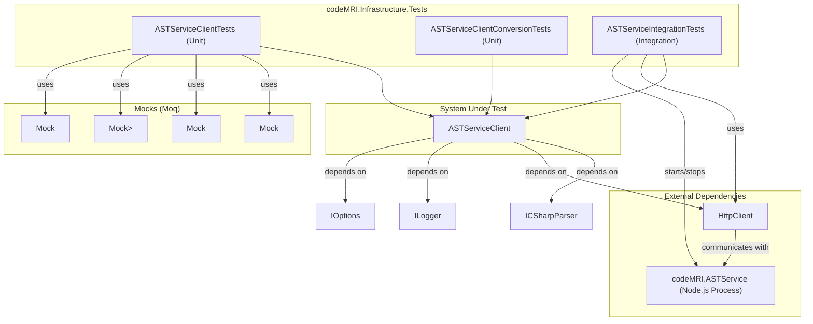

# Application - codeMRI.Infrastructure.Tests

### 1. Overview (For Everyone)
The `codeMRI.Infrastructure.Tests` module is a comprehensive test suite for the infrastructure layer of the codeMRI application. Its primary purpose is to validate the functionality, reliability, and robustness of the `ASTServiceClient`, a component responsible for communicating with an external Abstract Syntax Tree (AST) parsing service.

This module solves the critical problem of ensuring that the application's interaction with external services is stable and predictable. It verifies that the client can handle successful responses, network failures, server-side errors, and various data formats correctly. Furthermore, it confirms that the client correctly transforms the raw data from the service into structured, usable objects within the application.

Key capabilities of this test suite include:
*   **Unit Testing**: Isolating the `ASTServiceClient` to test its logic in a controlled environment using mocked dependencies.
*   **Integration Testing**: Communicating with a live instance of the external AST service to validate end-to-end functionality.
*   **Data Transformation Testing**: Verifying that the complex JSON responses from the AST service are accurately converted into the application's domain models.
*   **Language-Specific Logic Testing**: Confirming that C# code is handled by a local parser (Roslyn) instead of being sent to the external service.

### 2. User Guide (For End Users)
The end users of this module are developers and quality assurance professionals responsible for maintaining the quality of the `codeMRI.Infrastructure` layer.

#### How to Use the Features
The tests are written using the NUnit framework and can be executed using any standard .NET test runner, such as the one integrated into Visual Studio, JetBrains Rider, or the .NET CLI (`dotnet test`).

#### Configuration Options
The tests are largely self-configuring. However, the integration tests (`ASTServiceIntegrationTests`) have an implicit requirement:
*   The external `codeMRI.ASTService` (a Node.js application) must be available at the relative path `../../../codeMRI.ASTService` from the test assembly's output directory.
*   The `node` executable must be installed and accessible in the system's PATH for the integration tests to start the service.

#### Common Use Cases
*   **Pre-commit Validation**: A developer runs the entire test suite locally to ensure their changes to the `ASTServiceClient` or its dependencies do not break existing functionality.
*   **Continuous Integration (CI)**: The test suite is executed automatically in a CI/CD pipeline on every pull request or merge to the main branch, providing a safety net against regressions.
*   **Debugging**: When an issue arises with the AST parsing functionality, a developer can run specific tests to isolate the problem. For example, running `ParseCodeAsync_ShouldHandleNetworkFailure` can verify if error handling for network issues is working as expected.

### 3. Technical Architecture (For Developers)
This test suite is built using standard .NET testing practices and does not follow a specific architectural pattern itself, but it thoroughly tests a client that likely implements a Service or Gateway pattern.

*   **Architectural Pattern**: Not identified (for the test suite itself).
*   **Metrics**: Cohesion (0,00), Coupling (0,00), Complexity (23,0).

#### Class/Component Structure and Key Relationships
The module is organized into three main test classes, each with a specific focus:

*   `ASTServiceClientTests`: Contains unit tests for the `ASTServiceClient`. It uses `Moq` to mock `HttpMessageHandler`, `ILogger`, `IOptions<ASTServiceSettings>`, and `ICSharpParser` to simulate various scenarios without external dependencies.
*   `ASTServiceClientConversionTests`: Contains unit tests specifically for the `ConvertToCodeComponentsAsync` method. It focuses on the logic of converting `JsonElement` data from the service into `CodeComponent` domain models.
*   `ASTServiceIntegrationTests`: Contains integration tests that spin up a real instance of the `codeMRI.ASTService` Node.js process using `System.Diagnostics.Process`. It then uses a real `HttpClient` to perform end-to-end testing against this live service.

#### Important Public Interfaces
The tests validate the behavior of the following public methods on the `ASTServiceClient`:
*   `Task<ASTParseResult?> ParseCodeAsync(string code, string language, string filePath)`
*   `Task<List<CodeComponent>> ConvertToCodeComponentsAsync(ASTParseResult astResult)`
*   `Task<bool> IsHealthyAsync()`

#### Mermaid Component Diagram

### 4. Operations & Deployment (For DevOps)
This module is primarily for development and testing, but its integration tests have specific operational requirements.

#### External Dependencies
*   **`codeMRI.ASTService`**: The `ASTServiceIntegrationTests` class has a hard dependency on the `codeMRI.ASTService` Node.js application. The tests are designed to start this process automatically, but this requires:
    1.  The `node` runtime to be installed on the build/development agent.
    2.  The source code for `codeMRI.ASTService` to be located in a specific relative path to the test output directory (`../../../codeMRI.ASTService`).

#### Configuration
*   **Environment Variables/Settings**: The tests configure the `ASTServiceClient` in-memory. For integration tests, the service URL is hardcoded to `http://localhost:3002`, and the timeout is set to 60 seconds to accommodate service startup and processing time.

#### Troubleshooting and Logs
*   **Service Logs**: The `ASTServiceIntegrationTests` class captures and redirects the standard output (`stdout`) and standard error (`stderr`) from the Node.js process to the test runner's console. These logs are prefixed with `AST_OUT:` and `AST_ERR:` and are invaluable for diagnosing issues with the external service during test runs.
*   **Application Logs**: The unit tests verify that the `ASTServiceClient` logs errors under certain conditions (e.g., when an unsupported language is provided). In a deployed application, ensuring the logging infrastructure is correctly configured will be essential for monitoring the health of the AST parsing functionality.

### 5. API Reference (If applicable)
This module does not expose an API itself but serves to test the API of the `ASTServiceClient`. The key methods exercised by the tests are:

*   **`ParseCodeAsync(string code, string language, string filePath)`**
    *   **Description**: Asynchronously sends code to the external AST service for parsing. For the "csharp" language, it bypasses the external call and uses a local `ICSharpParser` instance.
    *   **Parameters**:
        *   `code`: The source code string to be parsed.
        *   `language`: The programming language of the code (e.g., "java", "python", "csharp").
        *   `filePath`: The file path associated with the code.
    *   **Returns**: A `Task<ASTParseResult?>` which, on success, contains the parsed AST data, or `null` if a network or service error occurs.

*   **`ConvertToCodeComponentsAsync(ASTParseResult astResult)`**
    *   **Description**: Converts the raw, JSON-based `ASTParseResult` object into a list of strongly-typed `CodeComponent` objects for easier use within the application.
    *   **Parameters**:
        *   `astResult`: The raw result object from a previous `ParseCodeAsync` call.
    *   **Returns**: A `Task<List<CodeComponent>>` representing the structured components of the parsed code.

*   **`IsHealthyAsync()`**
    *   **Description**: Checks if the external AST service is running and responsive.
    *   **Returns**: A `Task<bool>` which is `true` if the service is healthy, otherwise `false`. This method is primarily used by the integration test suite to wait for the service to be ready.

Relevant source files

- [codeMRI.Infrastructure.Tests/Services/ASTServiceClientTests.cs](/var/folders/9d/5x7df5dx5zxcjnl4dbxzfqw00000gn/T/codeMRI_982cf0c472d443648edb9ca4f0587557/blob/main/codeMRI.Infrastructure.Tests/Services/ASTServiceClientTests.cs)
- [codeMRI.Infrastructure.Tests/Services/ASTServiceClientConversionTests.cs](/var/folders/9d/5x7df5dx5zxcjnl4dbxzfqw00000gn/T/codeMRI_982cf0c472d443648edb9ca4f0587557/blob/main/codeMRI.Infrastructure.Tests/Services/ASTServiceClientConversionTests.cs)
- [codeMRI.Infrastructure.Tests/Services/ASTServiceIntegrationTests.cs](/var/folders/9d/5x7df5dx5zxcjnl4dbxzfqw00000gn/T/codeMRI_982cf0c472d443648edb9ca4f0587557/blob/main/codeMRI.Infrastructure.Tests/Services/ASTServiceIntegrationTests.cs)

