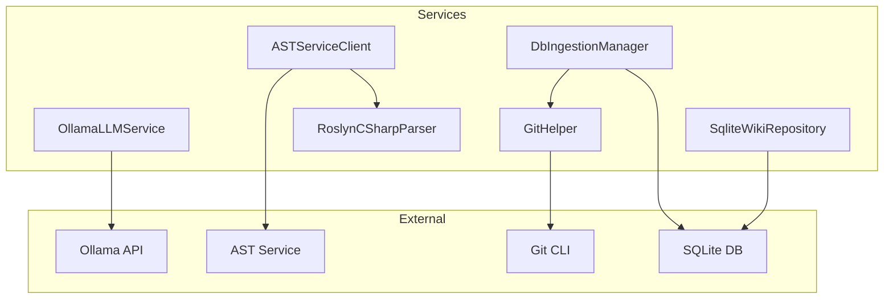

# Application - codeMRI.Infrastructure

## 1. Overview (For Everyone)
The `codeMRI.Infrastructure` module provides foundational services for the codeMRI application, enabling repository analysis, AI-powered code processing, and data persistence. It solves key challenges in automated code analysis by integrating Git operations, large language model (LLM) interactions, abstract syntax tree (AST) parsing, and SQLite-based storage. Primary capabilities include:
- Git repository cloning and branch detection
- LLM integration for chat and streaming responses with context management
- AST parsing for multiple languages (with local C# support)
- Ingestion job management with progress tracking and cancellation
- Wiki content storage and retrieval in SQLite with full CRUD operations
- Repository metadata tracking and ingestion state management

## 2. User Guide (For End Users)
### Configuration Options
- **AST Service** (`ASTServiceSettings`):
  - `BaseUrl`: AST service endpoint (default: `http://localhost:3002`)
  - `TimeoutSeconds`: Request timeout (default: 120)
  - `Enabled`: Toggle remote AST parsing (default: true)
- **Ollama LLM** (`OllamaSettings`):
  - `BaseUrl`: Ollama API endpoint
  - `ChatModel`: Default model name
  - `Temperature`: Response randomness (0.0-1.0)
  - `ContextSize`: Token limit for context window

### Common Use Cases
1. **Repository Analysis**:
   - Start ingestion job via `DbIngestionManager.StartJobAsync()`
   - Monitor progress through job status updates
   - Retrieve generated wiki content via `SqliteWikiRepository`
   - Track all analyzed repositories with `GetAllRepositorySummariesAsync()`
2. **Code Parsing**:
   - Use `ASTServiceClient.ParseCodeAsync()` for multi-language support
   - C# code parsed locally via `RoslynCSharpParser`
3. **AI Interactions**:
   - Chat with LLM using `OllamaLLMService.ChatAsync()`
   - Stream responses with `ChatStreamAsync()`
   - Process large content via `ChatWithFindingsAsync()`
4. **Wiki Management**:
   - Create and update wiki pages with `SavePageAsync()`
   - Search pages by title with `GetPageByTitleAsync()`
   - Retrieve all pages for a repository with `GetAllPagesAsync()`
   - Delete unwanted pages with `DeletePageAsync()`
5. **Ingestion Tracking**:
   - Store and retrieve ingestion manifests
   - Monitor processing states during analysis
   - Clean up old states with `DeleteIngestionProcessingStateAsync()`

## 3. Technical Architecture (For Developers)
### Architectural Pattern
Service-oriented architecture with static helpers and repository pattern

### Metrics
- **Cohesion**: 0.01 (very low - indicates broad responsibilities)
- **Coupling**: 0.88 (high - tight integration with external systems)
- **Complexity**: 278.0 (high - due to retry logic, context management, and AST processing)

### Class/Component Structure

### Key Relationships
- `DbIngestionManager` orchestrates ingestion using `GitHelper` and `ICodeWikiOrchestrator`
- `ASTServiceClient` uses `RoslynCSharpParser` for local C# parsing
- `OllamaLLMService` handles all LLM interactions with retry logic
- `SqliteWikiRepository` provides comprehensive data persistence with:
  - Repository metadata tracking
  - Wiki structure and page management
  - Ingestion manifest and state persistence
  - Full CRUD operations with foreign key constraints

### Important Public Interfaces
- `ILLMClient`: LLM interaction contract
- `IASTServiceClient`: AST parsing operations
- `IIngestionJobManager`: Job lifecycle management
- `IWikiRepository`: Wiki storage operations
- `ICSharpParser`: C# parsing contract

## 4. Operations & Deployment (For DevOps)
### External Dependencies
- **Git CLI**: Required for repository cloning
- **Ollama Service**: For LLM operations
- **AST Service**: Optional remote parsing service
- **SQLite**: Local database for jobs and wiki storage

### Configuration
- Environment variables for service endpoints:
  - `ASTService__BaseUrl`
  - `Ollama__BaseUrl`
- Database path configured during service initialization
- Timeout/retry settings in respective configuration classes

### Troubleshooting and Logs
- **Git Operations**: Check logs for clone failures in `GitHelper`
- **LLM Requests**: Monitor `OllamaLLMService` for retry attempts and context window warnings
- **AST Parsing**: Verify AST service health via `IsHealthyAsync()`
- **Database**: Check SQLite file permissions and disk space
- **Circuit Breaker**: AST service uses circuit breaker pattern - logs show state changes
- **Schema Migrations**: Database automatically creates tables and handles migrations (e.g., adding RemoteUrl column)

## 5. API Reference (If applicable)
### GitHelper
- `CloneRepositoryAsync(string gitUrl, string? targetDir, CancellationToken)`: Clones repository
- `IsGitUrl(string input)`: Validates Git URLs/local paths
- `GetCurrentBranch(string repoPath)`: Gets current branch

### OllamaLLMService
- `ChatAsync(string systemPrompt, string userPrompt, List<ChatMessage> history, string? model, CancellationToken)`: Sends chat request
- `ChatStreamAsync(...)`: Streams chat responses
- `ChatWithFindingsAsync(...)`: Processes large content in chunks

### ASTServiceClient
- `ParseCodeAsync(string code, string language, string filePath, CancellationToken)`: Parses code to AST
- `ConvertToCodeComponentsAsync(ASTParseResult astResult, CancellationToken)`: Converts AST to components
- `GetSupportedLanguagesAsync()`: Returns supported languages

### DbIngestionManager
- `StartJobAsync(string repoUrl, bool forceRegenerate, AudienceType audience, string? connectionId)`: Starts ingestion
- `CancelJobAsync(string jobId)`: Cancels running job
- `ListActiveJobsAsync()`: Returns active jobs

### SqliteWikiRepository
#### Wiki Structure Management
- `SaveStructureAsync(string repoPath, WikiStructure structure)`: Persists wiki structure
- `GetStructureAsync(string repoPath)`: Retrieves wiki structure
- `DeleteStructureAsync(string repoPath)`: Deletes wiki structure

#### Wiki Page Management
- `SavePageAsync(string repoPath, WikiPage page)`: Creates or updates a wiki page
- `GetPageAsync(string repoPath, string pageId)`: Retrieves specific page by ID
- `GetPageByTitleAsync(string repoPath, string pageTitle)`: Searches page by title (case-insensitive)
- `GetAllPagesAsync(string repoPath)`: Retrieves all pages for a repository
- `DeletePageAsync(string repoPath, string pageId)`: Removes a page

#### Repository Management
- `GetAllRepositoriesAsync()`: Lists all repository paths
- `GetAllRepositorySummariesAsync()`: Returns repository summaries with ingestion status
- `SetRepositoryRemoteUrlAsync(string repoPath, string remoteUrl)`: Updates repository remote URL

#### Ingestion Management
- `SaveIngestionManifestAsync(string repoPath, Dictionary<string, string> manifest)`: Stores ingestion metadata
- `GetIngestionManifestAsync(string repoPath)`: Retrieves ingestion manifest
- `DeleteIngestionManifestAsync(string repoPath)`: Removes ingestion manifest
- `SaveIngestionProcessingStateAsync(string repoPath, IngestionProcessingState state)`: Persists processing state
- `GetIngestionProcessingStateAsync(string repoPath)`: Retrieves current processing state
- `DeleteIngestionProcessingStateAsync(string repoPath)`: Clears processing state

Relevant source files

- [codeMRI.Infrastructure/Services/GitHelper.cs](/var/folders/9d/5x7df5dx5zxcjnl4dbxzfqw00000gn/T/codeMRI_982cf0c472d443648edb9ca4f0587557/blob/main/codeMRI.Infrastructure/Services/GitHelper.cs)
- [codeMRI.Infrastructure/Services/OllamaLLMService.cs](/var/folders/9d/5x7df5dx5zxcjnl4dbxzfqw00000gn/T/codeMRI_982cf0c472d443648edb9ca4f0587557/blob/main/codeMRI.Infrastructure/Services/OllamaLLMService.cs)
- [codeMRI.Infrastructure/Services/ASTServiceClient.cs](/var/folders/9d/5x7df5dx5zxcjnl4dbxzfqw00000gn/T/codeMRI_982cf0c472d443648edb9ca4f0587557/blob/main/codeMRI.Infrastructure/Services/ASTServiceClient.cs)
- [codeMRI.Infrastructure/Configuration/ASTServiceSettings.cs](/var/folders/9d/5x7df5dx5zxcjnl4dbxzfqw00000gn/T/codeMRI_982cf0c472d443648edb9ca4f0587557/blob/main/codeMRI.Infrastructure/Configuration/ASTServiceSettings.cs)
- [codeMRI.Infrastructure/Services/RoslynCSharpParser.cs](/var/folders/9d/5x7df5dx5zxcjnl4dbxzfqw00000gn/T/codeMRI_982cf0c472d443648edb9ca4f0587557/blob/main/codeMRI.Infrastructure/Services/RoslynCSharpParser.cs)
- [codeMRI.Infrastructure/Services/DbIngestionManager.cs](/var/folders/9d/5x7df5dx5zxcjnl4dbxzfqw00000gn/T/codeMRI_982cf0c472d443648edb9ca4f0587557/blob/main/codeMRI.Infrastructure/Services/DbIngestionManager.cs)
- [codeMRI.Infrastructure/Services/SqliteWikiRepository.cs](/var/folders/9d/5x7df5dx5zxcjnl4dbxzfqw00000gn/T/codeMRI_982cf0c472d443648edb9ca4f0587557/blob/main/codeMRI.Infrastructure/Services/SqliteWikiRepository.cs)

