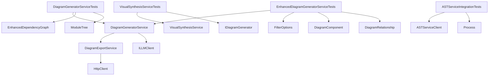

# Application - codeMRI.Visualization.Tests

## 1. Overview (For Everyone)
The `codeMRI.Visualization.Tests` module is a comprehensive test suite for the visualization components of the codeMRI application. It ensures the reliability and correctness of diagram generation services that produce architectural, sequence, data flow, and component diagrams. The module validates that visualization services correctly group components by layers, handle microservices patterns, generate proper Mermaid syntax, and support interactive features like filtering and exporting.

Key problems solved:
- Verifies diagram generation accuracy across different visualization types
- Ensures proper component grouping and relationship representation
- Validates interactive diagram features, filtering, and export capabilities
- Confirms handling of complex architectural patterns (microservices, layered architecture)
- Tests integration with external AST service for code parsing

Primary capabilities:
- Unit testing of diagram generation services
- Integration testing with AST service
- Validation of Mermaid syntax output
- Testing of component and relationship filtering
- Verification of layer-based component grouping
- Testing of data flow highlighting and focus node handling
- Validation of diagram export functionality (PNG, SVG, PDF)
- Testing of interactive HTML generation with zoom controls

## 2. User Guide (For End Users)
This module is intended for developers and quality assurance engineers running the test suite. There are no end-user facing features.

### Running Tests
Execute tests using your preferred test runner:
```bash
dotnet test codeMRI.Visualization.Tests
```

### Test Coverage
The test suite covers:
- **Architecture Diagrams**: Layer grouping, microservices patterns
- **Sequence Diagrams**: Mermaid syntax validation, interaction flows
- **Data Flow Diagrams**: Focus node highlighting, data flow paths
- **Interactive Diagrams**: Component filtering, relationship filtering, zoom controls
- **Visual Synthesis**: Artifact generation coordination
- **Diagram Export**: PNG, SVG, PDF export functionality
- **AST Service Integration**: End-to-end parsing service validation

### Configuration
- Unit tests use in-memory setups and mocks
- Integration tests require AST service running on localhost:3002
- Tests use hardcoded test data builders and default configurations

## 3. Technical Architecture (For Developers)
### Architectural Pattern
Unit Testing with Mocks, Integration Testing with External Services

### Metrics
- **Cohesion**: 0.00
- **Coupling**: 0.00
- **Complexity**: 316.0

### Class/Component Structure


### Key Relationships
- `DiagramGeneratorServiceTests` validates diagram generation against mock graphs
- `VisualSynthesisServiceTests` verifies artifact generation coordination
- `EnhancedDiagramGeneratorServiceTests` tests interactive features and filtering
- `ASTServiceIntegrationTests` performs end-to-end testing with Node.js AST service
- `DiagramExportService` handles export to PNG, SVG, and PDF formats
- All test classes use `Moq` for mocking dependencies except integration tests

### Important Public Interfaces
- `DiagramGeneratorServiceTests`:
  - `GenerateArchitectureDiagram_ShouldGroupComponentsByLayer`
  - `GenerateSequenceDiagram_ShouldGenerateMermaidSequenceSyntax`
  - `GenerateDataFlowDiagram_ShouldHighlightFocusNodeAndDataFlow`
- `VisualSynthesisServiceTests`:
  - `GenerateArtifactsAsync_ShouldCallGeneratorsAndReturnArtifacts`
- `EnhancedDiagramGeneratorServiceTests`:
  - `GenerateInteractiveComponentDiagramAsync_ShouldReturnValidInteractiveDiagram`
  - `FilterComponents_ShouldApplyComplexityFilter`
- `ASTServiceIntegrationTests`:
  - `ParseCodeAsync_WithSpecificPythonContent_ShouldReturnSuccess`
  - `ParseCodeAsync_WithInvalidLanguage_ShouldThrowErrorHandledByClient`
- `DiagramExportService`:
  - `ExportToPngAsync`, `ExportToSvgAsync`, `ExportToPdfAsync`
  - `GenerateInteractiveHtml`

## 4. Operations & Deployment (For DevOps)
### External Dependencies
- **AST Service**: Node.js application running on localhost:3002 (for integration tests)
- **Mermaid Live**: External service for diagram rendering (simulated in current implementation)
- **HttpClient**: For external service communication

### Configuration
- Unit tests: No configuration required, use in-memory mocks
- Integration tests:
  - AST Service URL: http://localhost:3002
  - Timeout: 60 seconds
  - Service must be manually started before running integration tests
- Export settings use default values (PNG: 1920x1080, quality 90)

### Troubleshooting and Logs
- Test output provides detailed assertion messages
- NUnit framework logs test execution status
- Integration tests log AST service stdout/stderr to console
- Common issues:
  - AST service not running before integration tests
  - Port conflicts on localhost:3002
  - Node.js not installed or not in PATH

## 5. API Reference
This module contains no public APIs. It consists of test methods validating internal service behavior:

### Key Test Methods
| Test Class | Method | Purpose |
|------------|--------|---------|
| DiagramGeneratorServiceTests | GenerateArchitectureDiagram_ShouldGroupComponentsByLayer | Verifies layer-based component grouping |
| DiagramGeneratorServiceTests | GenerateSequenceDiagram_ShouldGenerateMermaidSequenceSyntax | Validates sequence diagram syntax |
| DiagramGeneratorServiceTests | GenerateDataFlowDiagram_ShouldHighlightFocusNodeAndDataFlow | Tests focus node highlighting |
| VisualSynthesisServiceTests | GenerateArtifactsAsync_ShouldCallGeneratorsAndReturnArtifacts | Verifies artifact generation coordination |
| EnhancedDiagramGeneratorServiceTests | FilterComponents_ShouldApplyComplexityFilter | Tests component filtering logic |
| EnhancedDiagramGeneratorServiceTests | FilterRelationships_ShouldApplyTypeFilter | Tests relationship filtering logic |
| ASTServiceIntegrationTests | ParseCodeAsync_WithSpecificPythonContent_ShouldReturnSuccess | Validates Python code parsing |
| ASTServiceIntegrationTests | ParseCodeAsync_WithInvalidLanguage_ShouldThrowErrorHandledByClient | Tests error handling for unsupported languages |

### Service Methods Tested
- `DiagramGeneratorService.GenerateArchitectureDiagramAsync`
- `DiagramGeneratorService.GenerateInteractiveComponentDiagramAsync`
- `DiagramExportService.ExportToPngAsync`
- `DiagramExportService.ExportToSvgAsync`
- `DiagramExportService.ExportToPdfAsync`
- `DiagramExportService.GenerateInteractiveHtml`
- `VisualSynthesisService.GenerateArtifactsAsync`
- `ASTServiceClient.ParseCodeAsync`
- `ASTServiceClient.IsHealthyAsync`

<details>
<summary>Relevant source files</summary>

- [codeMRI.Visualization.Tests/Services/DiagramGeneratorServiceTests.cs](/var/folders/9d/5x7df5dx5zxcjnl4dbxzfqw00000gn/T/codeMRI_982cf0c472d443648edb9ca4f0587557/blob/main/codeMRI.Visualization.Tests/Services/DiagramGeneratorServiceTests.cs)
- [codeMRI.Visualization.Tests/Services/VisualSynthesisServiceTests.cs](/var/folders/9d/5x7df5dx5zxcjnl4dbxzfqw00000gn/T/codeMRI_982cf0c472d443648edb9ca4f0587557/blob/main/codeMRI.Visualization.Tests/Services/VisualSynthesisServiceTests.cs)
- [codeMRI.Visualization.Tests/Services/EnhancedDiagramGeneratorServiceTests.cs](/var/folders/9d/5x7df5dx5zxcjnl4dbxzfqw00000gn/T/codeMRI_982cf0c472d443648edb9ca4f0587557/blob/main/codeMRI.Visualization.Tests/Services/EnhancedDiagramGeneratorServiceTests.cs)
- [codeMRI.Frontend/Services/WikiHubClient.cs](/var/folders/9d/5x7df5dx5zxcjnl4dbxzfqw00000gn/T/codeMRI_982cf0c472d443648edb9ca4f0587557/blob/main/codeMRI.Frontend/Services/WikiHubClient.cs)
- [codeMRI.Frontend/Services/WikiApiClient.cs](/var/folders/9d/5x7df5dx5zxcjnl4dbxzfqw00000gn/T/codeMRI_982cf0c472d443648edb9ca4f0587557/blob/main/codeMRI.Frontend/Services/WikiApiClient.cs)
- [codeMRI.Frontend/Services/AppState.cs](/var/folders/9d/5x7df5dx5zxcjnl4dbxzfqw00000gn/T/codeMRI_982cf0c472d443648edb9ca4f0587557/blob/main/codeMRI.Frontend/Services/AppState.cs)
- [codeMRI.Agents/Services/DelegationService.cs](/var/folders/9d/5x7df5dx5zxcjnl4dbxzfqw00000gn/T/codeMRI_982cf0c472d443648edb9ca4f0587557/blob/main/codeMRI.Agents/Services/DelegationService.cs)
- [codeMRI.Agents/Services/AgentTelemetryService.cs](/var/folders/9d/5x7df5dx5zxcjnl4dbxzfqw00000gn/T/codeMRI_982cf0c472d443648edb9ca4f0587557/blob/main/codeMRI.Agents/Services/AgentTelemetryService.cs)
- [codeMRI.Agents/Services/DocumentationGenerationPipeline.cs](/var/folders/9d/5x7df5dx5zxcjnl4dbxzfqw00000gn/T/codeMRI_982cf0c472d443648edb9ca4f0587557/blob/main/codeMRI.Agents/Services/DocumentationGenerationPipeline.cs)
- [codeMRI.Agents/Services/AgentMessageBus.cs](/var/folders/9d/5x7df5dx5zxcjnl4dbxzfqw00000gn/T/codeMRI_982cf0c472d443648edb9ca4f0587557/blob/main/codeMRI.Agents/Services/AgentMessageBus.cs)
- [codeMRI.Agents/Services/AgentCoordinator.cs](/var/folders/9d/5x7df5dx5zxcjnl4dbxzfqw00000gn/T/codeMRI_982cf0c472d443648edb9ca4f0587557/blob/main/codeMRI.Agents/Services/AgentCoordinator.cs)
- [codeMRI.Agents.Tests/Unit/DelegationServiceTests.cs](/var/folders/9d/5x7df5dx5zxcjnl4dbxzfqw00000gn/T/codeMRI_982cf0c472d443648edb9ca4f0587557/blob/main/codeMRI.Agents.Tests/Unit/DelegationServiceTests.cs)
- [codeMRI.Infrastructure.Tests/Services/ASTServiceClientTests.cs](/var/folders/9d/5x7df5dx5zxcjnl4dbxzfqw00000gn/T/codeMRI_982cf0c472d443648edb9ca4f0587557/blob/main/codeMRI.Infrastructure.Tests/Services/ASTServiceClientTests.cs)
- [codeMRI.Infrastructure.Tests/Services/ASTServiceClientConversionTests.cs](/var/folders/9d/5x7df5dx5zxcjnl4dbxzfqw00000gn/T/codeMRI_982cf0c472d443648edb9ca4f0587557/blob/main/codeMRI.Infrastructure.Tests/Services/ASTServiceClientConversionTests.cs)
- [codeMRI.Infrastructure.Tests/Services/ASTServiceIntegrationTests.cs](/var/folders/9d/5x7df5dx5zxcjnl4dbxzfqw00000gn/T/codeMRI_982cf0c472d443648edb9ca4f0587557/blob/main/codeMRI.Infrastructure.Tests/Services/ASTServiceIntegrationTests.cs)
- [codeMRI.Visualization/Services/DiagramExportService.cs](/var/folders/9d/5x7df5dx5zxcjnl4dbxzfqw00000gn/T/codeMRI_982cf0c472d443648edb9ca4f0587557/blob/main/codeMRI.Visualization/Services/DiagramExportService.cs)
- [codeMRI.Visualization/Services/DiagramGeneratorService.cs](/var/folders/9d/5x7df5dx5zxcjnl4dbxzfqw00000gn/T/codeMRI_982cf0c472d443648edb9ca4f0587557/blob/main/codeMRI.Visualization/Services/DiagramGeneratorService.cs)
- [codeMRI.Visualization/Services/VisualSynthesisService.cs](/var/folders/9d/5x7df5dx5zxcjnl4dbxzfqw00000gn/T/codeMRI_982cf0c472d443648edb9ca4f0587557/blob/main/codeMRI.Visualization/Services/VisualSynthesisService.cs)
</details>
