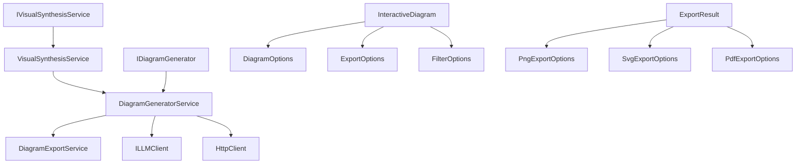

# Application - codeMRI.Visualization

## 1. Overview (For Everyone)

The `codeMRI.Visualization` module is a comprehensive diagram generation and export system designed to transform code analysis data into visual representations. It serves as the visualization layer of the codeMRI platform, converting complex code structures and dependencies into interactive diagrams that help developers understand software architecture.

**Key Problems It Solves:**
- Transforms abstract code analysis data into intuitive visual diagrams
- Provides multiple diagram types (architecture, component, sequence, data flow) for different analysis needs
- Enables interactive exploration of code relationships with zoom and filtering capabilities
- Supports multiple export formats (PNG, SVG, PDF) for documentation and presentations
- Automates the generation of visual artifacts from code analysis results

**Primary Capabilities:**
- Generate various diagram types using Mermaid syntax
- Create interactive HTML diagrams with zoom controls and filtering
- Export diagrams to multiple formats with customizable options
- Synthesize comprehensive visual artifacts from code analysis
- Support AI-assisted diagram generation for deployment views

## 2. User Guide (For End Users)

### How to Use the Features

#### Generating Diagrams
The visualization module provides several diagram types:
- **Architecture Diagrams**: High-level view of the entire system structure
- **Component Diagrams**: Detailed view of specific components and their relationships
- **Sequence Diagrams**: Interaction flows between components
- **Data Flow Diagrams**: How data moves through the system
- **Deployment Diagrams**: Infrastructure and deployment architecture

#### Interactive Features
- **Zoom Controls**: Use + and - buttons to zoom in/out, Reset to return to 100%, or Fit to screen
- **Export Options**: Export diagrams as PNG, SVG, or copy the Mermaid code
- **Filtering**: Filter components by complexity, visibility, layers, or documentation status

#### Exporting Diagrams
1. Use the export buttons in the interactive diagram viewer
2. Choose your preferred format (PNG, SVG, PDF)
3. Customize export options like size, quality, and background color
4. Download the exported file

### Configuration Options (User-facing)

#### Diagram Options
- **Zoom Settings**: Configure min/max zoom levels and default zoom
- **Theme Selection**: Choose visual theme for diagrams
- **Label Display**: Show/hide component labels and metadata
- **Depth Control**: Limit diagram complexity by setting maximum depth

#### Export Options
- **PNG Export**: Set dimensions (width/height), quality (1-100), background color, transparency
- **SVG Export**: Include styles and metadata, enable compression
- **PDF Export**: Configure paper size, orientation, margins, and bookmarks

#### Filter Options
- **Component Filters**: Include/exclude specific components, filter by complexity range
- **Visibility Filters**: Show only public or documented components
- **Layer Filters**: Focus on specific architectural layers (Presentation, Business, Data, etc.)
- **Relationship Filters**: Filter by relationship types (calls, dependencies, etc.)

### Common Use Cases

1. **Architecture Documentation**: Generate comprehensive architecture diagrams for system documentation
2. **Code Review**: Visualize component relationships during code reviews
3. **Onboarding**: Help new developers understand system structure through visual diagrams
4. **Impact Analysis**: Use filtering to focus on specific areas before making changes
5. **Presentation Materials**: Export diagrams for presentations and technical documentation

## 3. Technical Architecture (For Developers)

### Architectural Pattern
Service-Oriented Architecture with dependency injection, implementing the Strategy pattern for different diagram types and Template Method pattern for HTML generation.

### Metrics
- **Cohesion**: High (services are focused on specific visualization responsibilities)
- **Coupling**: Moderate (depends on core models and external services)
- **Complexity**: 92.0 (due to multiple diagram generation methods and interactive features)

### Class/Component Structure and Key Relationships



### Important Public Interfaces

#### IDiagramGenerator
```csharp
Task<string> GenerateDeploymentDiagramAsync(ModuleNode module, EnhancedDependencyGraph graph)
Task<string> GenerateArchitectureDiagramAsync(ModuleTree moduleTree, EnhancedDependencyGraph graph)
Task<string> GenerateComponentDiagramAsync(EnhancedDependencyGraph graph, string? focusComponentId = null)
Task<string> GenerateSequenceDiagramAsync(EnhancedDependencyGraph graph, string entryPointId)
Task<string> GenerateDataFlowDiagramAsync(EnhancedDependencyGraph graph, string focusComponentId)
```

#### DiagramExportService
```csharp
Task<ExportResult> ExportToPngAsync(InteractiveDiagram diagram, PngExportOptions? options = null)
Task<ExportResult> ExportToSvgAsync(InteractiveDiagram diagram, SvgExportOptions? options = null)
Task<ExportResult> ExportToPdfAsync(InteractiveDiagram diagram, PdfExportOptions? options = null)
Task<List<ExportResult>> ExportToMultipleFormatsAsync(InteractiveDiagram diagram)
string GenerateInteractiveHtml(InteractiveDiagram diagram)
```

#### IVisualSynthesisService
```csharp
Task<VisualArtifacts> GenerateArtifactsAsync(ModuleTree moduleTree, EnhancedDependencyGraph graph)
```

### Key Models
- **InteractiveDiagram**: Contains diagram content, options, and export settings
- **DiagramOptions**: Configuration for zoom, filtering, and display options
- **ExportOptions**: Settings for PNG, SVG, and PDF exports
- **FilterOptions**: Criteria for filtering components and relationships
- **ExportResult**: Result of export operation with success status and data

## 4. Operations & Deployment (For DevOps)

### External Dependencies
- **HttpClient**: For external service calls (currently simulated for Mermaid rendering)
- **ILLMClient**: For AI-powered diagram generation (deployment diagrams)
- **Core Models**: Depends on codeMRI.Core for shared models and interfaces

### Configuration (Env vars, settings files)
The module uses configuration objects rather than environment variables:
- DiagramOptions configured programmatically with defaults
- ExportOptions set per diagram with customizable settings
- FilterOptions applied dynamically based on user selections

### Troubleshooting and Logs

#### Common Issues
1. **Export Failures**: Check network connectivity and external service availability
2. **Large Diagram Performance**: Apply filters to reduce complexity
3. **Mermaid Rendering Errors**: Verify diagram syntax validity
4. **Memory Issues**: Limit diagram size and depth for large codebases

#### Logging Points
- Export operation start/completion/failure
- Diagram generation timing and success
- Filter application results
- Interactive HTML generation

#### Performance Considerations
- Sequence diagrams limited to 20 steps to prevent infinite loops
- Component filtering applied before rendering to reduce complexity
- SVG compression available for large exports
- Zoom levels constrained between 0.1x and 5.0x

## 5. API Reference (If applicable)

### DiagramGeneratorService Methods

#### GenerateInteractiveComponentDiagramAsync
```csharp
Task<InteractiveDiagram> GenerateInteractiveComponentDiagramAsync(
    EnhancedDependencyGraph graph,
    string? focusComponentId = null,
    DiagramOptions? options = null)
```
Generates an interactive component diagram with filtering capabilities.

#### GenerateInteractiveSequenceDiagramAsync
```csharp
Task<InteractiveDiagram> GenerateInteractiveSequenceDiagramAsync(
    EnhancedDependencyGraph graph,
    string entryPointId,
    DiagramOptions? options = null)
```
Creates an interactive sequence diagram showing component interactions.

#### GenerateInteractiveArchitectureDiagramAsync
```csharp
Task<InteractiveDiagram> GenerateInteractiveArchitectureDiagramAsync(
    ModuleTree moduleTree,
    EnhancedDependencyGraph graph,
    DiagramOptions? options = null)
```
Produces an interactive architecture diagram with module hierarchy.

### DiagramExportService Methods

#### ExportToPngAsync
```csharp
Task<ExportResult> ExportToPngAsync(
    InteractiveDiagram diagram, 
    PngExportOptions? options = null)
```
Exports diagram to PNG format with specified dimensions and quality.

#### ExportToSvgAsync
```csharp
Task<ExportResult> ExportToSvgAsync(
    InteractiveDiagram diagram, 
    SvgExportOptions? options = null)
```
Exports diagram to SVG format with optional compression.

#### ExportToPdfAsync
```csharp
Task<ExportResult> ExportToPdfAsync(
    InteractiveDiagram diagram, 
    PdfExportOptions? options = null)
```
Exports diagram to PDF format with paper size and orientation options.

### VisualSynthesisService Methods

#### GenerateArtifactsAsync
```csharp
Task<VisualArtifacts> GenerateArtifactsAsync(
    ModuleTree moduleTree, 
    EnhancedDependencyGraph graph)
```
Generates a complete set of visual artifacts including architecture, component, and sequence diagrams.

<details>
<summary>Relevant source files</summary>

- [codeMRI.Visualization/Services/DiagramExportService.cs](/var/folders/9d/5x7df5dx5zxcjnl4dbxzfqw00000gn/T/codeMRI_982cf0c472d443648edb9ca4f0587557/blob/main/codeMRI.Visualization/Services/DiagramExportService.cs)
- [codeMRI.Visualization/Services/DiagramGeneratorService.cs](/var/folders/9d/5x7df5dx5zxcjnl4dbxzfqw00000gn/T/codeMRI_982cf0c472d443648edb9ca4f0587557/blob/main/codeMRI.Visualization/Services/DiagramGeneratorService.cs)
- [codeMRI.Visualization/Services/VisualSynthesisService.cs](/var/folders/9d/5x7df5dx5zxcjnl4dbxzfqw00000gn/T/codeMRI_982cf0c472d443648edb9ca4f0587557/blob/main/codeMRI.Visualization/Services/VisualSynthesisService.cs)
</details>
