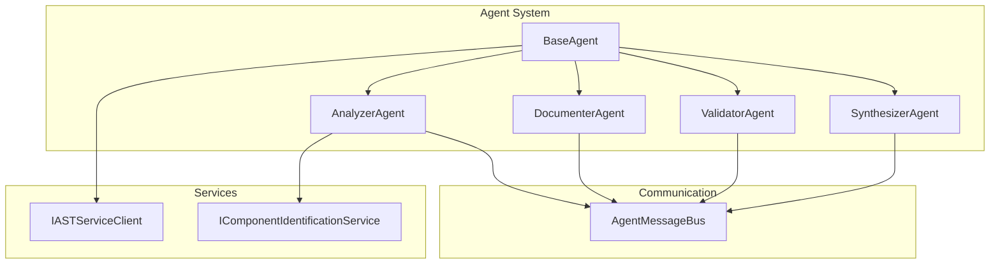

# Codemri.Agents Agents

## 1. Overview (For Everyone)
The Codemri.Agents Agents module provides a multi-agent system for automated code analysis and documentation generation. It implements a distributed architecture where specialized agents collaborate through message passing to analyze code repositories, generate documentation, validate results, and synthesize final documentation structures.

**Key problems it solves:**
- Automated analysis of code repository structure
- Component identification and documentation generation
- Validation of generated documentation
- Synthesis of individual documentation pieces into cohesive structures

**Primary capabilities:**
- Repository structure analysis and component identification
- Automatic documentation generation for code components
- Validation of documentation completeness and structure
- Synthesis of multiple documentation artifacts into unified wiki structures
- Message-based inter-agent communication for distributed processing

## 2. User Guide (For End Users)

### How to Use the Features
The agents operate as part of an automated pipeline. Each agent performs a specific role in the documentation generation process:

1. **AnalyzerAgent**: Initiates the process by analyzing repository structure and identifying components
2. **DocumenterAgent**: Generates documentation for each identified component
3. **SynthesizerAgent**: Combines individual documentation pages into a structured wiki
4. **ValidatorAgent**: Validates the final documentation structure

### Configuration Options
The agents support the following configuration through dependency injection:
- **AgentMessageBus**: Configures the message bus for inter-agent communication
- **IASTServiceClient**: Optional AST service for enhanced code analysis
- **Logging**: Configurable logging levels and providers

### Common Use Cases
1. **Repository Documentation**: Generate comprehensive documentation for a codebase
2. **Component Analysis**: Identify and document software components
3. **Wiki Generation**: Create structured wiki pages from code analysis
4. **Documentation Validation**: Ensure generated documentation meets quality standards

## 3. Technical Architecture (For Developers)

### Architectural Pattern
Agent-based architecture with message passing for inter-agent communication

### Metrics
- **Cohesion**: 0.20 (Low - agents have focused responsibilities but share common base functionality)
- **Coupling**: 0.76 (High - agents are tightly coupled through the message bus and shared models)
- **Complexity**: 48.0 (Moderate - primarily due to message handling and async operations)

### Class/Component Structure
```
BaseAgent (Abstract)
├── AnalyzerAgent
├── DocumenterAgent
├── ValidatorAgent
└── SynthesizerAgent
```

**Key Relationships:**
- All agents inherit from BaseAgent providing common functionality
- Agents communicate via AgentMessageBus using predefined message types
- Each agent subscribes to specific message types relevant to their role
- Agents use IASTServiceClient (optional) for enhanced code analysis

### Important Public Interfaces
```csharp
public interface IAgent
{
    string Id { get; }
    string Role { get; }
    Task<AgentResult> ExecuteAsync(AgentTask task, CancellationToken cancellationToken);
    bool CanHandle(AgentTask task);
    Task<DelegationRequest?> ShouldDelegate(AgentTask task, CancellationToken cancellationToken);
}
```

### Mermaid Component Diagram


## 4. Operations & Deployment (For DevOps)

### External Dependencies
- **None detected** - The module operates without external database or API dependencies

### Configuration
**Environment Variables/Settings:**
- Logging configuration (via Microsoft.Extensions.Logging)
- Message bus configuration (if using external message broker)
- AST service endpoint (if IASTServiceClient is implemented)

**Service Registration Example:**
```csharp
services.AddSingleton<AgentMessageBus>();
services.AddTransient<AnalyzerAgent>();
services.AddTransient<DocumenterAgent>();
services.AddTransient<ValidatorAgent>();
services.AddTransient<SynthesizerAgent>();
```

### Troubleshooting and Logs
**Common Issues:**
1. **AST Service Failures**: Agents fallback to basic complexity calculation
2. **Message Subscription Failures**: Check message bus configuration
3. **Invalid Payloads**: Agents validate input types before processing

**Logging Levels:**
- Debug: Message reception details
- Information: Task execution progress
- Warning: AST service fallbacks
- Error: Task execution failures

**Key Log Messages:**
- "AnalyzerAgent executing task {TaskId}"
- "DocumenterAgent executing task {TaskId}"
- "Error in [AgentName]"
- "AST Service failed, falling back to basic complexity calculation"

## 5. API Reference (If applicable)

### Key Methods

#### BaseAgent
```csharp
Task<AgentResult> ExecuteAsync(AgentTask task, CancellationToken cancellationToken)
bool CanHandle(AgentTask task)
Task<DelegationRequest?> ShouldDelegate(AgentTask task, CancellationToken cancellationToken)
```

#### AnalyzerAgent
```csharp
Task<AgentResult> ExecuteAsync(AgentTask task, CancellationToken cancellationToken)
// Payload: string path (repository path)
// Output: AnalysisResult with Structure and Components
```

#### DocumenterAgent
```csharp
Task<AgentResult> ExecuteAsync(AgentTask task, CancellationToken cancellationToken)
// Payload: CodeComponent
// Output: WikiPage
```

#### SynthesizerAgent
```csharp
Task<AgentResult> ExecuteAsync(AgentTask task, CancellationToken cancellationToken)
// Payload: List<WikiPage>
// Output: WikiStructure
```

#### ValidatorAgent
```csharp
Task<AgentResult> ExecuteAsync(AgentTask task, CancellationToken cancellationToken)
// Payload: WikiStructure
// Output: Validation result
```

### Message Types
- `AgentMessageTypes.AnalysisComplete`
- `AgentMessageTypes.DocumentationComplete`
- `AgentMessageTypes.SynthesisComplete`
- `AgentMessageTypes.ValidationComplete`
- `AgentMessageTypes.AgentStatus`
- `AgentMessageTypes.TaskStarted`
- `AgentMessageTypes.TaskCompleted`
- `AgentMessageTypes.TaskFailed`

<details>
<summary>Relevant source files</summary>

- [codeMRI.Agents/Agents/DocumenterAgent.cs](/var/folders/9d/5x7df5dx5zxcjnl4dbxzfqw00000gn/T/codeMRI_982cf0c472d443648edb9ca4f0587557/blob/main/codeMRI.Agents/Agents/DocumenterAgent.cs)
- [codeMRI.Agents/Agents/BaseAgent.cs](/var/folders/9d/5x7df5dx5zxcjnl4dbxzfqw00000gn/T/codeMRI_982cf0c472d443648edb9ca4f0587557/blob/main/codeMRI.Agents/Agents/BaseAgent.cs)
- [codeMRI.Agents/Agents/AnalyzerAgent.cs](/var/folders/9d/5x7df5dx5zxcjnl4dbxzfqw00000gn/T/codeMRI_982cf0c472d443648edb9ca4f0587557/blob/main/codeMRI.Agents/Agents/AnalyzerAgent.cs)
- [codeMRI.Agents/Agents/ValidatorAgent.cs](/var/folders/9d/5x7df5dx5zxcjnl4dbxzfqw00000gn/T/codeMRI_982cf0c472d443648edb9ca4f0587557/blob/main/codeMRI.Agents/Agents/ValidatorAgent.cs)
- [codeMRI.Agents/Agents/SynthesizerAgent.cs](/var/folders/9d/5x7df5dx5zxcjnl4dbxzfqw00000gn/T/codeMRI_982cf0c472d443648edb9ca4f0587557/blob/main/codeMRI.Agents/Agents/SynthesizerAgent.cs)
</details>
