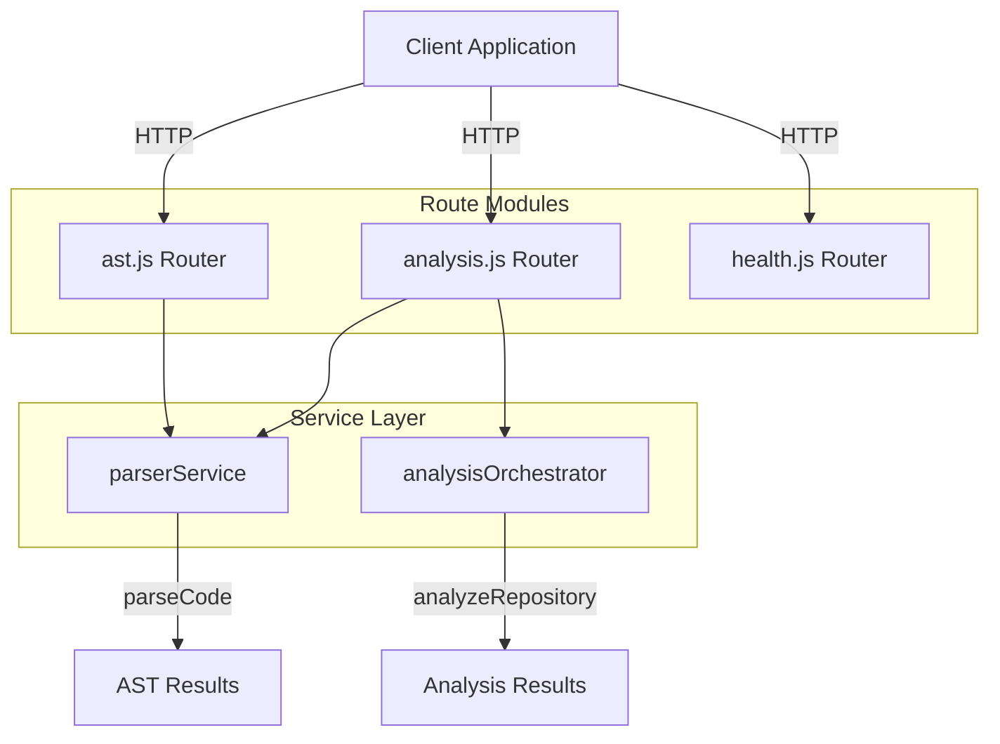

# Codemri.Astservice Src Routes

## 1. Overview (For Everyone)

The 'Codemri.Astservice Src Routes' module provides the REST API layer for the AST Parser Service, enabling external systems to interact with code parsing and analysis capabilities. It serves as the entry point for all HTTP requests related to Abstract Syntax Tree (AST) generation, code analysis, and service health monitoring.

**Key problems it solves:**
- Provides a standardized REST interface for code parsing operations
- Enables asynchronous repository analysis with job tracking
- Offers configurable complexity thresholds for analysis customization
- Delivers health monitoring capabilities for service reliability

**Primary capabilities:**
- Parse source code into AST structures for multiple programming languages
- Analyze entire repositories or individual files with enhanced metrics
- Track analysis job status and manage long-running operations
- Configure and retrieve complexity thresholds for analysis tuning
- Provide service health status for monitoring and alerting

## 2. User Guide (For End Users)

### How to Use the Features

The module exposes several REST endpoints that can be consumed by client applications:

**AST Parsing:**
- Send POST requests to `/parse` with code and language to generate AST
- Retrieve supported languages via GET `/supported-languages`

**Repository Analysis:**
- Submit repository analysis jobs via POST `/repository` with file array
- Check analysis progress with GET `/status/:analysisId`
- Cancel running analyses with DELETE `/cancel/:analysisId`
- Analyze individual files with POST `/file`

**Configuration:**
- View current complexity thresholds with GET `/thresholds`
- Update thresholds with PUT `/thresholds`

**Health Monitoring:**
- Check service status with GET `/health`

### Configuration Options (User-facing)

**Complexity Thresholds:**
Users can configure analysis thresholds by sending a PUT request to `/analysis/thresholds` with a JSON object containing threshold values. The system validates all inputs and applies defaults for invalid values.

Example configuration:
```json
{
  "thresholds": {
    "cyclomatic": 10,
    "cognitive": 15,
    "halstead": 100
  }
}
```

### Common Use Cases

**Single File Analysis:**
1. Send file content, language, and path to `/analysis/file`
2. Receive immediate analysis results with metrics

**Repository Analysis:**
1. Submit array of files to `/analysis/repository`
2. Track progress using the returned `analysisId`
3. Poll `/analysis/status/:analysisId` for updates
4. Retrieve final results when status indicates completion

**Language Support Check:**
1. Query `/analysis/languages` to get sorted list of supported languages
2. Use this list to validate inputs before parsing

## 3. Technical Architecture (For Developers)

**Architectural Pattern:** Express.js Router Pattern with modular route separation

**Metrics:**
- Cohesion: 0.00 (indicating low cohesion - routes handle diverse responsibilities)
- Coupling: 0.00 (minimal direct coupling between route modules)
- Complexity: 47.0 (moderate complexity due to error handling and validation)

**Class/Component Structure and Key Relationships:**

```
ast.js (Router)
├── parserService (dependency)
├── POST /parse endpoint
└── GET /supported-languages endpoint

analysis.js (Router)
├── analysisOrchestrator (dependency)
├── parserService (dynamic import)
├── POST /repository endpoint
├── GET /status/:analysisId endpoint
├── DELETE /cancel/:analysisId endpoint
├── GET /languages endpoint
├── POST /file endpoint
├── GET /thresholds endpoint
└── PUT /thresholds endpoint

health.js (Router)
└── GET / endpoint
```

**Important Public Interfaces:**

**ast.js exports:**
- Express router with parse and language support endpoints

**analysis.js exports:**
- Express router with comprehensive analysis and management endpoints

**health.js exports:**
- Express router with health check endpoint

**Mermaid Component Diagram:**



## 4. Operations & Deployment (For DevOps)

**External Dependencies:** None detected. The module relies solely on internal services (`parserService` and `analysisOrchestrator`).

**Configuration:**
- **Environment Variables:** No specific environment variables required
- **Settings Files:** Configuration is managed through runtime API calls (thresholds)
- **Service Dependencies:** Depends on internal services being available at runtime

**Troubleshooting and Logs:**

**Common Error Patterns:**
1. **400 Bad Request:** Missing required parameters in request body
   - Check for `code` and `language` in `/parse` requests
   - Verify `files` array structure in `/repository` requests
   - Ensure `content`, `language`, and `filePath` in `/file` requests

2. **404 Not Found:** Analysis ID not found
   - Verify the `analysisId` is correct
   - Check if analysis was properly initiated

3. **500 Internal Server Error:** Service-level failures
   - Check service logs for detailed error messages
   - Verify dependent services are running

**Logging Strategy:**
- All routes use `console.error` for error logging
- Error messages include context (e.g., 'Error parsing code:', 'Repository analysis error:')
- Errors are propagated to clients with sanitized messages

**Health Monitoring:**
- GET `/health` endpoint returns service status
- Response includes timestamp for monitoring freshness
- Simple health check suitable for load balancer probes

## 5. API Reference

### AST Routes (`/ast`)

**POST /parse**
- Description: Parse code into AST
- Request Body: `{ code: string, language: string, filePath?: string }`
- Response: AST object or error
- Status: 200 (success), 400 (missing params), 500 (error)

**GET /supported-languages**
- Description: Get list of supported languages
- Response: `{ languages: string[] }`
- Status: 200 (success)

### Analysis Routes (`/analysis`)

**POST /repository**
- Description: Analyze entire repository
- Request Body: `{ files: FileObject[], options?: object }`
- Response: `{ success: boolean, analysisId: string, status: string, results: object }`
- Status: 200 (success), 400 (invalid input), 500 (error)

**GET /status/:analysisId**
- Description: Get analysis status
- Response: `{ success: boolean, analysisId: string, status: string, startTime: string, endTime?: string, error?: string }`
- Status: 200 (success), 404 (not found), 500 (error)

**DELETE /cancel/:analysisId**
- Description: Cancel running analysis
- Response: `{ success: boolean, message: string }`
- Status: 200 (success), 404 (not found), 500 (error)

**GET /languages**
- Description: Get supported languages (sorted)
- Response: `{ success: boolean, languages: string[] }`
- Status: 200 (success), 500 (error)

**POST /file**
- Description: Analyze single file
- Request Body: `{ content: string, language: string, filePath: string, options?: object }`
- Response: `{ success: boolean, result: object }`
- Status: 200 (success), 400 (missing params), 500 (error)

**GET /thresholds**
- Description: Get complexity thresholds
- Response: `{ success: boolean, thresholds: object }`
- Status: 200 (success), 500 (error)

**PUT /thresholds**
- Description: Update complexity thresholds
- Request Body: `{ thresholds: object }`
- Response: `{ success: boolean, thresholds: object }`
- Status: 200 (success), 400 (invalid input), 500 (error)

### Health Routes (`/health`)

**GET /**
- Description: Service health check
- Response: `{ status: string, service: string, timestamp: string }`
- Status: 200 (success)

<details>
<summary>Relevant source files</summary>

- [codeMRI.ASTService/src/routes/ast.js](/var/folders/9d/5x7df5dx5zxcjnl4dbxzfqw00000gn/T/codeMRI_982cf0c472d443648edb9ca4f0587557/blob/main/codeMRI.ASTService/src/routes/ast.js)
- [codeMRI.ASTService/src/routes/analysis.js](/var/folders/9d/5x7df5dx5zxcjnl4dbxzfqw00000gn/T/codeMRI_982cf0c472d443648edb9ca4f0587557/blob/main/codeMRI.ASTService/src/routes/analysis.js)
- [codeMRI.ASTService/src/routes/health.js](/var/folders/9d/5x7df5dx5zxcjnl4dbxzfqw00000gn/T/codeMRI_982cf0c472d443648edb9ca4f0587557/blob/main/codeMRI.ASTService/src/routes/health.js)
</details>
