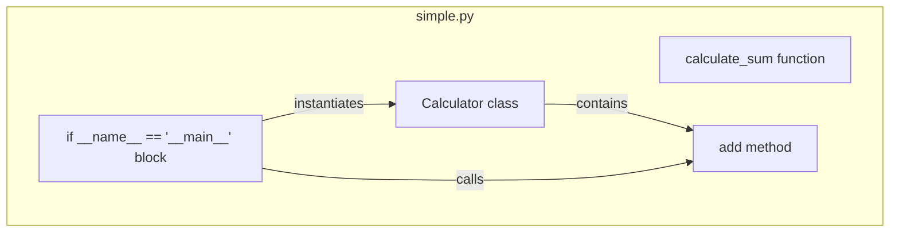

# Codemri.Astservice Tests Fixtures Python

### 1. Overview (For Everyone)

The `Codemri.Astservice Tests Fixtures Python` module provides a simple, self-contained Python file intended for use as a test fixture. Its primary purpose is to serve as a predictable and representative sample of Python code for the automated testing of the `ASTService`.

**Key problems it solves:**
- Provides a stable, version-controlled piece of Python code for testing, ensuring consistency across test runs.
- Eliminates the need for tests to dynamically generate code samples, simplifying test logic.
- Offers a known input with identifiable components (functions, classes) to validate the parsing and analysis capabilities of the `ASTService`.

**Primary capabilities:**
- Defines a basic function (`calculate_sum`) to test function parsing.
- Defines a simple class (`Calculator`) with an initializer and a method to test class parsing.
- Includes a standard `if __name__ == "__main__":` block, representing a common Python script structure.

### 2. User Guide (For End Users)

This module is a test fixture and is not intended to be used as a library or an application by end-users. Its "users" are the automated tests within the `ASTService` test suite.

**How to use the features:**
The fixture is used by the test framework to provide input to the `ASTService`. A typical test would:
1.  Locate the `simple.py` file within the test fixtures directory.
2.  Pass the file's content or path to the `ASTService` for processing (e.g., parsing into an Abstract Syntax Tree).
3.  Assert that the output from the service correctly represents the structures within `simple.py` (e.g., a function named `calculate_sum` with two parameters, a class named `Calculator` with a method named `add`).

**Configuration options (user-facing):**
There are no configuration options. The file is a static piece of code.

**Common use cases:**
- **AST Parsing Tests:** Verifying that the service can correctly parse Python functions, classes, methods, and script entry points.
- **Static Analysis Tests:** Using the file as input for tests that perform static analysis, such as identifying function calls, class instantiations, or variable assignments.
- **Transformation Tests:** Providing a source file for tests that transform or modify Python code.

### 3. Technical Architecture (For Developers)

**Architectural Pattern:**
Not identified. This is a single, standalone script file acting as a test fixture, not a structured application.

**Metrics:**
- **Cohesion:** 1.00 (High)
- **Coupling:** 0.00 (None)
- **Complexity:** 2.0 (Low)

**Class/Component structure and key relationships:**
The file consists of two primary components at the top level:
- `calculate_sum(a, b)`: A standalone function that takes two arguments and returns their sum.
- `Calculator`: A class that encapsulates a single integer `value`.
    - `__init__(self)`: The constructor initializes the `value` attribute to 0.
    - `add(self, x)`: An instance method that adds a number `x` to the current `value` and returns the new total.
- `if __name__ == "__main__":`: A script execution block that demonstrates the usage of the `Calculator` class by creating an instance, calling its `add` method, and printing the result to standard output.

**Important public interfaces:**
- `calculate_sum(a, b)`: `(int | float, int | float) -> int | float`
- `Calculator`: A class with a public method `add(x)`.

**Mermaid Component Diagram:**

### 4. Operations & Deployment (For DevOps)

This module is a test fixture and has no operational or deployment requirements in the traditional sense. It is a static file that is checked into the source code repository.

**External dependencies (DBs, APIs, Queues):**
None detected. The file uses only built-in Python functions and types.

**Configuration (Env vars, settings files):**
None. The file's behavior is fixed and does not depend on external configuration.

**Troubleshooting and Logs:**
- **Logging:** The file does not produce any logs. The only output is from the `if __name__ == "__main__"` block, which prints `Result: 5` to standard output when executed directly.
- **Troubleshooting:** Since this is not a running service, troubleshooting is not applicable. If a test using this fixture fails, the issue likely lies within the test logic or the `ASTService` being tested, not within the fixture itself. The fixture can be manually executed (`python simple.py`) to verify its basic functionality.

### 5. API Reference (If applicable)

This section documents the public elements of the fixture that a test might need to reference or assert against.

#### Functions

**`calculate_sum(a, b)`**
- **Description:** Adds two numbers and returns the result.
- **Parameters:**
  - `a` (int | float): The first number.
  - `b` (int | float): The second number.
- **Returns:** (int | float): The sum of `a` and `b`.

#### Classes

**`Calculator`**
- **Description:** A simple class to maintain a running total.

**`Calculator.__init__(self)`**
- **Description:** Initializes a new `Calculator` instance.
- **Side Effects:** Sets the instance's `value` attribute to `0`.

**`Calculator.add(self, x)`**
- **Description:** Adds a number to the calculator's current value.
- **Parameters:**
  - `x` (int | float): The number to add.
- **Returns:** (int | float): The new total value after the addition.
- **Side Effects:** Updates the instance's `value` attribute.

Relevant source files

- [codeMRI.ASTService/tests/fixtures/python/simple.py](/var/folders/9d/5x7df5dx5zxcjnl4dbxzfqw00000gn/T/codeMRI_982cf0c472d443648edb9ca4f0587557/blob/main/codeMRI.ASTService/tests/fixtures/python/simple.py)

