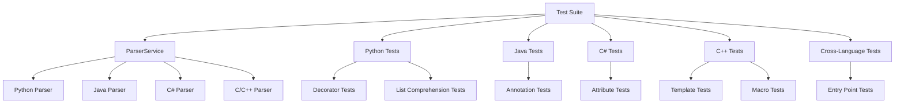

# Codemri.Astservice Tests Unit

## 1. Overview (For Everyone)

The Codemri.Astservice Tests Unit module provides comprehensive testing capabilities for the AST (Abstract Syntax Tree) parsing service across multiple programming languages. This module ensures the reliability and accuracy of code parsing functionality by validating language-specific features and constructs.

**Key problems it solves:**
- Validates parsing accuracy for different programming languages
- Ensures proper extraction of language-specific constructs (decorators, annotations, attributes, templates, macros)
- Verifies dependency graph generation and metrics calculation
- Confirms entry point identification across languages

**Primary capabilities:**
- Python parsing validation (decorators, list comprehensions)
- Java parsing validation (annotations)
- C# parsing validation (attributes)
- C/C++ parsing validation (templates, macros)
- Cross-language entry point detection
- Cyclomatic complexity metrics verification

## 2. User Guide (For End Users)

### How to Use the Features

The test suite automatically validates the parsing service capabilities. To run the tests:

```bash
npm test
```

The tests will automatically:
- Initialize the ParserService
- Execute language-specific parsing tests
- Validate the structure and content of generated ASTs
- Verify metrics and entry points

### Configuration Options

The test suite uses the ParserService with default configurations. No user-facing configuration options are available as this is a test module.

### Common Use Cases

1. **Validating Python Code Parsing**
   - Tests decorator recognition (`@app.route`, `@auth_required`)
   - Validates list comprehension parsing
   - Ensures proper complexity metrics

2. **Testing Java Annotation Support**
   - Verifies `@RestController` and `@RequestMapping` annotation parsing
   - Validates class-level and method-level annotations

3. **C# Attribute Validation**
   - Tests `[ApiController]` and `[Route]` attribute recognition
   - Validates method attributes like `[HttpGet]`

4. **C/C++ Feature Testing**
   - Template definition parsing (`template <typename T>`)
   - Macro definition recognition (`#define`)

5. **Entry Point Detection**
   - Identifies main functions and entry points across languages

## 3. Technical Architecture (For Developers)

### Architectural Pattern
Test Suite Pattern with Behavior-Driven Development (BDD) style testing using Mocha/Chai

### Metrics
- **Cohesion**: 1.00 (Highly cohesive - focused on testing parsing functionality)
- **Coupling**: 0.00 (No external coupling - only depends on ParserService)
- **Complexity**: 7.0 (Moderate complexity due to multiple language test scenarios)

### Class/Component Structure

The test suite consists of:
- **Main Test Suite**: `Language Support & Parsing Tests`
- **Language-Specific Test Groups**:
  - Python Parsing Tests
  - Java Parsing Tests
  - C# Parsing Tests
  - C++ Parsing Tests
  - Cross-Language References Tests

### Important Public Interfaces

- **ParserService**: Core service for parsing code
  - `parseCode(code, language, filename)`: Parses code and returns AST with metrics
  - Returns object containing:
    - `dependencyGraph.Nodes`: Array of AST nodes
    - `metrics.cyclomaticComplexity`: Complexity metrics
    - `entryPoints`: Array of identified entry points

### Mermaid Component Diagram



## 4. Operations & Deployment (For DevOps)

### External Dependencies
- **None detected** - The test module only depends on the internal ParserService

### Configuration

**Environment Variables:**
- No specific environment variables required

**Settings Files:**
- No configuration files needed
- Test cases are hardcoded within the test suite

**Dependencies:**
- `chai`: Assertion library
- `mocha`: Test runner (implied from describe/it structure)
- `ParserService`: Internal service from `../../src/services/parserService`

### Troubleshooting and Logs

**Common Issues:**
1. **ParserService Not Found**
   - Ensure ParserService is correctly located at `../../src/services/parserService`
   - Verify the service is properly exported

2. **Test Failures**
   - Check if language-specific parsing features are implemented
   - Verify AST node structure matches expected format
   - Ensure dependency graph contains expected node types

**Debugging Tips:**
- Use `console.log(result)` to inspect parsing results
- Verify node types in `dependencyGraph.Nodes` array
- Check `Properties` object for language-specific features (Decorators, Annotations, etc.)

## 5. API Reference (If applicable)

### ParserService Methods

#### parseCode(code, language, filename)
Parses source code and generates AST with metrics.

**Parameters:**
- `code` (string): Source code to parse
- `language` (string): Programming language identifier ('python', 'java', 'csharp', 'cpp', 'c')
- `filename` (string): Name of the file being parsed

**Returns:**
Promise resolving to an object containing:
- `dependencyGraph` (object): Contains `Nodes` array with AST nodes
- `metrics` (object): Contains `cyclomaticComplexity` number
- `entryPoints` (array): Array of entry point objects with `name` property

**Example Usage:**
```javascript
const result = await parserService.parseCode(code, 'python', 'test.py');
const nodes = result.dependencyGraph.Nodes;
const complexity = result.metrics.cyclomaticComplexity;
const entryPoints = result.entryPoints;

<details>
<summary>Relevant source files</summary>

- [codeMRI.ASTService/tests/unit/languageSupport.test.js](/var/folders/9d/5x7df5dx5zxcjnl4dbxzfqw00000gn/T/codeMRI_982cf0c472d443648edb9ca4f0587557/blob/main/codeMRI.ASTService/tests/unit/languageSupport.test.js)
</details>
