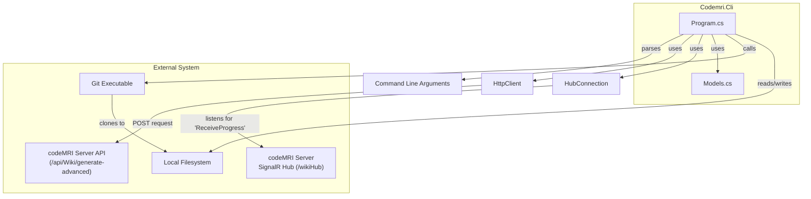

# Codemri.Cli

### 1. Overview (For Everyone)

The `Codemri.Cli` module is a command-line interface (CLI) that acts as a thin client for the codeMRI system. Its primary purpose is to provide a terminal-based way for users to trigger the generation of documentation for a given codebase.

**Key problems it solves:**
*   Provides a programmatic and scriptable interface to the codeMRI documentation engine, catering to users who prefer working in a command-line environment.
*   Automates the initial setup of handling Git repositories by cloning them locally before processing.
*   Enables users to retrieve the generated documentation as local Markdown files, which can be used in static site generators, stored for archiving, or viewed in any text editor.

**Primary capabilities:**
*   Accepts a local file path or a remote Git repository URL as input.
*   Communicates with a remote `codeMRI` server to perform the heavy lifting of documentation analysis and generation.
*   Subscribes to real-time progress updates from the server, providing feedback directly in the terminal during long-running generation tasks.
*   Saves the final generated documentation, structured as a collection of pages, to a user-specified directory on the local machine.

### 2. User Guide (For End Users)

The `codeMRI.Cli` is a command-line tool. You run it from your terminal, providing options to control its behavior.

**How to use the features:**

To generate documentation, you execute the `codemri.cli` command with the required and optional arguments. The core operation involves specifying an input source (a local path or a Git URL) and the address of the codeMRI server.

**Configuration options (user-facing):**

The tool is configured exclusively via command-line options:

| Option | Aliases | Required | Description |
|---|---|---|---|
| `--input` | `-i` | Yes | The path to a local repository directory or a URL to a Git repository. |
| `--server` | `-s` | No | The URL of the codeMRI Server. Defaults to `http://localhost:5247`. |
| `--verbose` | `-v` | No | Enables detailed logging, including connection status and server responses. |
| `--force` | `-f` | No | Instructs the server to regenerate the documentation from scratch, ignoring any cached results. |
| `--output` | `-o` | No | A local directory path where the generated Markdown files will be saved. If not provided, the documentation is generated on the server but not saved locally by the CLI. |

**Common use cases:**

1.  **Generate documentation for a local project and save it to a `docs` folder:**
    ```sh
    codemri.cli -i /path/to/your/project -o ./docs
    ```

2.  **Generate documentation for a public Git repository:**
    ```sh
    codemri.cli -i https://github.com/some-user/some-repo.git -o ./repo-docs
    ```

3.  **Force regeneration of documentation for a local project with verbose output:**
    ```sh
    codemri.cli -i /path/to/your/project --force --verbose
    ```

### 3. Technical Architecture (For Developers)

**Architectural Pattern:**
The module follows a **Client-Server** architectural pattern. The `Codemri.Cli` is a "Thin Client" responsible for user interaction, input preparation, and response handling, while a separate `codeMRI.Server` handles the core logic of analysis and generation.

**Metrics:**
*   **Cohesion:** 0,00 (Indicates the main `Program` class handles multiple, distinct responsibilities).
*   **Coupling:** 1,00 (Indicates a high degree of coupling, primarily to the `codeMRI.Server` API and external libraries like `System.CommandLine`).
*   **Complexity:** 29,0 (A moderate complexity score, reflecting the orchestration of multiple tasks like HTTP requests, SignalR connections, and file I/O).

**Class/Component structure and key relationships:**

*   **`Program`**: The main entry point and orchestrator. It is responsible for:
    *   Parsing command-line arguments using `System.CommandLine`.
    *   Handling input, including cloning Git repositories via an external `GitHelper`.
    *   Establishing an `HttpClient` for communication with the server.
    *   Setting up a `HubConnection` to receive real-time progress updates via SignalR.
    *   Deserializing the server's JSON response into `WikiStructure` and `WikiPage` models.
    *   Writing the final Markdown files to the local filesystem.
*   **`Models` (`WikiStructure`, `WikiPage`, `ProgressInfo`)**: These are Plain Old C# Objects (POCOs) used as Data Transfer Objects (DTOs). `WikiStructure` and `WikiPage` model the expected JSON response from the server, while `ProgressInfo` models the data received through the SignalR hub.
*   **`HttpClient`**: A standard .NET class used for making the `POST` request to the `codeMRI.Server` API endpoint.
*   **`HubConnection`**: A component from the `Microsoft.AspNetCore.SignalR.Client` library used to establish a persistent connection with the server's SignalR hub for receiving progress notifications.

**Important public interfaces:**
The primary public interface is the command-line itself. The key programmatic interaction is the HTTP request made to the server. The request payload sent to `POST /api/Wiki/generate-advanced` has the following structure:
```json
{
  "RepoPath": "string",
  "Language": "Detected automatically",
  "ForceRegenerate": "boolean",
  "SkipPersistence": "boolean",
  "ConnectionId": "string|null"
}
```

**Mermaid Component Diagram:**



### 4. Operations & Deployment (For DevOps)

**External dependencies:**
*   **codeMRI Server**: This is the most critical dependency. The CLI is non-functional without a running and accessible `codeMRI.Server` instance. The server must be reachable at the URL specified by the `--server` option.
*   **Git**: The `git` command-line tool must be installed and available in the system's PATH environment variable on the machine where the CLI is run. This is required for the `--input` option to work with Git URLs.

**Configuration:**
The module does not use configuration files or environment variables. All configuration is provided at runtime via command-line arguments. See the User Guide section for a complete list of options.

**Troubleshooting and Logs:**
*   **Logging**: The application outputs all logs and messages to the standard console output (`stdout`). The `--verbose` flag enables more granular logging, which is useful for debugging connection issues or understanding server responses.
*   **Common Issues and Solutions**:
    *   **Error: "Error connecting to server"**
        *   **Cause**: The `codeMRI.Server` is not running, the firewall is blocking the connection, or the `--server` URL is incorrect.
        *   **Solution**: Ensure the server is running and accessible from the client machine. Verify the URL and network connectivity.
    *   **Error: "Error cloning repository"**
        *   **Cause**: The Git URL is invalid, authentication is required but not provided, or the `git` executable is not found.
        *   **Solution**: Validate the Git URL. Ensure `git` is installed and in the system's PATH.
    *   **Error: "Directory not found: {path}"**
        *   **Cause**: The path provided to `--input` does not exist or is not a directory.
        *   **Solution**: Check that the local path is correct and points to a valid directory.
    *   **Error: "Server Error: {StatusCode}"**
        *   **Cause**: The server-side processing failed. The CLI will print the detailed error message returned by the server.
        *   **Solution**: Check the server logs for more details on the internal error.

### 5. API Reference (If applicable)

The `Codemri.Cli` module is a client and does not expose a public API itself. Instead, it consumes a single API endpoint on the `codeMRI.Server`.

**Endpoint: `POST /api/Wiki/generate-advanced`**

*   **Description**: This endpoint is called by the CLI to start the documentation generation process on the server.
*   **Request Headers**: `Content-Type: application/json`
*   **Request Body**: A JSON object with the following properties:
    *   `RepoPath` (string): The absolute path to the source code on the server's accessible filesystem.
    *   `Language` (string): A hint for the language. The CLI sends "Detected automatically".
    *   `ForceRegenerate` (boolean): If true, instructs the server to bypass its cache.
    *   `SkipPersistence` (boolean): If true, indicates the server should not persist the results to its own database.
    *   `ConnectionId` (string|null): The SignalR connection ID, if established, for receiving progress updates.
*   **Success Response (200 OK)**:
    *   **Content-Type**: `application/json`
    *   **Body**: A `WikiStructure` object representing the generated documentation.
        ```json
        {
          "Title": "string",
          "Description": "string",
          "Pages": [
            {
              "Id": "string",
              "Title": "string",
              "Description": "string",
              "Content": "string"
            }
          ]
        }
        ```
*   **Error Response (4xx/5xx)**:
    *   **Content-Type**: `text/plain` or `application/json`
    *   **Body**: A plain text or JSON error message describing the failure.

<details>
<summary>Relevant source files</summary>

- [codeMRI.CLI/Models.cs](/var/folders/9d/5x7df5dx5zxcjnl4dbxzfqw00000gn/T/codeMRI_982cf0c472d443648edb9ca4f0587557/blob/main/codeMRI.CLI/Models.cs)
- [codeMRI.CLI/Program.cs](/var/folders/9d/5x7df5dx5zxcjnl4dbxzfqw00000gn/T/codeMRI_982cf0c472d443648edb9ca4f0587557/blob/main/codeMRI.CLI/Program.cs)
</details>
