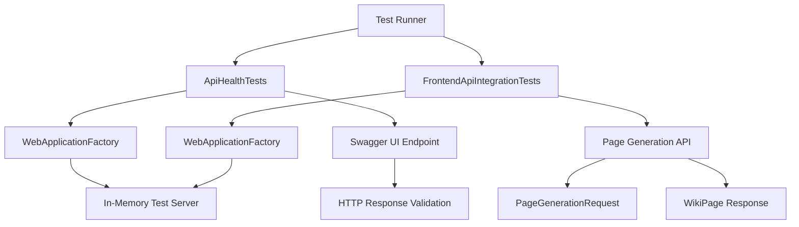

# Codemri.E2e

## 1. Overview (For Everyone)

The Codemri.E2e module is an end-to-end testing suite designed to validate the functionality and health of the codeMRI application's API endpoints. It ensures that the system's core features, particularly the API documentation interface and page generation capabilities, are working correctly in an integrated environment.

**Key Problems It Solves:**
- Validates API accessibility and proper response handling
- Ensures Swagger UI documentation is correctly served
- Tests the wiki page generation feature with real repository data
- Provides automated regression testing for critical API endpoints

**Primary Capabilities:**
- Health check verification for Swagger UI endpoint
- Integration testing for frontend API endpoints
- Page generation workflow testing with repository content
- Automated test execution with proper setup and teardown

## 2. User Guide (For End Users)

### How to Use the Features

The Codemri.E2e module is primarily used by developers and QA teams to validate the application's API functionality. The tests are executed automatically as part of the test suite.

**Running the Tests:**
- Use your preferred test runner (NUnit console, Visual Studio Test Explorer, or CI/CD pipeline)
- Tests will automatically set up the WebApplicationFactory and execute the test cases
- No manual configuration is required for basic execution

### Configuration Options

**Test Repository Path:**
- The `FrontendApiIntegrationTests` uses a hardcoded test repository path: `/Users/levente/AI/OllamaRAG5`
- Update this path in the source code to point to your test repository

**Test Timeout:**
- The HTTP client timeout is set to 5 minutes to accommodate longer ingestion operations
- Modify the `_client.Timeout` value in `OneTimeSetup()` if needed

### Common Use Cases

1. **API Health Verification**: Run `ApiHealthTests` to ensure Swagger UI is accessible
2. **Page Generation Testing**: Execute `FrontendApiIntegrationTests` to validate the wiki page generation feature
3. **CI/CD Pipeline Integration**: Include these tests in your deployment pipeline to validate API functionality before release

## 3. Technical Architecture (For Developers)

**Architectural Pattern:** Microservices

**Metrics:**
- Cohesion: 0.00
- Coupling: 1.00
- Complexity: 9.0

### Class/Component Structure

The module consists of two main test classes:

1. **ApiHealthTests**
   - Tests the accessibility of the Swagger UI endpoint
   - Uses WebApplicationFactory for in-memory test server
   - Validates HTTP response status and content type

2. **FrontendApiIntegrationTests**
   - Tests the page generation API endpoint
   - Handles complex request/response objects for wiki page creation
   - Includes timeout configuration for long-running operations

### Important Public Interfaces

```csharp
// Test fixture setup and teardown
[OneTimeSetUp] public void Setup()
[OneTimeTearDown] public void TearDown()

// Key test methods
[Test] public async Task Get_SwaggerUI_ReturnsSuccessAndHtml()
[Test] public async Task GeneratePage_WithValidPathAndFiles_ReturnsPage()
```

### Mermaid Component Diagram



## 4. Operations & Deployment (For DevOps)

### External Dependencies

**None detected.** The module operates with in-memory test server using WebApplicationFactory and does not require external databases, APIs, or message queues.

### Configuration

**Environment Variables:**
- No explicit environment variables are required

**Settings Files:**
- No configuration files are needed for test execution
- Test repository path is hardcoded in `FrontendApiIntegrationTests.cs`

**Runtime Requirements:**
- .NET runtime compatible with the test project
- Access to the test repository path specified in the tests

### Troubleshooting and Logs

**Common Issues:**

1. **Repository Path Not Found**
   - Error: Tests fail due to invalid repository path
   - Solution: Update `TestRepoPath` in `FrontendApiIntegrationTests.cs` to a valid path

2. **Timeout Issues**
   - Error: Tests timeout during page generation
   - Solution: Increase the `_client.Timeout` value in `OneTimeSetup()`

3. **Port Conflicts**
   - Error: WebApplicationFactory fails to start due to port conflicts
   - Solution: Ensure no conflicting processes are running

**Logging:**
- Test output includes detailed error messages via `TestContext.WriteLine()`
- Failed responses include status codes and content for debugging
- Use standard NUnit test runners to capture and view logs

## 5. API Reference (If applicable)

### Key Endpoints Tested

1. **Swagger UI Endpoint**
   - **Method:** GET
   - **Path:** `/swagger/index.html`
   - **Expected Response:** HTML content with media type `text/html`
   - **Status Code:** 200-299 (Success)

2. **Page Generation API**
   - **Method:** POST
   - **Path:** `api/wiki/page`
   - **Request Body:** `PageGenerationRequest`
     ```json
     {
       "RepoPath": "string",
       "Title": "string",
       "FilePaths": ["string"],
       "Language": "string",
       "ForceRegenerate": boolean
     }
     ```
   - **Response Body:** `WikiPage` object
   - **Expected Status Code:** 200 (Success)

### Key Test Methods

- `Get_SwaggerUI_ReturnsSuccessAndHtml()`: Validates Swagger UI accessibility
- `GeneratePage_WithValidPathAndFiles_ReturnsPage()`: Tests page generation workflow

<details>
<summary>Relevant source files</summary>

- [codeMRI.E2E/ApiHealthTests.cs](/var/folders/9d/5x7df5dx5zxcjnl4dbxzfqw00000gn/T/codeMRI_982cf0c472d443648edb9ca4f0587557/blob/main/codeMRI.E2E/ApiHealthTests.cs)
- [codeMRI.E2E/FrontendApiIntegrationTests.cs](/var/folders/9d/5x7df5dx5zxcjnl4dbxzfqw00000gn/T/codeMRI_982cf0c472d443648edb9ca4f0587557/blob/main/codeMRI.E2E/FrontendApiIntegrationTests.cs)
</details>
