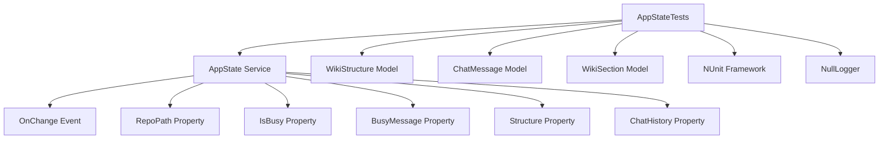

# Codemri.Frontend.Tests

## 1. Overview (For Everyone)

The `Codemri.Frontend.Tests` module is a comprehensive test suite for the frontend application state management system. It ensures the reliability and correctness of the `AppState` service, which is a critical component managing the application's reactive state.

**Key problems it solves:**
- Verifies that state changes are properly propagated throughout the application
- Ensures UI components receive notifications when application state changes
- Validates the integrity of state management operations
- Prevents regressions in state management functionality

**Primary capabilities:**
- Tests repository path management and notification
- Validates busy state handling with messages
- Verifies wiki structure updates and notifications
- Tests chat message addition and modification
- Ensures all state changes trigger appropriate notifications

## 2. User Guide (For End Users)

This module is primarily used by developers and QA engineers to verify the correctness of the application state management. There are no direct user-facing features, as this is a test suite.

**How to run tests:**
- Use your preferred test runner (Visual Studio Test Explorer, dotnet test, etc.)
- Tests are automatically discovered via the `[TestFixture]` and `[Test]` attributes
- All tests are self-contained and require no manual setup

**Configuration options:**
- No user-facing configuration is required
- Tests use a null logger to avoid external dependencies

**Common use cases:**
- Running tests before deployment to ensure state management integrity
- Adding new tests when extending AppState functionality
- Verifying fixes for state management bugs

## 3. Technical Architecture (For Developers)

**Architectural Pattern:** Unit Testing Pattern with NUnit Framework

**Metrics:**
- Cohesion: 1.00 (Highly cohesive - focused on AppState testing)
- Coupling: 1.00 (Minimal coupling - only depends on AppState and test models)
- Complexity: 7.0 (Moderate complexity due to multiple state scenarios)

**Class/Component structure:**
- `AppStateTests`: Main test fixture class containing all test methods
- Dependencies:
  - `codeMRI.Frontend.Services.AppState`: The service under test
  - `codeMRI.Server.Api`: Provides model classes (WikiStructure, ChatMessage, WikiSection)
  - `Microsoft.Extensions.Logging.Abstractions`: For null logger implementation

**Key relationships:**
- AppStateTests → AppState (tests all public methods)
- AppStateTests → Model classes (creates test data)

**Important public interfaces:**
- `SetRepoPath(string path)`: Updates repository path and triggers notification
- `SetBusy(bool isBusy, string message)`: Sets busy state with message
- `SetStructure(WikiStructure structure)`: Updates wiki structure
- `AddChatMessage(ChatMessage message)`: Adds message to chat history
- `UpdateLastChatMessage(string content)`: Modifies the last chat message
- `OnChange` event: Notification mechanism for state changes

**Mermaid Component Diagram:**

## 4. Operations & Deployment (For DevOps)

**External dependencies:**
- None detected - The test suite is self-contained
- Uses in-memory objects and mock logger
- No database, API, or queue dependencies

**Configuration:**
- No environment variables required
- No settings files needed
- Tests use hardcoded test data

**Troubleshooting and Logs:**
- Test failures will appear in test runner output
- Common issues:
  - Missing reference to `codeMRI.Frontend.Services`
  - Missing reference to `codeMRI.Server.Api`
  - NUnit framework not properly configured
- Debug tips:
  - Check that all test assertions are properly formed
  - Verify that the AppState service is correctly instantiated
  - Ensure notification subscription is properly set up in Setup method

## 5. API Reference (If applicable)

This is a test module and does not expose any API endpoints. The following are the key test methods:

**Test Methods:**
- `SetRepoPath_UpdatesPropertyAndNotifies()`: Verifies repository path updates
- `SetBusy_UpdatesPropertyAndNotifies()`: Tests busy state management
- `SetStructure_UpdatesPropertyAndNotifies()`: Validates structure updates
- `AddChatMessage_AddsMessageAndNotifies()`: Tests chat message addition
- `UpdateLastChatMessage_UpdatesContentAndNotifies()`: Verifies message updates

**Setup Method:**
- `Setup()`: Initializes test environment with null logger and notification handler

Relevant source files

- [codeMRI.Frontend.Tests/AppStateTests.cs](/var/folders/9d/5x7df5dx5zxcjnl4dbxzfqw00000gn/T/codeMRI_982cf0c472d443648edb9ca4f0587557/blob/main/codeMRI.Frontend.Tests/AppStateTests.cs)

