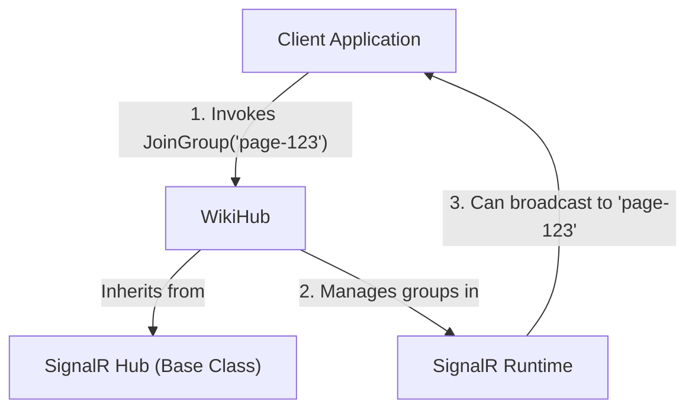

# Codemri.Server Hubs

## 1. Overview (For Everyone)

The `Codemri.Server Hubs` module provides the real-time communication backbone for the application, specifically for features related to collaborative viewing and editing. It uses ASP.NET Core SignalR to enable instant, bidirectional messaging between the server and connected clients (like a web browser).

**Key problems it solves:**

*   **Stale Data:** Prevents users from seeing outdated information. Without real-time updates, a user would not know if another person modified the content they are currently viewing.
*   **Poor User Experience:** Eliminates the need for manual page refreshing to see the latest changes, providing a seamless and interactive experience.

**Primary capabilities:**

*   **Group Management:** Allows clients to dynamically subscribe to ("join") or unsubscribe from ("leave") named communication channels, referred to as "groups".
*   **Targeted Messaging:** Forms the foundation for sending messages only to clients who have joined a specific group, ensuring that users only receive updates relevant to their current context (e.g., the specific page they are viewing).

## 2. User Guide (For End Users)

The functionality of this module is exposed automatically through the application's user interface. You do not need to configure or interact with it directly.

**How to use the features:**

The real-time features work in the background as you use the application.

1.  **Subscribing to Updates:** When you navigate to a specific page or section of the application (e.g., a "Wiki Page"), your browser automatically connects to the server and joins a group associated with that page.
2.  **Receiving Updates:** While you are on that page, if another user makes a change, your browser will instantly receive a notification from the server. This might manifest as a pop-up, a highlighted change on the page, or an automatic refresh of the content.
3.  **Unsubscribing from Updates:** When you navigate away from the page or close your browser tab, your client automatically leaves the group, and you will no longer receive updates for it.

**Configuration options (user-facing):**

There are no user-facing configuration options. The system handles all subscriptions and unsubscriptions automatically based on your navigation within the application.

**Common use cases:**

*   **Collaborative Editing:** Two or more users are editing the same document. When one user saves their changes, the other users see the updates in real-time.
*   **Live Notifications:** A team is viewing a project dashboard. When a task's status is updated by one team member, the dashboard for all other viewers updates instantly.

## 3. Technical Architecture (For Developers)

The `WikiHub` class is a SignalR Hub designed to manage client group membership for real-time events related to a specific entity, like a "Wiki" page.

**Architectural Pattern:**

The component implements the **Publish/Subscribe (Pub/Sub)** pattern. Clients "subscribe" to a topic by joining a group. Other parts of the application can then "publish" messages to that group, and SignalR ensures all subscribed clients receive the message.

**Metrics:**

*   **Cohesion:** 1.00 (High - The class has a single, well-defined purpose: group management).
*   **Coupling:** 0.00 (Low - It has no dependencies on other application modules).
*   **Complexity:** 3.0 (Low - The logic is straightforward and relies entirely on the SignalR framework).

**Class/Component structure and key relationships:**

*   **`WikiHub`**: The main component that inherits from `Microsoft.AspNetCore.SignalR.Hub`. This inheritance provides the base context, connection management, and group management capabilities.
*   **`Hub` (SignalR)**: The base class from the ASP.NET Core SignalR framework. It provides the `Context` property (to access connection information like `ConnectionId`) and the `Groups` property (to manage group membership).
*   **`Clients`**: The `WikiHub` does not directly call clients, but it enables other services to do so by managing the groups they can target.

**Important public interfaces:**

*   `JoinGroup(string groupName)`: An asynchronous method that adds the current client's connection to a specified group.
    *   `groupName`: A string identifier for the group (e.g., a page ID or slug).
*   `LeaveGroup(string groupName)`: An asynchronous method that removes the current client's connection from a specified group.
    *   `groupName`: The string identifier for the group to leave.

**Mermaid Component Diagram:**

## 4. Operations & Deployment (For DevOps)

The `WikiHub` is a lightweight component with minimal operational overhead.

**External dependencies:**

*   **None detected.** The hub does not directly interact with any databases, external APIs, or message queues. Its only dependency is the ASP.NET Core SignalR framework, which is part of the host application.

**Configuration (Env vars, settings files):**

The `WikiHub` itself does not require any specific configuration via environment variables or settings files. Its behavior is entirely driven by client-side calls. The overall SignalR functionality (e.g., transport types, ping intervals) should be configured as part of the main application's startup procedure (`Program.cs` or `Startup.cs`).

**Troubleshooting and Logs:**

*   **SignalR Logs:** The primary source for troubleshooting will be the general application logs, specifically those from the Microsoft.AspNetCore.SignalR namespace. Look for errors related to connection negotiation, transport failures (e.g., WebSockets), or hub method invocation errors.
*   **Hub-Specific Logging:** The current implementation of `WikiHub` does not include any logging. For advanced debugging, a developer could add logging to the `JoinGroup` and `LeaveGroup` methods to track which connection IDs are joining or leaving specific groups. This would help diagnose issues where clients are not receiving messages they are supposed to.

## 5. API Reference

This is the real-time API exposed by the `WikiHub`. These methods are intended to be called from client-side code (e.g., JavaScript in a web browser) using the SignalR client library.

---

### `JoinGroup`

Adds the calling client to the specified group.

*   **Signature:** `Task JoinGroup(string groupName)`
*   **Parameters:**
    *   `groupName` (`string`): The name of the group to join. This should be a unique identifier for the resource the client wants to receive updates for (e.g., "wiki-page-42").
*   **Returns:** A `Task` that represents the asynchronous operation.
*   **Description:** When a client calls this method, the server adds its connection to the specified group. The client will then receive any messages sent to that group.

---

### `LeaveGroup`

Removes the calling client from the specified group.

*   **Signature:** `Task LeaveGroup(string groupName)`
*   **Parameters:**
    *   `groupName` (`string`): The name of the group to leave.
*   **Returns:** A `Task` that represents the asynchronous operation.
*   **Description:** When a client calls this method, the server removes its connection from the specified group. The client will stop receiving messages sent to that group.

Relevant source files

- [codeMRI.Server/Hubs/WikiHub.cs](/var/folders/9d/5x7df5dx5zxcjnl4dbxzfqw00000gn/T/codeMRI_982cf0c472d443648edb9ca4f0587557/blob/main/codeMRI.Server/Hubs/WikiHub.cs)

