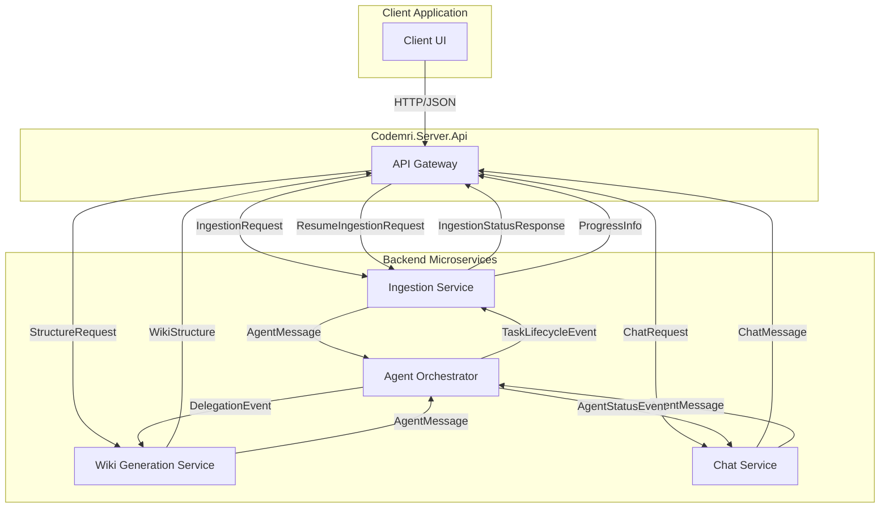

# Codemri.Server.Api

## 1. Overview (For Everyone)

The `Codemri.Server.Api` module is the core API layer for a system designed to intelligently process and understand code repositories. It acts as the central hub for initiating and monitoring complex analysis tasks and provides the data contracts for all interactions.

The primary problems this module solves are the manual effort and time required to understand and document large, unfamiliar codebases. It automates the process of ingesting source code, structuring it into a navigable wiki, and enabling a conversational interface to query the code's functionality and architecture.

Key capabilities provided through this API include:

*   **Repository Ingestion**: Initiating and managing the process of analyzing a code repository, either from a local path or a remote URL.
*   **Progress Tracking**: Providing real-time status and progress updates for long-running tasks, including the ability to resume paused operations.
*   **Wiki Structure Generation**: Requesting the generation of a structured documentation model (`WikiStructure`) for a repository, tailored to different audiences (e.g., Developers, Users).
*   **Interactive Chat**: Facilitating a conversational Q&A interface to ask questions about the ingested codebase, maintaining a history of the conversation.
*   **Agent System Communication**: Defining the data models for an underlying multi-agent system that collaboratively performs the analysis and generation tasks.

## 2. User Guide (For End Users)

This module provides the data models for interacting with the system's features. As an end user, you will interact with a client application that sends requests defined by these models.

### How to Use the Features

The typical workflow involves the following steps:

1.  **Ingest a Repository**: You start by providing the location of your code. You can either point to a local repository path or provide a URL. This is done using an `IngestionRequest` or `IngestRequest`. You can also control the behavior with flags like `Force` to re-process data or `Delete` to clean up previous results.
2.  **Monitor Progress**: Once ingestion starts, you can monitor its progress. The system provides detailed status updates through an `IngestionStatusResponse`, which tells you how many files are processed, the percentage complete, and any errors encountered. If the process is interrupted, you can use a `ResumeIngestionRequest` to continue from where it left off.
3.  **Generate Documentation**: After ingestion, you can request the system to generate a structured wiki. Using a `StructureRequest`, you can specify the target audience (e.g., `Developer`, `User`, `DevOps`) to get documentation tailored to that level of technical detail.
4.  **Chat with Your Code**: You can then ask questions about the codebase in natural language. A `ChatRequest` containing your question and conversation history is sent, and the system responds with an answer, allowing for an interactive exploration of the project.

### Configuration Options (User-facing)

When making requests, you can configure the behavior of the system:

*   **AudienceType**: This is a key configuration available in `StructureRequest` and `IngestionRequest`. It allows you to specify the target audience for the generated content.
    *   `Developer`: Provides detailed, technical information suitable for engineers.
    *   `User`: Offers higher-level, less technical descriptions.
    *   `DevOps`: Focuses on operational and deployment-related aspects.
    *   `All`: Attempts to generate content for all audiences.
*   **Force Flags**: Options like `Force` (in `IngestRequest`) and `ForceRegenerate` (in `StructureRequest`) allow you to bypass caches and re-run processes from scratch.
*   **Language**: You can specify the output language for generated content and chat responses (e.g., "English").

### Common Use Cases

*   **Developer Onboarding**: Quickly bring new team members up to speed by having them ingest the codebase and explore its structure and functionality via the generated wiki and chat interface.
*   **Documentation Maintenance**: Automate the generation of project documentation, ensuring it stays synchronized with the actual code.
*   **Code Review and Audits**: Use the system to get a high-level overview and ask targeted questions about an unfamiliar or complex part of a system.

## 3. Technical Architecture (For Developers)

The `Codemri.Server.Api` module is built on a **Microservices** architectural pattern. The classes within this namespace serve as Data Transfer Objects (DTOs) that define the public contracts for communication between the API gateway, various backend services, and clients.

**Metrics:**
*   **Cohesion**: 0,00 (Indicates the DTOs serve a wide variety of purposes across different services).
*   **Coupling**: 1,00 (High coupling, as these DTOs are likely shared across many microservices).
*   **Complexity**: 74,0 (The complexity is derived from the number and intricacy of the DTOs, reflecting the multifaceted nature of the system's operations).

### Class/Component Structure and Key Relationships

The DTOs are organized by functional domain:

*   **Ingestion Domain**: `IngestRequest`, `IngestionRequest` (URL-based), `ResumeIngestionRequest`, `IngestionStatusResponse`, and `ProgressInfo` model the entire lifecycle of a repository ingestion job, from initiation to monitoring and resumption.
*   **Wiki/Structure Domain**: `WikiStructure`, `WikiSection`, and `StructureRequest` are used to define and request the generation of a hierarchical documentation model.
*   **Chat Domain**: `ChatRequest` and `ChatMessage` define the contract for the conversational Q&A feature.
*   **Agent Domain**: `AgentMessage`, `AgentStatusEvent`, `DelegationEvent`, and `TaskLifecycleEvent` are critical for the inter-service communication within the microservices architecture. They facilitate an event-driven, agent-based system where different services (agents) can delegate tasks, report status, and signal task completion or failure.

The relationship between these domains is sequential: An `IngestionRequest` triggers a process whose status is reported via `IngestionStatusResponse`. Upon completion, a `StructureRequest` can be made to generate a `WikiStructure`. Concurrently or subsequently, `ChatRequest`s can be made to query the ingested knowledge. The `Agent` DTOs underpin the asynchronous communication that makes this possible.

### Important Public Interfaces

The primary public interfaces are the request and response models themselves:

*   `IngestionRequest` / `IngestRequest`: To start an ingestion job.
*   `ResumeIngestionRequest`: To resume a paused job.
*   `StructureRequest`: To generate a wiki structure.
*   `ChatRequest`: To interact with the chatbot.
*   `IngestionStatusResponse`: To get the status of an ingestion job.

### Mermaid Component Diagram

## 4. Operations & Deployment (For DevOps)

### External Dependencies

Based on the provided source files, **no external dependencies** (such as specific databases, APIs, or message queues) are explicitly defined or referenced within the `Codemri.Server.Api` module itself. The module is purely a collection of data contracts. Dependencies are likely injected or configured at the service implementation level.

### Configuration

Configuration is primarily handled at runtime through the request payloads sent by the client. There are no static configuration files or environment variables defined within these DTOs.

Key runtime configuration parameters include:

*   **Repository Source**: `RepoPath` (local filesystem) or `Url` (remote repository).
*   **Operational Flags**: `Force`, `Delete`, `ForceRegenerate`, `SkipPersistence`.
*   **Processing Options**: `BatchSize` (for resuming), `Language`, `Audience`.
*   **Real-time Communication**: `ConnectionId` (likely for SignalR or similar).

### Troubleshooting and Logs

The DTOs provide several structures designed for effective monitoring and troubleshooting:

*   **IngestionStatusResponse**: This is the primary model for debugging the ingestion process. It provides:
    *   `Status`: The current state (e.g., "idle", "running", "completed").
    *   `ProgressPercentage`: A clear metric for completion.
    *   `ProcessedFiles`, `FailedFiles`: Counts to identify the scale of success or failure.
    *   `RecentErrors`: A list of the latest error messages, which is invaluable for diagnosing issues without needing to sift through extensive logs.
    *   `CanResume`: Indicates if a failure is recoverable.
    *   Timestamps (`StartedAt`, `CompletedAt`, `LastCheckpoint`): For performance analysis and identifying bottlenecks.
*   **TaskLifecycleEvent**: In the agent system, this event is crucial for logging. The `Error` property on a "Failed" event provides specific, task-level failure information.
*   **ProgressInfo**: Used for real-time updates, the `Message` field can provide context-specific information about the current phase of operation (e.g., "Parsing files", "Generating embeddings").

To troubleshoot, consume the status endpoints that return these models and inspect the `RecentErrors` and `Status` fields. For agent-level issues, logs should be correlated using the `TaskId` from `TaskLifecycleEvent`.

## 5. API Reference (If applicable)

The API exposes logical endpoints that utilize the DTOs defined in this module. While the exact routes are not defined in the source files, the contracts for the primary operations are as follows.

### Ingestion Endpoints

| Logical Endpoint | Purpose | Request DTO | Response/Status DTO |
| :--- | :--- | :--- | :--- |
| **Start Ingestion** | Initiates the analysis of a repository from a local path. | `IngestRequest` | `IngestionStatusResponse` (initial status) |
| **Start Ingestion (URL)** | Initiates the analysis of a repository from a remote URL. | `IngestionRequest` | `IngestionStatusResponse` (initial status) |
| **Resume Ingestion** | Resumes a previously paused or failed ingestion job. | `ResumeIngestionRequest` | `IngestionStatusResponse` (initial status) |
| **Get Ingestion Status** | Retrieves the current detailed status of an ingestion job. | (e.g., via a job ID in the route) | `IngestionStatusResponse` |

### Structure Generation Endpoint

| Logical Endpoint | Purpose | Request DTO | Response DTO |
| :--- | :--- | :--- | :--- |
| **Generate Wiki Structure** | Requests the creation of a hierarchical documentation model for a repository. | `StructureRequest` | `WikiStructure` |

### Chat Endpoint

| Logical Endpoint | Purpose | Request DTO | Response DTO |
| :--- | :--- | :--- | :--- |
| **Ask Question** | Submits a user query to the chat system for a given repository. | `ChatRequest` | `ChatMessage` (from the "assistant") |

Relevant source files

- [codeMRI.Server.Api/WikiSection.cs](/var/folders/9d/5x7df5dx5zxcjnl4dbxzfqw00000gn/T/codeMRI_982cf0c472d443648edb9ca4f0587557/blob/main/codeMRI.Server.Api/WikiSection.cs)
- [codeMRI.Server.Api/ResumeIngestionRequest.cs](/var/folders/9d/5x7df5dx5zxcjnl4dbxzfqw00000gn/T/codeMRI_982cf0c472d443648edb9ca4f0587557/blob/main/codeMRI.Server.Api/ResumeIngestionRequest.cs)
- [codeMRI.Server.Api/IngestRequest.cs](/var/folders/9d/5x7df5dx5zxcjnl4dbxzfqw00000gn/T/codeMRI_982cf0c472d443648edb9ca4f0587557/blob/main/codeMRI.Server.Api/IngestRequest.cs)
- [codeMRI.Server.Api/ChatMessage.cs](/var/folders/9d/5x7df5dx5zxcjnl4dbxzfqw00000gn/T/codeMRI_982cf0c472d443648edb9ca4f0587557/blob/main/codeMRI.Server.Api/ChatMessage.cs)
- [codeMRI.Server.Api/AgentDtos.cs](/var/folders/9d/5x7df5dx5zxcjnl4dbxzfqw00000gn/T/codeMRI_982cf0c472d443648edb9ca4f0587557/blob/main/codeMRI.Server.Api/AgentDtos.cs)
- [codeMRI.Server.Api/WikiStructure.cs](/var/folders/9d/5x7df5dx5zxcjnl4dbxzfqw00000gn/T/codeMRI_982cf0c472d443648edb9ca4f0587557/blob/main/codeMRI.Server.Api/WikiStructure.cs)
- [codeMRI.Server.Api/IngestionStatusResponse.cs](/var/folders/9d/5x7df5dx5zxcjnl4dbxzfqw00000gn/T/codeMRI_982cf0c472d443648edb9ca4f0587557/blob/main/codeMRI.Server.Api/IngestionStatusResponse.cs)
- [codeMRI.Server.Api/ProgressInfo.cs](/var/folders/9d/5x7df5dx5zxcjnl4dbxzfqw00000gn/T/codeMRI_982cf0c472d443648edb9ca4f0587557/blob/main/codeMRI.Server.Api/ProgressInfo.cs)
- [codeMRI.Server.Api/StructureRequest.cs](/var/folders/9d/5x7df5dx5zxcjnl4dbxzfqw00000gn/T/codeMRI_982cf0c472d443648edb9ca4f0587557/blob/main/codeMRI.Server.Api/StructureRequest.cs)
- [codeMRI.Server.Api/ChatRequest.cs](/var/folders/9d/5x7df5dx5zxcjnl4dbxzfqw00000gn/T/codeMRI_982cf0c472d443648edb9ca4f0587557/blob/main/codeMRI.Server.Api/ChatRequest.cs)
- [codeMRI.Server.Api/IngestionRequest.cs](/var/folders/9d/5x7df5dx5zxcjnl4dbxzfqw00000gn/T/codeMRI_982cf0c472d443648edb9ca4f0587557/blob/main/codeMRI.Server.Api/IngestionRequest.cs)

