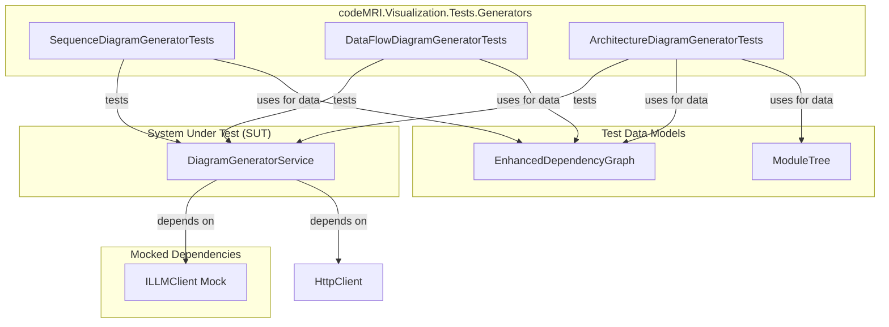

# Codemri.Visualization.Tests Generators

### 1. Overview (For Everyone)
The `Codemri.Visualization.Tests Generators` module is a dedicated test suite designed to ensure the reliability and correctness of the application's diagram generation capabilities. Its primary purpose is to validate that the `DiagramGeneratorService` can accurately translate code analysis data into various visual representations.

This module solves the critical problem of maintaining quality in the visualization pipeline. By providing automated tests, it guarantees that changes to the core visualization logic do not introduce regressions, such as generating incorrect or malformed diagrams. This gives developers confidence that the visual outputs they rely on for understanding system architecture are always accurate.

The primary capabilities of this test suite include:
- **Validating Sequence Diagram Generation**: It tests the creation of Mermaid sequence diagrams from a dependency graph, ensuring correct participant interactions and message flows.
- **Validating Data Flow Diagram Generation**: It verifies the generation of Mermaid flowcharts that represent data movement between components.
- **Validating Architecture Diagram Generation**: It ensures that high-level architectural overviews can be generated from module trees and dependency graphs.

### 2. User Guide (For End Users)
The "end users" of this module are developers and quality assurance professionals responsible for running and maintaining the test suite.

#### How to Use the Features
This module is not a feature-rich application but a collection of automated tests. Interaction is performed through a standard test runner (like the one in Visual Studio, Rider, or the .NET CLI).

To execute the tests, you typically run the entire test solution or the specific test project from your development environment or a CI/CD pipeline using a command like:
```bash
dotnet test
```
The tests are self-contained and require no manual setup or interaction during execution.

#### Configuration Options
There are no user-facing configuration options for this test module. All necessary setup, including the mocking of external services like the LLM client, is handled programmatically within the test code. This ensures the tests are isolated, repeatable, and fast.

#### Common Use Cases
- **Continuous Integration (CI)**: The primary use case is to run this test suite as part of an automated build pipeline to prevent regressions in diagram generation logic.
- **Development Validation**: A developer working on the `DiagramGeneratorService` or related components will run these tests locally to verify their changes before committing code.
- **Debugging**: If a specific diagram type is not rendering correctly, a developer can run the corresponding test class (e.g., `SequenceDiagramGeneratorTests`) to isolate and debug the issue.

### 3. Technical Architecture (For Developers)
This module is a standard unit test project built with the NUnit framework. It does not implement a complex architectural pattern but follows best practices for testing, such as dependency injection and mocking.

- **Architectural Pattern**: Unit Testing with Dependency Injection and Mocking.
- **Metrics**:
    - **Cohesion (0,00)**: The cohesion is very low because the module groups tests for three distinct functionalities (sequence, data flow, and architecture diagrams) based on their shared dependency on the `DiagramGeneratorService`.
    - **Coupling (1,00)**: The coupling is high, which is expected and desirable for a test suite. The tests are tightly coupled to the public interfaces of the `DiagramGeneratorService`, `EnhancedDependencyGraph`, and `ModuleTree` to ensure they accurately test the system's behavior.
    - **Complexity (9,0)**: The complexity is moderate, primarily driven by the setup required to build representative in-memory graph and tree structures for each test case.

#### Class/Component Structure and Key Relationships
The module consists of three main test classes, each corresponding to a type of diagram the service can generate:

- `SequenceDiagramGeneratorTests`: Contains tests for the `GenerateSequenceDiagramAsync` method.
- `DataFlowDiagramGeneratorTests`: Contains tests for the `GenerateDataFlowDiagramAsync` method.
- `ArchitectureDiagramGeneratorTests`: Contains tests for the `GenerateArchitectureDiagramAsync` method.

All three classes share a common setup pattern:
1.  They instantiate a `Mock<ILLMClient>` to isolate the `DiagramGeneratorService` from external LLM API calls.
2.  They create a `DiagramGeneratorService` instance, injecting the mocked `ILLMClient` and a new `HttpClient`.
3.  They use `EnhancedDependencyGraph` and `ModuleTree` to build test data that simulates a real codebase's structure.

#### Important Public Interfaces
The public interfaces being tested are the asynchronous methods on the `DiagramGeneratorService` class:
- `Task<string> GenerateSequenceDiagramAsync(EnhancedDependencyGraph graph, string entryPoint)`
- `Task<string> GenerateDataFlowDiagramAsync(EnhancedDependencyGraph graph, string component)`
- `Task<string> GenerateArchitectureDiagramAsync(ModuleTree moduleTree, EnhancedDependencyGraph graph)`

The test classes themselves are public to be discovered by the test runner but are not intended for use by other application code.

#### Mermaid Component Diagram


### 4. Operations & Deployment (For DevOps)
This module is designed for execution in a development or CI/CD environment and has minimal operational requirements.

#### External Dependencies
Based on the source code, this test module has **no external dependencies** at runtime. The `DiagramGeneratorService`'s dependency on an LLM client (`ILLMClient`) is mocked using the Moq library, meaning the tests do not make any network calls to external APIs, databases, or message queues.

#### Configuration
No configuration files or environment variables are required to run these tests. All setup is performed in-code within the `[SetUp]` methods of each test class. This makes the tests portable and easy to run in any environment that has the necessary .NET SDK and test runner installed.

#### Troubleshooting and Logs
- **Logs**: This module does not produce its own logs. Output is generated by the test runner (e.g., NUnit), which will report test success, failure, and any console output from the tests.
- **Troubleshooting**: A test failure typically manifests as an assertion error (e.g., `Assert.That(result, Does.Contain(...))`). This indicates that the output string from the `DiagramGeneratorService` did not match the expected Mermaid syntax. To troubleshoot, a developer must debug the `DiagramGeneratorService` itself, as the test's role is to surface the failure, not cause it.

### 5. API Reference (If applicable)
This module is a test suite and does not expose a public API for consumption by other applications or services. It contains test methods that are discovered and executed by a test runner. Therefore, an API reference is not applicable.

<details>
<summary>Relevant source files</summary>

- [codeMRI.Visualization.Tests/Generators/SequenceDiagramGeneratorTests.cs](/var/folders/9d/5x7df5dx5zxcjnl4dbxzfqw00000gn/T/codeMRI_982cf0c472d443648edb9ca4f0587557/blob/main/codeMRI.Visualization.Tests/Generators/SequenceDiagramGeneratorTests.cs)
- [codeMRI.Visualization.Tests/Generators/DataFlowDiagramGeneratorTests.cs](/var/folders/9d/5x7df5dx5zxcjnl4dbxzfqw00000gn/T/codeMRI_982cf0c472d443648edb9ca4f0587557/blob/main/codeMRI.Visualization.Tests/Generators/DataFlowDiagramGeneratorTests.cs)
- [codeMRI.Visualization.Tests/Generators/ArchitectureDiagramGeneratorTests.cs](/var/folders/9d/5x7df5dx5zxcjnl4dbxzfqw00000gn/T/codeMRI_982cf0c472d443648edb9ca4f0587557/blob/main/codeMRI.Visualization.Tests/Generators/ArchitectureDiagramGeneratorTests.cs)
</details>
