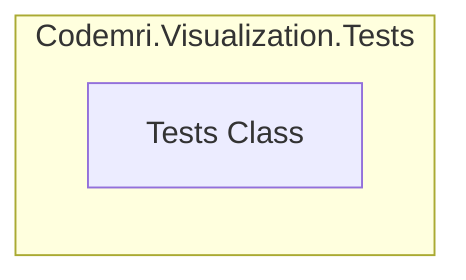

# Codemri.Visualization.Tests

### 1. Overview (For Everyone)
The `Codemri.Visualization.Tests` module is a test project designed to verify the functionality and correctness of the `Codemri.Visualization` component. Its primary purpose is to provide a structured and automated way to ensure that visualization-related features work as expected.

**Key problems it solves:**
- **Quality Assurance:** It helps prevent bugs and regressions in the visualization logic by providing a safety net of automated checks.
- **Verification:** It serves as a definitive source to confirm whether the visualization components meet their technical requirements.

**Primary capabilities:**
- Provides a basic framework for writing and executing unit tests using a standard testing framework (e.g., NUnit, xUnit).
- Includes a placeholder test (`Test1`) that validates the test infrastructure is correctly configured and can be executed successfully.

### 2. User Guide (For End Users)
The end users of this module are typically developers and QA engineers who need to run the tests to validate the codebase.

**How to use the features:**
The tests in this module are executed using a standard test runner.
- **Via an IDE:** Most modern IDEs (like Visual Studio or JetBrains Rider) have integrated test runners. You can right-click on the project or a specific test and select "Run Test(s)".
- **Via Command Line:** You can use the .NET CLI to run all tests in the project from the terminal:
  ```bash
  dotnet test
  ```

**Configuration options (user-facing):**
There are currently no user-facing configuration options for this test module.

**Common use cases:**
- **Sanity Check:** Running the single test `Test1` confirms that the testing environment is set up correctly before adding more complex tests.
- **CI/CD Integration:** This test project is intended to be integrated into a Continuous Integration/Continuous Deployment (CI/CD) pipeline to automatically run tests on every code change, ensuring that new commits do not break existing functionality.

### 3. Technical Architecture (For Developers)
The module follows a conventional unit test project structure. It is intentionally simple, containing a single test class with a setup method and a placeholder test.

**Architectural Pattern:** Not identified. The structure is a standard, flat unit test project.

**Metrics:**
- **Cohesion:** 1.00 (High)
- **Coupling:** 0.00 (None)
- **Complexity:** 3.0 (Low)

**Class/Component structure and key relationships:**
- **`Tests` Class:** This is the sole class in the module. It serves as a container for test methods.
- **`Setup()` Method:** Annotated with `[SetUp]`, this method is intended to run before each test in the class to prepare the test environment. It is currently empty.
- **`Test1()` Method:** Annotated with `[Test]`, this is a basic test method. Its only logic is `Assert.Pass()`, which causes the test to succeed unconditionally, acting as a placeholder.

**Important public interfaces:**
The public interface consists of the methods decorated with testing attributes, which are discovered and executed by the test runner:
- `Tests.Setup()`
- `Tests.Test1()`

**Mermaid Component Diagram (graph TD):**


### 4. Operations & Deployment (For DevOps)
This module is a self-contained test project with minimal operational requirements.

**External dependencies:**
None detected. The tests do not interact with any external databases, APIs, or message queues.

**Configuration (Env vars, settings files):**
There are no configuration files or environment variables required to build or run the tests in this module.

**Troubleshooting and Logs:**
- **Test Runner Output:** All test results (pass/fail) are reported directly by the test runner used to execute the tests (e.g., `dotnet test`, IDE test runner).
- **Failure Information:** If a test were to fail, the test runner would provide a detailed error message, including the assertion that failed and a stack trace, which is the primary tool for debugging.
- **Logging:** The module itself does not implement any custom logging. All output is handled by the hosting test runner.

### 5. API Reference (If applicable)
This module does not expose a consumable API for other applications. Its "API" consists of the test methods that are executed by a test runner.

**Key Methods:**

- **`Tests.Setup()`**
  - **Purpose:** A method that runs before each test to set up the test context.
  - **Attributes:** `[SetUp]`
  - **Implementation:** Currently empty.

- **`Tests.Test1()`**
  - **Purpose:** A placeholder test to verify the test infrastructure.
  - **Attributes:** `[Test]`
  - **Implementation:** Calls `Assert.Pass()`, which always results in a passed test.

<details>
<summary>Relevant source files</summary>

- [codeMRI.Visualization.Tests/UnitTest1.cs](/var/folders/9d/5x7df5dx5zxcjnl4dbxzfqw00000gn/T/codeMRI_982cf0c472d443648edb9ca4f0587557/blob/main/codeMRI.Visualization.Tests/UnitTest1.cs)
</details>
