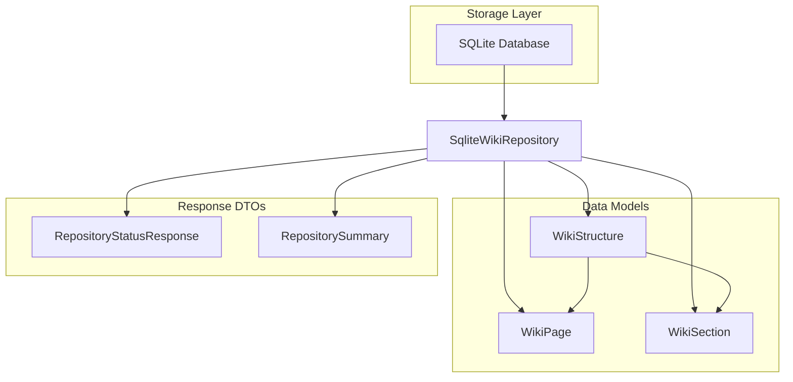

# Data

## 1. Overview (For Everyone)
The Data module provides persistent storage capabilities for wiki-related content and repository metadata. It serves as the foundational data layer for the application, enabling the storage and retrieval of wiki structures, pages, and ingestion manifests.

**Key problems it solves:**
- Persistent storage of wiki content (structures and pages) with SQLite
- Tracking repository ingestion status and metadata
- Managing file manifests for change detection
- Providing case-insensitive page lookup functionality

**Primary capabilities:**
- Store and retrieve wiki structures with nested sections
- Manage individual wiki pages with content
- Track ingestion manifests for repositories
- Query repository status and summary information
- Support for multiple repositories with isolated data

## 2. User Guide (For End Users)
This module operates as a backend service and does not expose direct user-facing features. End users interact with its capabilities through the application's higher-level interfaces.

**Configuration options:**
- Database location is configurable via connection string
- Repository path is used as a key for data isolation
- No user-facing configuration options are available

**Common use cases:**
- When a repository is ingested, its wiki structure and pages are stored
- The system tracks which files have been processed via manifests
- Repository status (ingestion state, page counts) is maintained
- Pages can be retrieved by title with case-insensitive matching

## 3. Technical Architecture (For Developers)
**Architectural Pattern:** Microservices

**Metrics:**
- Cohesion: 0.00
- Coupling: 0.00
- Complexity: 22.0

**Class/Component structure and key relationships:**
- `SqliteWikiRepository`: Core repository class handling all data operations
- `WikiStructure`: Represents the hierarchical structure of a wiki
- `WikiSection`: Individual sections within a wiki structure
- `WikiPage`: Individual wiki pages with content
- `RepositoryStatusResponse`: Response DTO for repository status queries
- `RepositorySummary`: DTO for repository summary information

**Important public interfaces:**
```csharp
// Core repository operations
Task SaveStructureAsync(string repoPath, WikiStructure structure);
Task<WikiStructure?> GetStructureAsync(string repoPath);
Task DeleteStructureAsync(string repoPath);

Task SavePageAsync(string repoPath, WikiPage page);
Task<WikiPage?> GetPageAsync(string repoPath, string pageId);
Task<WikiPage?> GetPageByTitleAsync(string repoPath, string title);

Task SaveIngestionManifestAsync(string repoPath, Dictionary<string, string> manifest);
Task<Dictionary<string, string>?> GetIngestionManifestAsync(string repoPath);
```

**Mermaid Component Diagram:**


## 4. Operations & Deployment (For DevOps)
**External dependencies:**
- SQLite database engine
- No external APIs or message queues detected

**Configuration:**
- Connection string format: `"Data Source={path_to_db_file}"`
- Database files are created in temporary locations during testing
- Repository paths are used as logical data separators

**Troubleshooting and Logs:**
- Database file permissions may cause write failures
- Concurrent access to the same SQLite file may cause locking issues
- Case-insensitive page title searches rely on proper SQLite collation
- Multiple pages with the same title will return the first found (no error thrown)

## 5. API Reference (If applicable)
**Key Methods:**

**WikiStructure Operations:**
- `SaveStructureAsync(repoPath, structure)`: Persists a wiki structure
- `GetStructureAsync(repoPath)`: Retrieves a wiki structure
- `DeleteStructureAsync(repoPath)`: Removes a wiki structure

**WikiPage Operations:**
- `SavePageAsync(repoPath, page)`: Persists a wiki page
- `GetPageAsync(repoPath, pageId)`: Retrieves a page by ID
- `GetPageByTitleAsync(repoPath, title)`: Retrieves a page by title (case-insensitive)

**Manifest Operations:**
- `SaveIngestionManifestAsync(repoPath, manifest)`: Stores file hash manifest
- `GetIngestionManifestAsync(repoPath)`: Retrieves ingestion manifest

**Response Models:**
- `RepositoryStatusResponse`: Contains existence, ingestion status, title, page count, and section count
- `RepositorySummary`: Contains path, name, remote URL, ingestion status, and creation timestamp

<details>
<summary>Relevant source files</summary>

- [codeMRI.Infrastructure.Tests/SqliteWikiRepositoryTests.cs](/var/folders/9d/5x7df5dx5zxcjnl4dbxzfqw00000gn/T/codeMRI_982cf0c472d443648edb9ca4f0587557/blob/main/codeMRI.Infrastructure.Tests/SqliteWikiRepositoryTests.cs)
- [codeMRI.Server.Api/RepositoryStatusResponse.cs](/var/folders/9d/5x7df5dx5zxcjnl4dbxzfqw00000gn/T/codeMRI_982cf0c472d443648edb9ca4f0587557/blob/main/codeMRI.Server.Api/RepositoryStatusResponse.cs)
- [codeMRI.Server.Api/RepositorySummary.cs](/var/folders/9d/5x7df5dx5zxcjnl4dbxzfqw00000gn/T/codeMRI_982cf0c472d443648edb9ca4f0587557/blob/main/codeMRI.Server.Api/RepositorySummary.cs)
</details>
