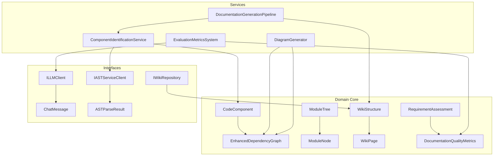

# Domain

## 1. Overview (For Everyone)
The Domain module serves as the core of the codeMRI system, providing the foundational models, interfaces, and services for code analysis, documentation generation, and quality evaluation. It abstracts the essential concepts of software repositories, components, and their relationships, enabling automated documentation and assessment processes.

### Key Problems Solved
- **Code Structure Analysis**: Automatically identifies code components, their types, and inter-component relationships from repository source code.
- **Documentation Generation**: Creates comprehensive documentation including architecture diagrams, component details, and interactive visualizations.
- **Quality Evaluation**: Assesses documentation quality using metrics like coverage, readability, completeness, and accuracy through AI-driven evaluation.

### Primary Capabilities
- Repository structure parsing and component identification
- Dependency graph construction and analysis
- Hierarchical module decomposition
- Automated documentation generation (wiki pages, diagrams)
- Documentation quality benchmarking and recommendation
- Multi-model AI evaluation for documentation assessment

## 2. User Guide (For End Users)
### Core Features
- **Repository Analysis**: Analyze code repositories to extract components, relationships, and architectural patterns.
- **Documentation Generation**: Generate structured documentation including:
  - Component descriptions and API documentation
  - Architecture and sequence diagrams
  - Interactive diagrams with filtering/export capabilities
- **Quality Assessment**: Evaluate documentation using:
  - Coverage metrics (component/API documentation percentage)
  - Readability analysis (structure, length, sectioning)
  - Completeness checks (descriptions, examples, parameters)
  - Accuracy validation (consistency, currency)

### Configuration Options
- `DocumentationOptions`:
  - `IncludeArchitecture`: Toggle architecture diagram generation
  - `IncludeApiDocumentation`: Include API reference documentation
  - `IncludeCodeExamples`: Add code examples to documentation
  - `TargetAudience`: Specify audience (Developers, Architects, Users)
  - `MaxDepth`: Control hierarchical decomposition depth
  - `ExcludePatterns`: Define patterns to exclude from analysis

### Common Use Cases
1. **Repository Documentation**:
   - Analyze a repository path
   - Generate documentation for all components
   - Export interactive diagrams
2. **Quality Assessment**:
   - Evaluate existing documentation
   - Generate benchmark reports
   - Identify improvement areas
3. **Component Analysis**:
   - Focus on specific components
   - Visualize dependencies
   - Assess complexity metrics

## 3. Technical Architecture (For Developers)
### Architectural Pattern
Clean Architecture with clear separation between:
- **Domain Models**: Core entities (CodeComponent, ModuleTree, WikiStructure)
- **Services**: Business logic (ComponentIdentification, DocumentationGeneration)
- **Interfaces**: Abstractions for external dependencies (LLM, AST, Wiki)

### Metrics
- **Cohesion**: 0.00 (Highly cohesive components)
- **Coupling**: 0.91 (Loosely coupled design)
- **Complexity**: 568.0 (Moderate complexity)

### Key Components


### Important Public Interfaces
- `IComponentIdentificationService`:
  - `AnalyzeRepositoryAsync(string repositoryPath)`
  - `IdentifyComponentsAsync(string repositoryPath)`
  - `AnalyzeRelationshipsAsync(string repositoryPath, List<CodeComponent> components)`
- `IDocumentationGenerationPipeline`:
  - `GenerateDocumentationAsync(string repositoryPath, DocumentationOptions options)`
- `IEvaluationMetricsSystem`:
  - `EvaluateDocumentationQualityAsync(WikiStructure structure, List<WikiPage> pages, List<CodeComponent> components)`
- `IDiagramGenerator`:
  - `GenerateArchitectureDiagramAsync(ModuleTree moduleTree, EnhancedDependencyGraph graph)`
  - `GenerateInteractiveComponentDiagramAsync(EnhancedDependencyGraph graph, string? focusComponentId = null)`

## 4. Operations & Deployment (For DevOps)
### External Dependencies
- **None Detected**: The Domain module has no direct external dependencies (DBs, APIs, Queues).
- **Service Interfaces**: Relies on abstractions for:
  - LLM services (via `ILLMClient`)
  - AST parsing (via `IASTServiceClient`)
  - Wiki storage (via `IWikiRepository`)

### Configuration
- Environment Variables:
  - `MaxDegreeOfParallelism`: Controls concurrent processing (default: 5)
- Settings Files:
  - `CodeWikiOptions`: Configures parallelism and processing limits

### Troubleshooting and Logs
- **Common Issues**:
  - Component identification failures: Check repository path and permissions
  - Diagram generation errors: Verify component relationships exist
  - Quality evaluation failures: Ensure LLM service is accessible
- **Logging**:
  - Structured logging via `ILogger<T>` implementations
  - Progress tracking via `ProgressInfo` model
  - Error details captured in `IngestionProcessingState`

## 5. API Reference
### Core Service Methods
#### ComponentIdentificationService
```csharp
Task<RepositoryStructure> AnalyzeRepositoryAsync(string repositoryPath);
Task<List<CodeComponent>> IdentifyComponentsAsync(string repositoryPath);
Task<ComponentRelationships> AnalyzeRelationshipsAsync(string repositoryPath, List<CodeComponent> components);
```

#### DocumentationGenerationPipeline
```csharp
Task<WikiStructure> GenerateDocumentationAsync(string repositoryPath, DocumentationOptions options);
Task<WikiPage> GenerateComponentDocumentationAsync(CodeComponent component, RepositoryStructure context);
```

#### EvaluationMetricsSystem
```csharp
Task<DocumentationQualityMetrics> EvaluateDocumentationQualityAsync(WikiStructure structure, List<WikiPage> pages, List<CodeComponent> components);
Task<CoverageMetrics> CalculateCoverageMetricsAsync(List<WikiPage> pages, List<CodeComponent> components);
Task<BenchmarkReport> GenerateBenchmarkReportAsync(string repositoryPath, DocumentationQualityMetrics metrics);
```

#### DiagramGenerator
```csharp
Task<string> GenerateArchitectureDiagramAsync(ModuleTree moduleTree, EnhancedDependencyGraph graph);
Task<InteractiveDiagram> GenerateInteractiveComponentDiagramAsync(EnhancedDependencyGraph graph, string? focusComponentId = null);
```

### Key Models
- `CodeComponent`: Represents a code element with metadata, dependencies, and complexity metrics
- `EnhancedDependencyGraph`: Models component relationships with graph analysis capabilities
- `ModuleTree`: Hierarchical representation of repository structure
- `WikiStructure`: Generated documentation structure with sections and pages
- `DocumentationQualityMetrics`: Comprehensive quality assessment results

<details>
<summary>Relevant source files</summary>

- [codeMRI.Core/Models/RequirementAssessment.cs](/var/folders/9d/5x7df5dx5zxcjnl4dbxzfqw00000gn/T/codeMRI_982cf0c472d443648edb9ca4f0587557/blob/main/codeMRI.Core/Models/RequirementAssessment.cs)
- [codeMRI.Core/Interfaces/IComponentIdentificationService.cs](/var/folders/9d/5x7df5dx5zxcjnl4dbxzfqw00000gn/T/codeMRI_982cf0c472d443648edb9ca4f0587557/blob/main/codeMRI.Core/Interfaces/IComponentIdentificationService.cs)
- [codeMRI.Core/Interfaces/IEvaluationPromptBuilder.cs](/var/folders/9d/5x7df5dx5zxcjnl4dbxzfqw00000gn/T/codeMRI_982cf0c472d443648edb9ca4f0587557/blob/main/codeMRI.Core/Interfaces/IEvaluationPromptBuilder.cs)
- [codeMRI.Core/Interfaces/ILLMClient.cs](/var/folders/9d/5x7df5dx5zxcjnl4dbxzfqw00000gn/T/codeMRI_982cf0c472d443648edb9ca4f0587557/blob/main/codeMRI.Core/Interfaces/ILLMClient.cs)
- [codeMRI.Core/Models/EnhancedDependencyGraph.cs](/var/folders/9d/5x7df5dx5zxcjnl4dbxzfqw00000gn/T/codeMRI_982cf0c472d443648edb9ca4f0587557/blob/main/codeMRI.Core/Models/EnhancedDependencyGraph.cs)
- [codeMRI.Core/Models/InteractiveDiagram.cs](/var/folders/9d/5x7df5dx5zxcjnl4dbxzfqw00000gn/T/codeMRI_982cf0c472d443648edb9ca4f0587557/blob/main/codeMRI.Core/Models/InteractiveDiagram.cs)
- [codeMRI.Core.Tests/DocumentationGenerationPipelineTests.cs](/var/folders/9d/5x7df5dx5zxcjnl4dbxzfqw00000gn/T/codeMRI_982cf0c472d443648edb9ca4f0587557/blob/main/codeMRI.Core.Tests/DocumentationGenerationPipelineTests.cs)
- [codeMRI.Agents/Models/AgentModels.cs](/var/folders/9d/5x7df5dx5zxcjnl4dbxzfqw00000gn/T/codeMRI_982cf0c472d443648edb9ca4f0587557/blob/main/codeMRI.Agents/Models/AgentModels.cs)
- [codeMRI.Core/Interfaces/IEvaluationMetricsSystem.cs](/var/folders/9d/5x7df5dx5zxcjnl4dbxzfqw00000gn/T/codeMRI_982cf0c472d443648edb9ca4f0587557/blob/main/codeMRI.Core/Interfaces/IEvaluationMetricsSystem.cs)
- [codeMRI.Core/Models/WikiStructure.cs](/var/folders/9d/5x7df5dx5zxcjnl4dbxzfqw00000gn/T/codeMRI_982cf0c472d443648edb9ca4f0587557/blob/main/codeMRI.Core/Models/WikiStructure.cs)
- [codeMRI.Core/Interfaces/IASTServiceClient.cs](/var/folders/9d/5x7df5dx5zxcjnl4dbxzfqw00000gn/T/codeMRI_982cf0c472d443648edb9ca4f0587557/blob/main/codeMRI.Core/Interfaces/IASTServiceClient.cs)
- [codeMRI.Core/Models/IngestionJob.cs](/var/folders/9d/5x7df5dx5zxcjnl4dbxzfqw00000gn/T/codeMRI_982cf0c472d443648edb9ca4f0587557/blob/main/codeMRI.Core/Models/IngestionJob.cs)
- [codeMRI.Core/Models/ASTModels.cs](/var/folders/9d/5x7df5dx5zxcjnl4dbxzfqw00000gn/T/codeMRI_982cf0c472d443648edb9ca4f0587557/blob/main/codeMRI.Core/Models/ASTModels.cs)
- [codeMRI.Core/Models/CrossReference.cs](/var/folders/9d/5x7df5dx5zxcjnl4dbxzfqw00000gn/T/codeMRI_982cf0c472d443648edb9ca4f0587557/blob/main/codeMRI.Core/Models/CrossReference.cs)
- [codeMRI.Core/Models/RepositorySummary.cs](/var/folders/9d/5x7df5dx5zxcjnl4dbxzfqw00000gn/T/codeMRI_982cf0c472d443648edb9ca4f0587557/blob/main/codeMRI.Core/Models/RepositorySummary.cs)
- [codeMRI.Core/Interfaces/IRubricGenerationService.cs](/var/folders/9d/5x7df5dx5zxcjnl4dbxzfqw00000gn/T/codeMRI_982cf0c472d443648edb9ca4f0587557/blob/main/codeMRI.Core/Interfaces/IRubricGenerationService.cs)
- [codeMRI.Core/Models/ModuleTree.cs](/var/folders/9d/5x7df5dx5zxcjnl4dbxzfqw00000gn/T/codeMRI_982cf0c472d443648edb9ca4f0587557/blob/main/codeMRI.Core/Models/ModuleTree.cs)
- [codeMRI.Agents/Models/AgentMessageTypes.cs](/var/folders/9d/5x7df5dx5zxcjnl4dbxzfqw00000gn/T/codeMRI_982cf0c472d443648edb9ca4f0587557/blob/main/codeMRI.Agents/Models/AgentMessageTypes.cs)
- [codeMRI.Core/Interfaces/IWikiRepository.cs](/var/folders/9d/5x7df5dx5zxcjnl4dbxzfqw00000gn/T/codeMRI_982cf0c472d443648edb9ca4f0587557/blob/main/codeMRI.Core/Interfaces/IWikiRepository.cs)
- [codeMRI.Core.Tests/Utils/TextSplitterTests.cs](/var/folders/9d/5x7df5dx5zxcjnl4dbxzfqw00000gn/T/codeMRI_982cf0c472d443648edb9ca4f0587557/blob/main/codeMRI.Core.Tests/Utils/TextSplitterTests.cs)
- [codeMRI.Core/Interfaces/IDocumentationGenerationPipeline.cs](/var/folders/9d/5x7df5dx5zxcjnl4dbxzfqw00000gn/T/codeMRI_982cf0c472d443648edb9ca4f0587557/blob/main/codeMRI.Core/Interfaces/IDocumentationGenerationPipeline.cs)
- [codeMRI.Agents/Interfaces/AgentInterfaces.cs](/var/folders/9d/5x7df5dx5zxcjnl4dbxzfqw00000gn/T/codeMRI_982cf0c472d443648edb9ca4f0587557/blob/main/codeMRI.Agents/Interfaces/AgentInterfaces.cs)
- [codeMRI.Core/Interfaces/IJudgeAgent.cs](/var/folders/9d/5x7df5dx5zxcjnl4dbxzfqw00000gn/T/codeMRI_982cf0c472d443648edb9ca4f0587557/blob/main/codeMRI.Core/Interfaces/IJudgeAgent.cs)
- [codeMRI.Core/Models/ArchitecturalPattern.cs](/var/folders/9d/5x7df5dx5zxcjnl4dbxzfqw00000gn/T/codeMRI_982cf0c472d443648edb9ca4f0587557/blob/main/codeMRI.Core/Models/ArchitecturalPattern.cs)
- [codeMRI.Core/Models/CodeWikiOptions.cs](/var/folders/9d/5x7df5dx5zxcjnl4dbxzfqw00000gn/T/codeMRI_982cf0c472d443648edb9ca4f0587557/blob/main/codeMRI.Core/Models/CodeWikiOptions.cs)
- [codeMRI.Core.Tests/EvaluationMetricsSystemTests.cs](/var/folders/9d/5x7df5dx5zxcjnl4dbxzfqw00000gn/T/codeMRI_982cf0c472d443648edb9ca4f0587557/blob/main/codeMRI.Core.Tests/EvaluationMetricsSystemTests.cs)
- [codeMRI.Core/Models/Document.cs](/var/folders/9d/5x7df5dx5zxcjnl4dbxzfqw00000gn/T/codeMRI_982cf0c472d443648edb9ca4f0587557/blob/main/codeMRI.Core/Models/Document.cs)
- [codeMRI.Core/Models/IngestionProcessingState.cs](/var/folders/9d/5x7df5dx5zxcjnl4dbxzfqw00000gn/T/codeMRI_982cf0c472d443648edb9ca4f0587557/blob/main/codeMRI.Core/Models/IngestionProcessingState.cs)
- [codeMRI.Core.Tests/InfrastructureFileTests.cs](/var/folders/9d/5x7df5dx5zxcjnl4dbxzfqw00000gn/T/codeMRI_982cf0c472d443648edb9ca4f0587557/blob/main/codeMRI.Core.Tests/InfrastructureFileTests.cs)
- [codeMRI.Core/Converters/RubricNodeConverter.cs](/var/folders/9d/5x7df5dx5zxcjnl4dbxzfqw00000gn/T/codeMRI_982cf0c472d443648edb9ca4f0587557/blob/main/codeMRI.Core/Converters/RubricNodeConverter.cs)
- [codeMRI.Core/Models/ModelAssessment.cs](/var/folders/9d/5x7df5dx5zxcjnl4dbxzfqw00000gn/T/codeMRI_982cf0c472d443648edb9ca4f0587557/blob/main/codeMRI.Core/Models/ModelAssessment.cs)
- [codeMRI.Agents/Models/AnalysisResult.cs](/var/folders/9d/5x7df5dx5zxcjnl4dbxzfqw00000gn/T/codeMRI_982cf0c472d443648edb9ca4f0587557/blob/main/codeMRI.Agents/Models/AnalysisResult.cs)
- [codeMRI.Core/Models/ProgressInfo.cs](/var/folders/9d/5x7df5dx5zxcjnl4dbxzfqw00000gn/T/codeMRI_982cf0c472d443648edb9ca4f0587557/blob/main/codeMRI.Core/Models/ProgressInfo.cs)
- [codeMRI.Core/Models/VisualArtifacts.cs](/var/folders/9d/5x7df5dx5zxcjnl4dbxzfqw00000gn/T/codeMRI_982cf0c472d443648edb9ca4f0587557/blob/main/codeMRI.Core/Models/VisualArtifacts.cs)
- [codeMRI.Core/Interfaces/IDiagramGenerator.cs](/var/folders/9d/5x7df5dx5zxcjnl4dbxzfqw00000gn/T/codeMRI_982cf0c472d443648edb9ca4f0587557/blob/main/codeMRI.Core/Interfaces/IDiagramGenerator.cs)
- [codeMRI.Core/Models/ArchitecturalLayer.cs](/var/folders/9d/5x7df5dx5zxcjnl4dbxzfqw00000gn/T/codeMRI_982cf0c472d443648edb9ca4f0587557/blob/main/codeMRI.Core/Models/ArchitecturalLayer.cs)
- [codeMRI.Core/Utils/TextSplitter.cs](/var/folders/9d/5x7df5dx5zxcjnl4dbxzfqw00000gn/T/codeMRI_982cf0c472d443648edb9ca4f0587557/blob/main/codeMRI.Core/Utils/TextSplitter.cs)
</details>
