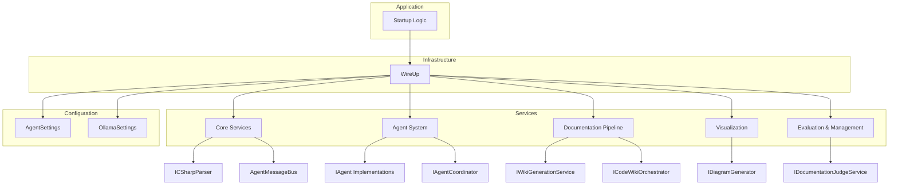

# Infrastructure

## 1. Overview (For Everyone)

The Infrastructure module is the foundational composition root for the application. Its primary purpose is to configure and register all necessary services, implementations, and settings into the dependency injection (DI) container at application startup. It acts as the central wiring hub, ensuring that all components of the system are correctly instantiated and can communicate with each other through well-defined interfaces.

**Key problems it solves:**

*   **Decoupling:** It prevents components from creating their own dependencies, which leads to tightly coupled and hard-to-test code.
*   **Configuration Management:** It centralizes the configuration of services, including default values and settings for external integrations.
*   **Lifecycle Management:** It defines the lifetime of each service (e.g., Singleton, Scoped) to manage memory and state correctly throughout the application's execution.

**Primary capabilities:**

*   Registers and configures all core application services, such as parsers, telemetry, and the agent message bus.
*   Sets up the agent-based system, including the `AnalyzerAgent`, `DocumenterAgent`, and their coordinator.
*   Configures the entire documentation generation pipeline, from decomposition and synthesis to wiki generation and evaluation.
*   Manages configuration for external services, specifically the Ollama Large Language Model (LLM) integration.

## 2. User Guide (For End Users)

The "user" of the Infrastructure module is primarily the developer setting up the application. Its main feature is the `WireUp` class, which is used to prepare the application's services.

### How to use the features

To enable all services, you must call the static registration method in your application's startup sequence (e.g., in `Program.cs` for a .NET application).

```csharp
// In your application's startup code
var services = new ServiceCollection();

codeMRI.Infrastructure.WireUp.Registered(services);

// Now you can build the service provider and resolve services
var serviceProvider = services.BuildServiceProvider();
```

### Configuration options (user-facing)

The module's behavior can be controlled through configuration settings, typically defined in `appsettings.json` or via environment variables.

#### AgentSettings

These settings control the behavior of the agent system.

| Property | Type | Default | Description |
|---|---|---|---|
| `EnableDelegation` | `bool` | `true` | Determines if agents can delegate tasks to other agents. |
| `MaxRecursionDepth` | `int` | `3` | The maximum depth for recursive delegation to prevent infinite loops. |
| `ComplexityThresholds` | `Dictionary<string, int>` | `{"ComplexityScore": 8, "LineCount": 500}` | Defines thresholds that agents might use to decide if a component is complex enough to require special handling. |

#### OllamaSettings

These settings configure the connection to the Ollama LLM service.

| Property | Type | Default | Description |
|---|---|---|---|
| `BaseUrl` | `string` | `http://localhost:11434` | The base URL of the running Ollama server instance. |
| `EmbeddingModel` | `string` | `nomic-embed-text` | The name of the model to use for generating text embeddings. |
| `DocumentationModel` | `string` | `llama3` | The default LLM model used for generating documentation content. |
| `ChatModel` | `string` | `llama3` | The default LLM model used for general chat or interaction tasks. |
| `ContextSize` | `int` | `4096` | The context window size to use when making requests to the LLM. |
| `Temperature` | `double` | `0.2` | The temperature setting for LLM generation, controlling creativity. |
| `JudgeModels` | `List<string>` | `new()` | A list of models to be used for judging or evaluating generated content. |

### Common use cases

*   **Application Initialization:** The primary use case is to call `WireUp.Registered()` once during the application's bootstrap process to make all services available.
*   **Configuring LLM Integration:** Before running, ensure an Ollama server is running at the `BaseUrl` and that the specified models (`DocumentationModel`, `EmbeddingModel`) are available in that Ollama instance.

## 3. Technical Architecture (For Developers)

The module's architecture is centered around the Dependency Injection pattern, with the `WireUp` class acting as the composition root. It follows a service-oriented approach where functionality is exposed through interfaces, and concrete implementations are registered at startup.

*   **Architectural Pattern:** Not identified
*   **Metrics:** Cohesion (0,00), Coupling (1,00), Complexity (16,0)

### Class/Component structure and key relationships

The `WireUp` class is the central component. It is responsible for registering all other services. The registered services can be grouped into several categories:

*   **Core Services:** `ICSharpParser` (implemented by `RoslynCSharpParser`), `AgentMessageBus`, `IAgentTelemetryService`. These are fundamental services used by many other components. `ICSharpParser` is registered as a Singleton.
*   **Agent System:** `IAgent` implementations (`AnalyzerAgent`, `DocumenterAgent`, `SynthesizerAgent`, `ValidatorAgent`), `IAgentCoordinator` (implemented by `AgentCoordinator`), and `DelegationService`. These are all registered as Scoped services, meaning a new instance is created per request/scope.
*   **Documentation Pipeline:** This includes services like `IComponentIdentificationService`, `IDocumentationGenerationPipeline`, `IWikiGenerationService`, `IDocumentationSynthesisService`, and `IHierarchicalDecompositionService`. The `CodeWikiOrchestrator` is a high-level Scoped service that coordinates many of these to produce the final documentation.
*   **Visualization:** `IDiagramGenerator` and `IVisualSynthesisService` are registered to handle the creation of visual diagrams.
*   **Evaluation & Management:** Services like `IDocumentationJudgeService`, `IRubricGenerationService`, and `IReferenceManagementService` are registered to evaluate and manage the documentation artifacts.

A key relationship is the dependency of the `CodeWikiOrchestrator` on various other services (`IWikiGenerationService`, `IDocumentationSynthesisService`, etc.) to perform its orchestration logic. Another is the dependency of `WikiGenerationService` on `ILLMClient` and the configured `DocumentationModel` from `OllamaSettings`.

### Important public interfaces

The module registers numerous public interfaces that define the contracts for the application's core logic. Key interfaces include:

*   `IAgent`: Defines the contract for an autonomous agent.
*   `IAgentCoordinator`: Manages and coordinates the execution of agents.
*   `ICSharpParser`: Responsible for parsing C# source code.
*   `IWikiGenerationService`: Defines the service for generating wiki pages.
*   `ICodeWikiOrchestrator`: The high-level orchestrator for the entire documentation generation process.
*   `IDocumentationJudgeService`: Defines the contract for evaluating the quality of generated documentation.

### Mermaid Component Diagram



## 4. Operations & Deployment (For DevOps)

### External dependencies

*   **Ollama Server:** The primary external dependency is an Ollama server instance. The application will attempt to connect to this server to perform language model-related tasks. The default connection URL is `http://localhost:11434`.
*   **Databases, APIs, Queues:** None detected.

### Configuration

Configuration is managed via the .NET configuration system. The settings are bound to the `AgentSettings` and `OllamaSettings` classes. The following configuration keys are relevant:

*   `AgentSettings:EnableDelegation`
*   `AgentSettings:MaxRecursionDepth`
*   `AgentSettings:ComplexityThresholds:ComplexityScore`
*   `AgentSettings:ComplexityThresholds:LineCount`
*   `OllamaSettings:BaseUrl`
*   `OllamaSettings:EmbeddingModel`
*   `OllamaSettings:DocumentationModel`
*   `OllamaSettings:ChatModel`
*   `OllamaSettings:ContextSize`
*   `OllamaSettings:Temperature`
*   `OllamaSettings:JudgeModels`

These can be set in `appsettings.json`, environment variables, or other .NET configuration providers.

### Troubleshooting and Logs

*   **Service Unavailable:** If the application fails to start or throws exceptions related to LLM calls, verify that the Ollama server is running and accessible at the configured `OllamaSettings:BaseUrl`.
*   **Model Not Found:** Ensure that the models specified in `OllamaSettings:DocumentationModel` and `OllamaSettings:EmbeddingModel` are downloaded and available in the Ollama instance. You can check this with the `ollama list` command on the server.
*   **Configuration Errors:** The `WikiGenerationService` registration explicitly checks if `OllamaSettings:DocumentationModel` is configured. If it is missing or null, an `InvalidOperationException` will be thrown during service registration, stating: "DocumentationModel is not configured in OllamaSettings." Check application logs for this specific error message.
*   **General Health:** Monitor the application logs for any exceptions thrown during the `WireUp.Registered(services)` call, as this indicates a failure in the service setup phase.

## 5. API Reference (If applicable)

The Infrastructure module does not expose public REST APIs or a traditional library API. Its primary public contract is the static method used for application composition:

*   **Method:** `codeMRI.Infrastructure.WireUp.Registered(IServiceCollection services)`
    *   **Purpose:** This method is the entry point for configuring the application's dependency injection container. It must be called once during application startup to register all necessary services and their implementations.

<details>
<summary>Relevant source files</summary>

- [codeMRI.Infrastructure/WireUp.cs](/var/folders/9d/5x7df5dx5zxcjnl4dbxzfqw00000gn/T/codeMRI_982cf0c472d443648edb9ca4f0587557/blob/main/codeMRI.Infrastructure/WireUp.cs)
- [codeMRI.Infrastructure/Configuration/OllamaSettings.cs](/var/folders/9d/5x7df5dx5zxcjnl4dbxzfqw00000gn/T/codeMRI_982cf0c472d443648edb9ca4f0587557/blob/main/codeMRI.Infrastructure/Configuration/OllamaSettings.cs)
- [codeMRI.Agents/Configuration/AgentSettings.cs](/var/folders/9d/5x7df5dx5zxcjnl4dbxzfqw00000gn/T/codeMRI_982cf0c472d443648edb9ca4f0587557/blob/main/codeMRI.Agents/Configuration/AgentSettings.cs)
</details>
