# codeMRI Ingestion Process Documentation

This document provides a comprehensive overview of the ingestion process used in the codeMRI system, starting with a high-level bird's eye view and then drilling down into the technical details of each phase.

---

## Bird's Eye View

The ingestion process transforms a raw code repository into a structured, navigable wiki with AI-generated documentation. The process follows a **5-phase pipeline** orchestrated by the `CodeWikiOrchestrator`:

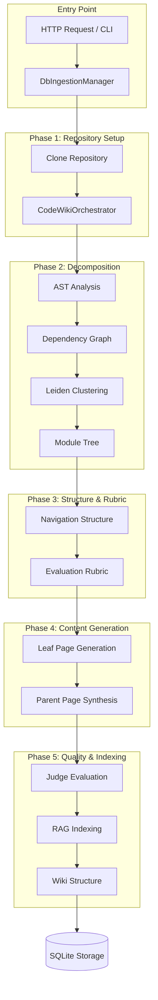

### High-Level Status Flow

| Status | Description |
|--------|-------------|
| `Queued` | Job created, waiting to start |
| `Cloning` | Repository is being cloned from Git |
| `Analyzing` | Decomposition and structure planning |
| `Generating` | Content generation for wiki pages |
| `Completed` | Successfully finished |
| `Failed` | Error occurred during processing |
| `Cancelling` → `Cancelled` | User-initiated cancellation |

---

## Architecture Overview

### Core Components

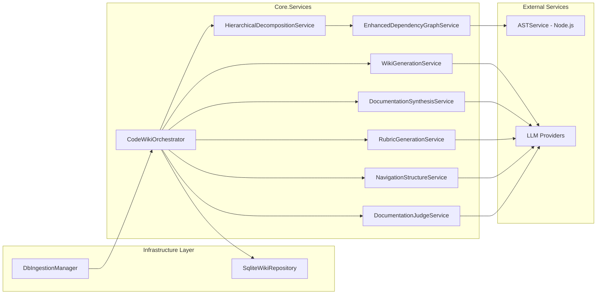

### Key Interfaces

| Interface | Implementation | Purpose |
|-----------|---------------|---------|
| `IIngestionJobManager` | `DbIngestionManager` | Job lifecycle management |
| `ICodeWikiOrchestrator` | `CodeWikiOrchestrator` | Main workflow orchestration |
| `IHierarchicalDecompositionService` | `HierarchicalDecompositionService` | Code structure analysis |
| `IRubricGenerationService` | `RubricGenerationService` | Quality criteria generation |
| `IWikiGenerationService` | `WikiGenerationService` | Page content generation |
| `IDocumentationJudgeService` | `DocumentationJudgeService` | Quality evaluation |
| `IWikiRepository` | `SqliteWikiRepository` | Persistence layer |

---

## Detailed Phase Breakdown

### Phase 0: Job Initialization

**Entry Points:**

- **HTTP API**: `POST /api/wiki/ingest` via `WikiController`
- **CLI**: `codeMRI ingest <url>` command

**Component:** [DbIngestionManager](file:///Users/levente/AI/codeMRI/codeMRI.Infrastructure/Services/DbIngestionManager.cs)

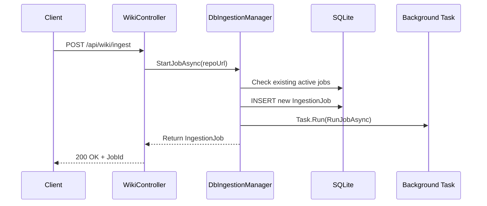

**Key Logic:**

1. **Deduplication**: Checks for existing active jobs for the same repository URL
2. **Job Creation**: Creates new `IngestionJob` record with `Queued` status
3. **Background Execution**: Spawns `Task.Run()` for non-blocking processing
4. **Progress Reporting**: Uses `AgentMessageBus` for SignalR real-time updates

**Data Model - IngestionJob:**

```csharp
public class IngestionJob
{
    public string Id { get; set; }
    public string RepoUrl { get; set; }
    public string RepoPath { get; set; }  // Local filesystem path
    public IngestionStatus Status { get; set; }
    public int ProgressPercentage { get; set; }
    public string CurrentPhase { get; set; }
    public AudienceType Audience { get; set; }
    // ... timestamps, errors, etc.
}
```

---

### Phase 1: Repository Cloning

**Progress Range:** 0-10%

**Component:** `GitHelper` (static utility)

The repository is cloned to a local directory:

- **Target Path**: `../data/repos/{repository-name}`
- **Clean Clone**: Existing directories are deleted for fresh cloning
- **Cancellation Support**: Token-based cancellation during clone

```csharp
// From DbIngestionManager.RunJobAsync
await UpdateJobStatusAsync(jobId, IngestionStatus.Cloning, 0, "Cloning repository...");
await GitHelper.CloneRepositoryAsync(repoUrl, targetDir, cts.Token);
```

---

### Phase 2: Hierarchical Decomposition (5-15%)

**Component:** [HierarchicalDecompositionService](file:///Users/levente/AI/codeMRI/codeMRI.Core/Services/HierarchicalDecompositionService.cs)

This phase analyzes the codebase structure and groups components into semantic modules.

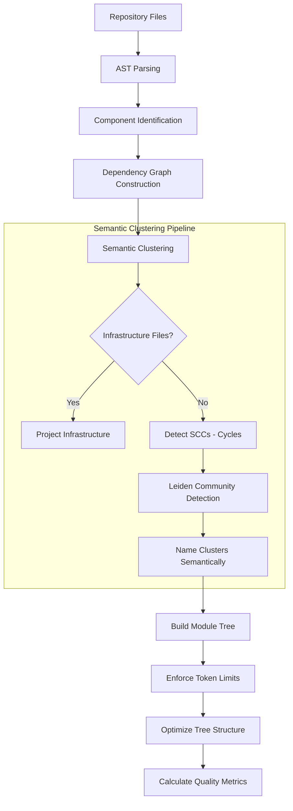

#### Sub-Phases

##### 2.1 Component Identification (0-20% of phase)

- **Service**: `EnhancedDependencyGraphService.GetComponentsAsync()`
- **External**: Calls `ASTService` (Node.js + Tree-sitter) for parsing
- **Output**: List of `CodeComponent` with metadata (type, file path, complexity)

##### 2.2 Dependency Graph Construction (20-100% of phase)

- **Service**: `EnhancedDependencyGraphService.BuildGraphAsync()`
- Creates nodes for each component
- Establishes edges for:
  - Import/dependency relationships
  - Inheritance hierarchies
  - Cross-file references

##### 2.3 Semantic Clustering

**Algorithm: Leiden Community Detection** (improved Louvain)

1. **Step 1 - Infrastructure Separation**: Configuration files isolated into "Project Infrastructure" cluster
2. **Step 2 - Cycle Detection**: Strongly Connected Components (Tarjan's algorithm) kept together
3. **Step 3 - Leiden Clustering**: Graph-based community detection on remaining nodes
4. **Step 4 - Semantic Naming**: Clusters named using directory structure, architectural layer patterns

##### 2.4 Module Tree Construction

```csharp
public class ModuleNode
{
    public string Id { get; set; }
    public string Name { get; set; }
    public List<string> Components { get; set; }  // Component IDs
    public List<ModuleNode> Children { get; set; }
    public ModuleNode? Parent { get; set; }
    public bool IsLeaf => Children.Count == 0;
    public int ComplexityScore { get; set; }
    public Dictionary<string, string> Metadata { get; set; }
}
```

---

### Phase 3: Structure Planning & Rubric Generation (15-20%)

#### 3.1 Navigation Structure Generation

**Component:** [NavigationStructureService](file:///Users/levente/AI/codeMRI/codeMRI.Core/Services/NavigationStructureService.cs)

Transforms the code-centric module tree into a **documentation-optimized navigation structure** using LLM analysis.

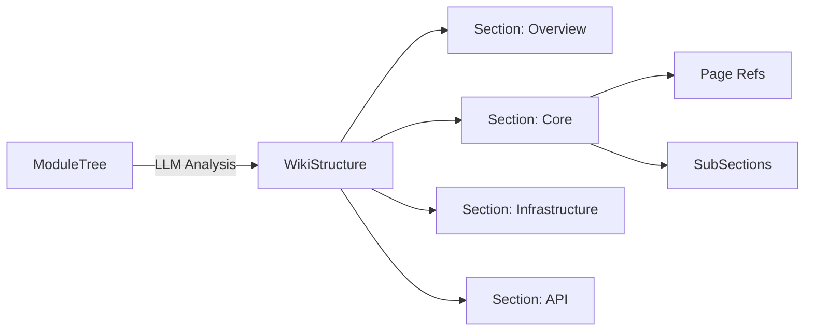

**Output:** `WikiStructure` with nested `WikiSection` hierarchy and `ModuleToSectionMap` for mapping.

#### 3.2 Rubric Generation

**Component:** [RubricGenerationService](file:///Users/levente/AI/codeMRI/codeMRI.Core/Services/RubricGenerationService.cs)

Generates an evaluation rubric defining quality criteria for documentation:

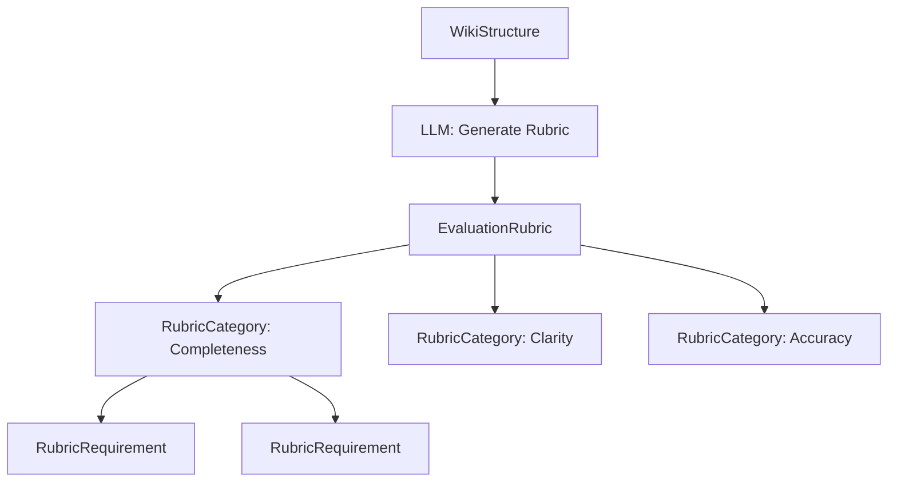

**Rubric Types:**

- `RubricCategory`: Grouping of related requirements
- `RubricRequirement`: Specific, evaluable criterion

---

### Phase 4: Content Generation (20-90%)

**Component:** [WikiGenerationService](file:///Users/levente/AI/codeMRI/codeMRI.Core/Services/WikiGenerationService.cs)

This is the **most time-intensive phase**, generating documentation for each module.

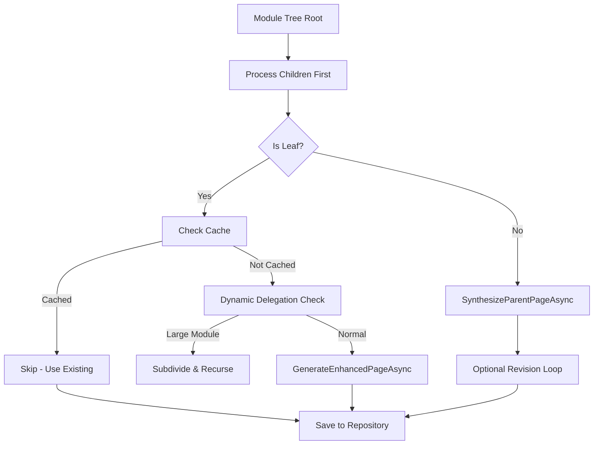

#### 4.1 Leaf Page Generation

- Loads source file contents for the module
- Uses LLM with rich context (dependencies, metrics, related pages)
- Generates markdown documentation with:
  - Module overview
  - Key components
  - Architecture diagrams (Mermaid)
  - Code examples
  - Relevant files collapsible section

#### 4.2 Dynamic Delegation

For very large modules (exceeding token limits):

- `DelegationService.EvaluateDelegation()` decides if subdivision needed
- Creates sub-modules and processes recursively
- Marks parent for cluster-merge synthesis

#### 4.3 Parent Page Synthesis

**Component:** [DocumentationSynthesisService](file:///Users/levente/AI/codeMRI/codeMRI.Core/Services/DocumentationSynthesisService.cs)

Aggregates child pages into coherent parent documentation:

- Summaries of child modules
- Cross-cutting concerns
- Navigation to detailed pages

#### 4.4 Revision Loop (Optional)

If enabled (`CodeWikiOptions.EnableRevisionLoop`):

- `DocumentationRevisionService` refines parent pages based on child insights
- Implements Algorithm 1 from CodeWiki paper

---

### Phase 5: Evaluation & Indexing (90-100%)

#### 5.1 Documentation Evaluation

**Component:** [DocumentationJudgeService](file:///Users/levente/AI/codeMRI/codeMRI.Core/Services/DocumentationJudgeService.cs)

Evaluates generated documentation against the rubric:

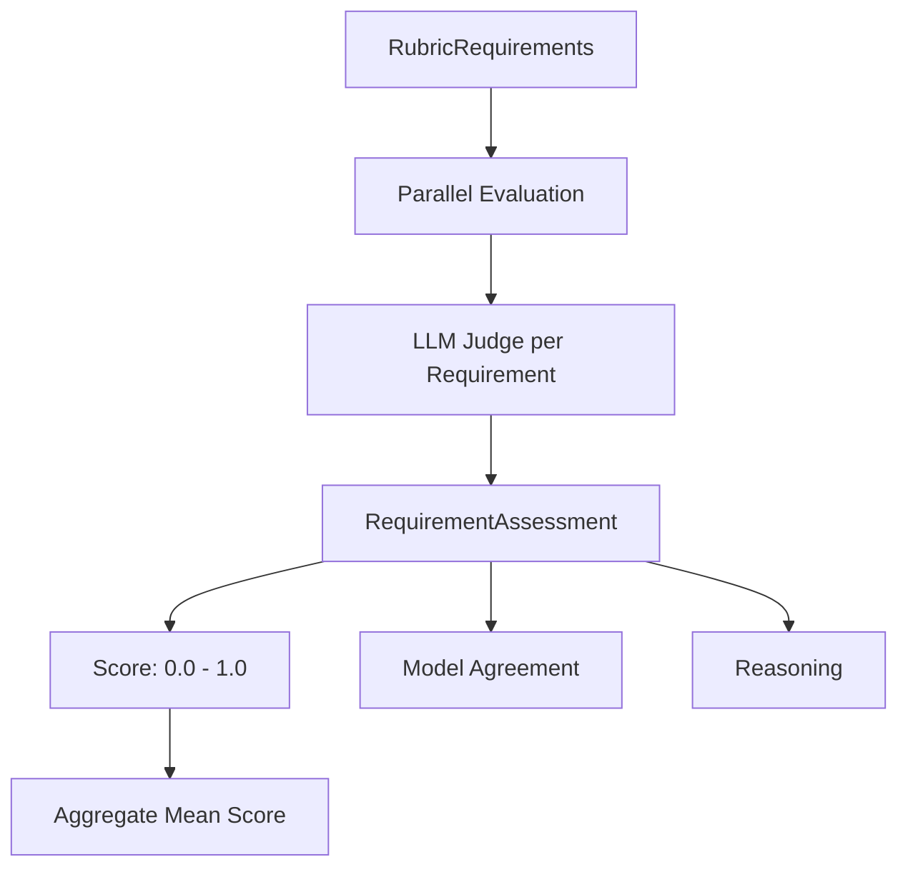

**Multi-Model Judging:**

- Configurable judge models
- Parallel evaluation with semaphore-controlled concurrency
- Score aggregation across models

#### 5.2 RAG Indexing

**Component:** `IDocumentIndexer`

Indexes documentation for Retrieval-Augmented Generation:

1. `IndexDocumentationAsync()` - Indexes wiki pages
2. `IndexCodebaseAsync()` - Indexes code structure from dependency graph

---

## Resumability Architecture

The system supports **resumable ingestion** for fault tolerance via decorator pattern:

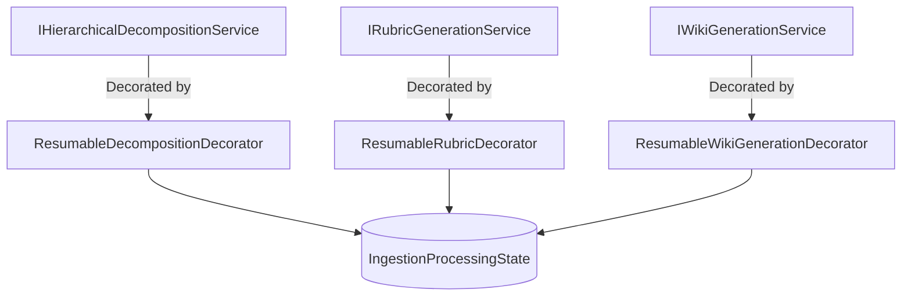

### IngestionProcessingState

File: [IngestionProcessingState.cs](file:///Users/levente/AI/codeMRI/codeMRI.Core/Models/IngestionProcessingState.cs)

Tracks:

- `ProcessingQueue`: Files pending processing
- `CompletedFiles` / `FailedFiles`: Processing status
- `CompletedModuleIds`: Successfully documented modules
- `SerializedGraph`: Cached dependency graph
- `SerializedRubric`: Cached rubric for resumption

### Decorator Behavior

1. **ResumableDecompositionDecorator**: Caches `ModuleTree` state
2. **ResumableRubricDecorator**: Caches generated rubric, skips if exists
3. **ResumableWikiGenerationDecorator**: Checks `IWikiRepository` for existing pages

---

## Cancellation Support

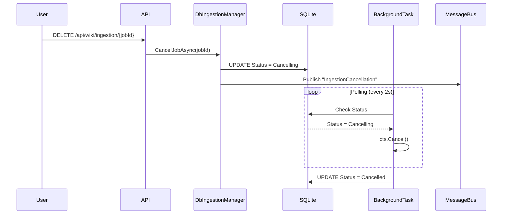

---

## Progress Reporting

**Service:** `IProgressService`

Provides scaled progress reporting across phases:

```csharp
// Phase scaling example from CodeWikiOrchestrator
await _progressService.WithScalingAsync(5, 10,    // Decomposition: 5-15%
    async () => { /* decomposition work */ });

await _progressService.WithScalingAsync(20, 70,   // Content Gen: 20-90%
    async () => { /* content generation */ });
```

**Real-time Updates:**

- `AgentMessageBus` publishes `IngestionProgress` messages
- SignalR hub broadcasts to connected clients
- Frontend `IngestionMonitor.razor` displays live progress

---

## Data Flow Summary

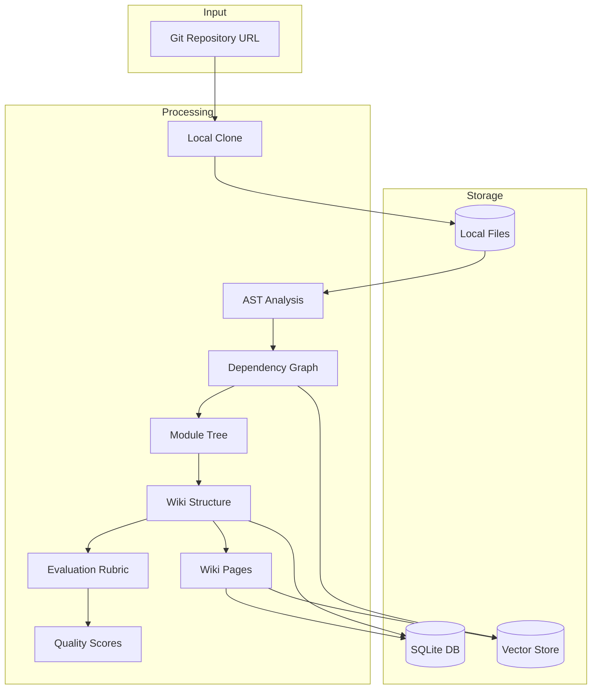

---

## Configuration

Key options in `CodeWikiOptions`:

| Option | Description | Default |
|--------|-------------|---------|
| `MaxDegreeOfParallelism` | Concurrent LLM calls | 5 |
| `DefaultAudience` | Target audience type | `Developer` |
| `EnableRevisionLoop` | Parent page refinement | true |
| `MinChildrenForRevision` | Threshold for revision | 2 |

---

## External Dependencies

1. **ASTService** (Node.js)
   - Uses Tree-sitter for multi-language parsing
   - Supports: C#, Python, JavaScript, TypeScript, Java, Go, Rust, Ruby, C, C++
   - Runs on port 3001 (default)

2. **LLM Providers**
   - Configurable via `ILLMServiceFacade`
   - Supports multiple models for generation vs. evaluation

3. **SQLite**
   - Ingestion jobs: `ingestion.db`
   - Wiki content: project-specific databases

---

## Error Handling

| Error Type | Handling |
|------------|----------|
| Git Clone Failure | Job marked as `Failed`, error stored |
| LLM Timeout | Retry logic in service layer |
| Cancellation | Graceful cleanup, status = `Cancelled` |
| Partial Failure | Resumable state allows continuation |

---

## Summary

The codeMRI ingestion process is a sophisticated **5-phase pipeline** that:

1. **Clones** repositories for local analysis
2. **Decomposes** code into semantic modules using graph theory
3. **Plans** documentation structure and quality criteria
4. **Generates** comprehensive wiki documentation with LLM
5. **Evaluates** quality and **indexes** for retrieval

Key architectural features:

- **Resumability** via decorator pattern and state persistence
- **Cancellation** support with polling-based token propagation
- **Real-time progress** via SignalR
- **Parallel processing** with configurable concurrency
- **Multi-language** support via Tree-sitter AST service
