# Presentation

## 1. Overview (For Everyone)
The Presentation module serves as the API layer for the CodeMRI system, exposing core functionality through RESTful endpoints. It enables clients to generate documentation, manage repositories, monitor ingestion jobs, interact with the codebase via chat interface, and generate interactive diagrams. The module handles real-time communication using SignalR for progress updates and agent status notifications.

Key problems solved:
- Provides a unified interface for repository analysis and documentation generation
- Manages asynchronous ingestion operations with status tracking
- Enables interactive exploration of codebases through chat functionality
- Supports real-time progress reporting for long-running operations
- Generates interactive diagrams with zoom, filtering, and export capabilities

Primary capabilities:
- Wiki page generation and repository structure analysis
- Repository ingestion from Git URLs with job management
- Real-time progress updates via SignalR
- Chat-based codebase interaction
- Navigation and status querying for repositories
- Interactive diagram generation with multiple export formats
- Comprehensive prompt templating for different documentation scenarios

## 2. User Guide (For End Users)
### Generating Wiki Pages
- **Endpoint**: `POST /api/wiki/page`
- **Parameters**:
  - `title`: Page title to generate
  - `repoPath`: Local repository path
  - `forceRegenerate`: Override existing pages (optional)
  - `filePaths`: Specific files to include (optional)
  - `fileContents`: File content mapping (optional)
  - `language`: Programming language (optional)
- **Use Case**: Generate documentation for specific components or entire repositories

### Repository Ingestion
- **Endpoint**: `POST /api/wiki/ingest`
- **Parameters**:
  - `url`: Git repository URL
  - `audience`: Target documentation audience
- **Use Case**: Ingest remote repositories for analysis

### Monitoring Ingestion Jobs
- **Endpoint**: `GET /api/wiki/ingestion/{jobId}`
- **Returns**: Job status and progress details
- **Use Case**: Track ingestion progress

### Advanced Wiki Generation
- **Endpoint**: `POST /api/wiki/generate-advanced`
- **Parameters**:
  - `repoPath`: Repository path or Git URL
  - `language`: Programming language
  - `connectionId`: SignalR connection ID for real-time updates
  - `skipPersistence`: Generate without saving (optional)
- **Use Case**: Full repository analysis with real-time feedback

### Chat Interaction
- **Endpoint**: `POST /api/chat`
- **Parameters**:
  - `history`: Conversation history
  - `role`: Message role (user/system)
  - `content`: Message content
- **Use Case**: Ask questions about the codebase

### Interactive Diagram Features
- **Diagram Types**: Class, Sequence, Architecture, DataFlow, Component, State, Deployment
- **Zoom Controls**: Mouse wheel zoom, pan functionality, fit-to-view
- **Filtering Options**: 
  - Component inclusion/exclusion lists
  - Relationship type filtering
  - Layer-based filtering
  - Complexity range filtering
- **Export Formats**: PNG, SVG, PDF with configurable options

### Configuration Options
- **Force Regeneration**: Override cached wiki pages
- **File Selection**: Specify files for targeted documentation
- **Real-time Updates**: Provide SignalR connection ID for live progress
- **Audience Targeting**: Adjust documentation style (Technical/Executive/etc.)
- **Diagram Customization**: Theme selection, depth limits, label visibility
- **Export Settings**: Resolution, quality, background color for PNG exports

## 3. Technical Architecture (For Developers)
### Architectural Pattern
- **Pattern**: Microservices
- **Communication**: REST APIs with SignalR for real-time updates
- **Async Processing**: Background job management for ingestion
- **Template System**: Static prompt templates for various documentation scenarios

### Metrics
- **Cohesion**: 0.02 (Low cohesion - handles diverse API responsibilities)
- **Coupling**: 0.85 (High coupling with core services)
- **Complexity**: 259.0 (Moderate complexity due to orchestration logic)

### Component Structure

```mermaid
graph TD
    WikiController --> IWikiRepository
    WikiController --> IWikiGenerationService
    WikiController --> ICodeWikiOrchestrator
    WikiController --> IHubContext
    WikiController --> IIngestionJobManager
    WikiController --> AgentMessageBus
    WikiController --> IAgentTelemetryService
    ChatController --> ILLMClient
    IWikiRepository --> WikiPage
    IWikiRepository --> WikiStructure
    IWikiGenerationService --> WikiPage
    ICodeWikiOrchestrator --> WikiStructure
    IIngestionJobManager --> IngestionJob
    AgentMessageBus --> AgentMessage
    IAgentTelemetryService --> TelemetryEvent
    PromptTemplates --> ModuleNode
    PromptTemplates --> WikiPage
    PromptTemplates --> ModulePageContext
    InteractiveDiagram --> DiagramComponent
    InteractiveDiagram --> DiagramRelationship
    InteractiveDiagram --> DiagramOptions
    PageGenerationRequest --> WikiPage
```

### Key Public Interfaces
- **WikiController**:
  - `GeneratePage(PageGenerationRequest)`: Creates wiki documentation
  - `IngestRepository(IngestionRequest)`: Starts repository ingestion
  - `GenerateAdvancedWiki(StructureRequest)`: Performs full analysis
  - `GetNavigation(string)`: Retrieves repository navigation tree
- **ChatController**:
  - `Chat(ChatRequest)`: Processes codebase queries
- **PromptTemplates**:
  - `EnhancedPagePrompt()`: Generates sophisticated page generation prompts
  - `ComprehensivePagePrompt()`: Creates prompts for all stakeholders
  - `DiagramContextPrompt()`: Generates diagram creation prompts
  - `RAGSystemPrompt()`: Creates context-aware chat prompts
- **InteractiveDiagram**:
  - Configurable zoom, filtering, and export options
  - Support for multiple diagram types and themes

## 4. Operations & Deployment (For DevOps)
### External Dependencies
- **None detected**: All dependencies are internal services
- **Git Integration**: Uses system `git` commands for repository operations
- **File System**: Direct file access for local repositories
- **Diagram Export**: May require additional system libraries for PNG/SVG/PDF generation

### Configuration
- **Environment Variables**: None directly used in controllers
- **DI Configuration**: Service registration in startup
- **SignalR**: Configured for real-time communication
- **Logging**: Configured via standard ASP.NET Core logging
- **Prompt Templates**: Configured for multiple languages and audiences

### Troubleshooting
- **Logs**:
  - Controller actions log entry/exit
  - Ingestion failures logged with stack traces
  - File access errors logged with full paths
  - Diagram generation errors with export format details
- **Common Issues**:
  - Git URL validation failures
  - File permission errors during ingestion
  - AST service fallback warnings
  - Diagram export failures due to missing system libraries
- **Debugging**:
  - Check `IHubContext` connection IDs for SignalR issues
  - Verify `GitHelper` operations for repository access
  - Monitor `AgentMessageBus` subscriptions
  - Review prompt template generation for documentation issues

## 5. API Reference (If applicable)
### WikiController Endpoints
| Method | Path | Description |
|--------|------|-------------|
| POST | `/api/wiki/page` | Generate wiki page |
| GET | `/api/wiki/repositories` | List all repositories |
| GET | `/api/wiki/repositories-summary` | Get repository summaries |
| POST | `/api/wiki/ingest` | Start repository ingestion |
| GET | `/api/wiki/ingestion/{jobId}` | Get ingestion status |
| DELETE | `/api/wiki/ingestion/{jobId}` | Cancel ingestion |
| GET | `/api/wiki/ingestions/active` | List active ingestions |
| GET | `/api/wiki/repository-status` | Check repository status |
| GET | `/api/wiki/navigation` | Get navigation tree |
| POST | `/api/wiki/generate-advanced` | Generate full wiki |

### ChatController Endpoints
| Method | Path | Description |
|--------|------|-------------|
| POST | `/api/chat` | Chat with codebase |

### Key Request Models
- **PageGenerationRequest**:
  - `title`: string
  - `repoPath`: string
  - `forceRegenerate`: bool
  - `filePaths`: List<string>
  - `fileContents`: Dictionary<string, string>
  - `language`: string
- **IngestionRequest**:
  - `url`: string
  - `audience`: AudienceType
- **StructureRequest**:
  - `repoPath`: string
  - `language`: string
  - `connectionId`: string
  - `skipPersistence`: bool
- **ChatRequest**:
  - `history`: List<ChatMessage>
- **InteractiveDiagram**:
  - `id`: string
  - `title`: string
  - `mermaidContent`: string
  - `type`: DiagramType
  - `options`: DiagramOptions
  - `components`: List<DiagramComponent>
  - `relationships`: List<DiagramRelationship>

### Response Models
- **WikiPage**: Generated documentation page with relevant files
- **WikiStructure**: Repository navigation structure
- **IngestionJob**: Ingestion status and progress
- **RepositoryStatusResponse**: Repository existence and ingestion status
- **ChatResponse**: LLM-generated response
- **InteractiveDiagram**: Configurable diagram with export options
- **ExportResult**: Diagram export operation result with format-specific data

Relevant source files

- [codeMRI.Core/Models/WikiPage.cs](/var/folders/9d/5x7df5dx5zxcjnl4dbxzfqw00000gn/T/codeMRI_982cf0c472d443648edb9ca4f0587557/blob/main/codeMRI.Core/Models/WikiPage.cs)
- [codeMRI.Core/Interfaces/IComponentIdentificationService.cs](/var/folders/9d/5x7df5dx5zxcjnl4dbxzfqw00000gn/T/codeMRI_982cf0c472d443648edb9ca4f0587557/blob/main/codeMRI.Core/Interfaces/IComponentIdentificationService.cs)
- [codeMRI.Core/Models/CrossReference.cs](/var/folders/9d/5x7df5dx5zxcjnl4dbxzfqw00000gn/T/codeMRI_982cf0c472d443648edb9ca4f0587557/blob/main/codeMRI.Core/Models/CrossReference.cs)
- [codeMRI.Core/Models/ModuleTree.cs](/var/folders/9d/5x7df5dx5zxcjnl4dbxzfqw00000gn/T/codeMRI_982cf0c472d443648edb9ca4f0587557/blob/main/codeMRI.Core/Models/ModuleTree.cs)
- [codeMRI.Server/Controllers/WikiController.cs](/var/folders/9d/5x7df5dx5zxcjnl4dbxzfqw00000gn/T/codeMRI_982cf0c472d443648edb9ca4f0587557/blob/main/codeMRI.Server/Controllers/WikiController.cs)
- [codeMRI.Agents/Services/ComponentIdentificationService.cs](/var/folders/9d/5x7df5dx5zxcjnl4dbxzfqw00000gn/T/codeMRI_982cf0c472d443648edb9ca4f0587557/blob/main/codeMRI.Agents/Services/ComponentIdentificationService.cs)
- [codeMRI.Server/Controllers/ChatController.cs](/var/folders/9d/5x7df5dx5zxcjnl4dbxzfqw00000gn/T/codeMRI_982cf0c472d443648edb9ca4f0587557/blob/main/codeMRI.Server/Controllers/ChatController.cs)
- [codeMRI.Core/Interfaces/IEvaluationMetricsSystem.cs](/var/folders/9d/5x7df5dx5zxcjnl4dbxzfqw00000gn/T/codeMRI_982cf0c472d443648edb9ca4f0587557/blob/main/codeMRI.Core/Interfaces/IEvaluationMetricsSystem.cs)
- [codeMRI.Core.Tests/Controllers/WikiControllerTests.cs](/var/folders/9d/5x7df5dx5zxcjnl4dbxzfqw00000gn/T/codeMRI_982cf0c472d443648edb9ca4f0587557/blob/main/codeMRI.Core.Tests/Controllers/WikiControllerTests.cs)
- [codeMRI.Visualization.Tests/Generators/ComponentDiagramGeneratorTests.cs](/var/folders/9d/5x7df5dx5zxcjnl4dbxzfqw00000gn/T/codeMRI_982cf0c472d443648edb9ca4f0587557/blob/main/codeMRI.Visualization.Tests/Generators/ComponentDiagramGeneratorTests.cs)
- [codeMRI.Core.Tests/ComponentIdentificationServiceTests.cs](/var/folders/9d/5x7df5dx5zxcjnl4dbxzfqw00000gn/T/codeMRI_982cf0c472d443648edb9ca4f0587557/blob/main/codeMRI.Core.Tests/ComponentIdentificationServiceTests.cs)
- [codeMRI.Core/Models/InteractiveDiagram.cs](/var/folders/9d/5x7df5dx5zxcjnl4dbxzfqw00000gn/T/codeMRI_982cf0c472d443648edb9ca4f0587557/blob/main/codeMRI.Core/Models/InteractiveDiagram.cs)
- [codeMRI.Core/Services/PromptTemplates.cs](/var/folders/9d/5x7df5dx5zxcjnl4dbxzfqw00000gn/T/codeMRI_982cf0c472d443648edb9ca4f0587557/blob/main/codeMRI.Core/Services/PromptTemplates.cs)
- [codeMRI.Server.Api/PageGenerationRequest.cs](/var/folders/9d/5x7df5dx5zxcjnl4dbxzfqw00000gn/T/codeMRI_982cf0c472d443648edb9ca4f0587557/blob/main/codeMRI.Server.Api/PageGenerationRequest.cs)
- [codeMRI.CLI/Models.cs](/var/folders/9d/5x7df5dx5zxcjnl4dbxzfqw00000gn/T/codeMRI_982cf0c472d443648edb9ca4f0587557/blob/main/codeMRI.CLI/Models.cs)
- [codeMRI.Server.Api/WikiPage.cs](/var/folders/9d/5x7df5dx5zxcjnl4dbxzfqw00000gn/T/codeMRI_982cf0c472d443648edb9ca4f0587557/blob/main/codeMRI.Server.Api/WikiPage.cs)

