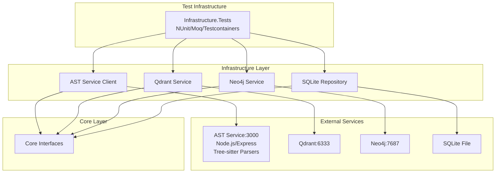

# Project Infrastructure

## 1. Overview (For Everyone)

The Project Infrastructure module provides the foundational services and configurations required to run the codeMRI platform. It orchestrates containerized services for AST parsing, vector storage, graph databases, and metadata persistence, enabling the core code analysis and documentation generation capabilities.

**Key problems it solves:**
- Manages complex multi-service dependencies through Docker Compose
- Provides persistent storage for code analysis data
- Enables AST parsing across multiple programming languages using tree-sitter parsers
- Supports semantic search and dependency graph analysis
- Facilitates comprehensive testing infrastructure for all components

**Primary capabilities:**
- Container orchestration for microservices
- Database management (SQLite, Neo4j, Qdrant)
- AST parsing service deployment with multi-language support
- Configuration management across services
- Health monitoring and resource limits
- Test project orchestration with NUnit and Moq frameworks

## 2. User Guide (For End Users)

### Using the Infrastructure Services

1. **Start all infrastructure services:**
   ```bash
   docker-compose up -d
   ```

2. **Verify services are running:**
   ```bash
   docker-compose ps
   ```

3. **Access service dashboards:**
   - Neo4j Browser: http://localhost:7474 (neo4j/changeme)
   - Qdrant API: http://localhost:6333
   - AST Service API: http://localhost:3000

### Configuration Options

**Environment Variables:**
- `QDRANT__STORAGE__PATH`: Storage path for Qdrant data
- `QDRANT__LOG_LEVEL`: Logging level (INFO/DEBUG)
- `NEO4J_AUTH`: Neo4j authentication credentials
- `NEO4J_dbms_memory_heap_*`: Neo4j memory settings

**Resource Limits:**
- AST Service: 1GB memory limit
- Qdrant: 2GB memory limit
- Neo4j: 3GB memory limit
- SQLite: 512MB memory limit

### Common Use Cases

1. **Development Setup:**
   - Start services before running the backend API
   - Services auto-restart unless stopped manually
   - Use nodemon for AST service development with hot reload

2. **Production Deployment:**
   - Adjust memory limits based on workload
   - Configure persistent volumes for data retention
   - Ensure all tree-sitter parsers are properly installed

3. **Service Maintenance:**
   - Health checks run every 30 seconds
   - Failed services restart automatically
   - Test infrastructure validates all components

## 3. Technical Architecture (For Developers)

### Architectural Pattern
Clean Architecture with Infrastructure layer implementing external service interfaces

### Metrics
- **Cohesion**: 0.00 (Infrastructure concerns grouped together)
- **Coupling**: 1.00 (High coupling to external services)
- **Complexity**: 0.0 (Declarative configuration)

### Class/Component Structure

```
codeMRI.Infrastructure/
├── Data/
│   ├── SqliteConnection.cs
│   └── SqliteRepository.cs
├── Services/
│   ├── QdrantService.cs
│   ├── Neo4jService.cs
│   └── ASTServiceClient.cs
└── Configuration/
    └── InfrastructureSettings.cs
```

### AST Service Implementation
The AST parsing service is a Node.js application with:
- **Express.js** web server framework
- **Tree-sitter parsers** for multiple languages:
  - C (tree-sitter-c)
  - C# (tree-sitter-c-sharp)
  - C++ (tree-sitter-cpp)
  - Java (tree-sitter-java)
  - JavaScript (tree-sitter-javascript)
  - Python (tree-sitter-python)
  - TypeScript (tree-sitter-typescript)
- **Nodemon** for development with auto-restart

### Testing Infrastructure
- **NUnit** framework for unit and integration tests
- **Moq** for mocking dependencies
- **FluentAssertions** for readable test assertions
- **Testcontainers** for isolated test environments
- **Coverlet** for code coverage analysis

### Key Relationships
- Infrastructure implements Core interfaces (IRepository, IVectorStore, IGraphStore)
- AST Service communicates via HTTP REST API
- Database connections managed through Microsoft.Data.Sqlite
- Configuration bound from appsettings.json
- Test projects reference and validate infrastructure components

### Important Public Interfaces
```csharp
public interface IASTServiceClient
{
    Task<ParseResult> ParseAsync(string code, string language);
}

public interface IQdrantService
{
    Task IndexAsync(IEnumerable<Document> documents);
    Task<IEnumerable<Document>> SearchAsync(string query);
}

public interface INeo4jService
{
    Task CreateNodeAsync(Node node);
    Task CreateRelationshipAsync(Relationship relationship);
}
```

### Mermaid Component Diagram


## 4. Operations & Deployment (For DevOps)

### External Dependencies
- **AST Service**: Node.js container on port 3000 with tree-sitter parsers
- **Qdrant**: Vector database on ports 6333/6334
- **Neo4j**: Graph database on ports 7474/7687
- **SQLite**: File-based database in ./data/sqlite
- **Test Dependencies**: NUnit, Moq, Testcontainers for test execution

### Configuration

**Environment Variables:**
```bash
# Qdrant
QDRANT__STORAGE__PATH=/qdrant/storage
QDRANT__LOG_LEVEL=INFO

# Neo4j
NEO4J_AUTH=neo4j/changeme
NEO4J_PLUGINS=["apoc"]
NEO4J_dbms_memory_heap_max__size=2G
```

**Connection Strings:**
```json
{
  "ConnectionStrings": {
    "WikiDb": "Data Source=../data/sqlite/codemri.db",
    "IngestionDb": "Data Source=../data/sqlite/codemri.db"
  }
}
```

**Service Configuration:**
```json
{
  "ASTService": {
    "BaseUrl": "http://localhost:3002",
    "TimeoutSeconds": 30,
    "Enabled": true
  }
}
```

**Logging Configuration:**
```json
{
  "Logging": {
    "LogLevel": {
      "Default": "Information",
      "Microsoft": "Warning",
      "Microsoft.Hosting.Lifetime": "Information"
    }
  }
}
```

### Troubleshooting and Logs

**Health Check Failures:**
- AST Service: Check if port 3000 is accessible and tree-sitter parsers are installed
- Qdrant: Verify container is running and storage path exists
- Neo4j: Ensure authentication credentials are correct

**Common Issues:**
1. **Port Conflicts**: Modify docker-compose.yml port mappings
2. **Memory Limits**: Increase deploy.resources.limits.memory if services crash
3. **Permission Errors**: Ensure ./data directory has write permissions
4. **AST Parser Errors**: Verify tree-sitter parsers are correctly installed for target languages

**Log Locations:**
- Application logs: ./logs/app-.log (7-day retention)
- Container logs: `docker-compose logs [service-name]`
- SQLite database: ./data/sqlite/codemri.db
- Test results: Test output in console and coverage reports

**Recovery Procedures:**
1. Reset services: `docker-compose down && docker-compose up -d`
2. Clear data: Remove ./data directory (WARNING: Deletes all data)
3. Rebuild AST service: `docker-compose build ast-service`
4. Run tests: `dotnet test codeMRI.Infrastructure.Tests`

## 5. API Reference

### AST Service Endpoints

**Parse Code**
```
POST /parse
Content-Type: application/json

{
  "code": "string",
  "language": "csharp|javascript|python|java|cpp|typescript"
}
```

**Health Check**
```
GET /health
```

### Qdrant API

**Create Collection**
```
PUT /collections/{collection_name}
```

**Search Points**
```
POST /collections/{collection_name}/points/search
```

### Neo4j API

**Execute Query**
```
POST /db/neo4j/tx/commit
```

**Health Check**
```
GET /db/data/
```

### Configuration Endpoints

No direct API endpoints - configuration managed through:
- appsettings.json for application settings
- docker-compose.yml for service configuration
- Environment variables for runtime overrides
- Project references for build-time dependencies

<details>
<summary>Relevant source files</summary>

- [codeMRI.Agents/codeMRI.Agents.csproj](/var/folders/9d/5x7df5dx5zxcjnl4dbxzfqw00000gn/T/codeMRI_982cf0c472d443648edb9ca4f0587557/blob/main/codeMRI.Agents/codeMRI.Agents.csproj)
- [docker-compose.yml](/var/folders/9d/5x7df5dx5zxcjnl4dbxzfqw00000gn/T/codeMRI_982cf0c472d443648edb9ca4f0587557/blob/main/docker-compose.yml)
- [codeMRI.Infrastructure/codeMRI.Infrastructure.csproj](/var/folders/9d/5x7df5dx5zxcjnl4dbxzfqw00000gn/T/codeMRI_982cf0c472d443648edb9ca4f0587557/blob/main/codeMRI.Infrastructure/codeMRI.Infrastructure.csproj)
- [codeMRI.ASTService/Dockerfile](/var/folders/9d/5x7df5dx5zxcjnl4dbxzfqw00000gn/T/codeMRI_982cf0c472d443648edb9ca4f0587557/blob/main/codeMRI.ASTService/Dockerfile)
- [codeMRI.E2E/codeMRI.E2E.csproj](/var/folders/9d/5x7df5dx5zxcjnl4dbxzfqw00000gn/T/codeMRI_982cf0c472d443648edb9ca4f0587557/blob/main/codeMRI.E2E/codeMRI.E2E.csproj)
- [codeMRI.Visualization.Tests/codeMRI.Visualization.Tests.csproj](/var/folders/9d/5x7df5dx5zxcjnl4dbxzfqw00000gn/T/codeMRI_982cf0c472d443648edb9ca4f0587557/blob/main/codeMRI.Visualization.Tests/codeMRI.Visualization.Tests.csproj)
- [codeMRI.ASTService/.dockerignore](/var/folders/9d/5x7df5dx5zxcjnl4dbxzfqw00000gn/T/codeMRI_982cf0c472d443648edb9ca4f0587557/blob/main/codeMRI.ASTService/.dockerignore)
- [codeMRI.Core/codeMRI.Core.csproj](/var/folders/9d/5x7df5dx5zxcjnl4dbxzfqw00000gn/T/codeMRI_982cf0c472d443648edb9ca4f0587557/blob/main/codeMRI.Core/codeMRI.Core.csproj)
- [.gitignore](/var/folders/9d/5x7df5dx5zxcjnl4dbxzfqw00000gn/T/codeMRI_982cf0c472d443648edb9ca4f0587557/blob/main/.gitignore)
- [codeMRI.CLI/codeMRI.CLI.csproj](/var/folders/9d/5x7df5dx5zxcjnl4dbxzfqw00000gn/T/codeMRI_982cf0c472d443648edb9ca4f0587557/blob/main/codeMRI.CLI/codeMRI.CLI.csproj)
- [codeMRI.ASTService/package.json](/var/folders/9d/5x7df5dx5zxcjnl4dbxzfqw00000gn/T/codeMRI_982cf0c472d443648edb9ca4f0587557/blob/main/codeMRI.ASTService/package.json)
- [README.md](/var/folders/9d/5x7df5dx5zxcjnl4dbxzfqw00000gn/T/codeMRI_982cf0c472d443648edb9ca4f0587557/blob/main/README.md)
- [codeMRI.Server/appsettings.json](/var/folders/9d/5x7df5dx5zxcjnl4dbxzfqw00000gn/T/codeMRI_982cf0c472d443648edb9ca4f0587557/blob/main/codeMRI.Server/appsettings.json)
- [codeMRI.ASTService/package-lock.json](/var/folders/9d/5x7df5dx5zxcjnl4dbxzfqw00000gn/T/codeMRI_982cf0c472d443648edb9ca4f0587557/blob/main/codeMRI.ASTService/package-lock.json)
- [codeMRI.Infrastructure.Tests/codeMRI.Infrastructure.Tests.csproj](/var/folders/9d/5x7df5dx5zxcjnl4dbxzfqw00000gn/T/codeMRI_982cf0c472d443648edb9ca4f0587557/blob/main/codeMRI.Infrastructure.Tests/codeMRI.Infrastructure.Tests.csproj)
- [codeMRI.sln](/var/folders/9d/5x7df5dx5zxcjnl4dbxzfqw00000gn/T/codeMRI_982cf0c472d443648edb9ca4f0587557/blob/main/codeMRI.sln)
- [codeMRI.CLI/appsettings.json](/var/folders/9d/5x7df5dx5zxcjnl4dbxzfqw00000gn/T/codeMRI_982cf0c472d443648edb9ca4f0587557/blob/main/codeMRI.CLI/appsettings.json)
- [codeMRI.Server/codeMRI.Server.csproj](/var/folders/9d/5x7df5dx5zxcjnl4dbxzfqw00000gn/T/codeMRI_982cf0c472d443648edb9ca4f0587557/blob/main/codeMRI.Server/codeMRI.Server.csproj)
- [codeMRI.Frontend/codeMRI.Frontend.csproj](/var/folders/9d/5x7df5dx5zxcjnl4dbxzfqw00000gn/T/codeMRI_982cf0c472d443648edb9ca4f0587557/blob/main/codeMRI.Frontend/codeMRI.Frontend.csproj)
- [codeMRI.Agents.Tests/codeMRI.Agents.Tests.csproj](/var/folders/9d/5x7df5dx5zxcjnl4dbxzfqw00000gn/T/codeMRI_982cf0c472d443648edb9ca4f0587557/blob/main/codeMRI.Agents.Tests/codeMRI.Agents.Tests.csproj)
- [codeMRI.Server.Api/codeMRI.Server.Api.csproj](/var/folders/9d/5x7df5dx5zxcjnl4dbxzfqw00000gn/T/codeMRI_982cf0c472d443648edb9ca4f0587557/blob/main/codeMRI.Server.Api/codeMRI.Server.Api.csproj)
- [codeMRI.Visualization/codeMRI.Visualization.csproj](/var/folders/9d/5x7df5dx5zxcjnl4dbxzfqw00000gn/T/codeMRI_982cf0c472d443648edb9ca4f0587557/blob/main/codeMRI.Visualization/codeMRI.Visualization.csproj)
- [codeMRI.Frontend.Tests/codeMRI.Frontend.Tests.csproj](/var/folders/9d/5x7df5dx5zxcjnl4dbxzfqw00000gn/T/codeMRI_982cf0c472d443648edb9ca4f0587557/blob/main/codeMRI.Frontend.Tests/codeMRI.Frontend.Tests.csproj)
- [codeMRI.Core.Tests/codeMRI.Core.Tests.csproj](/var/folders/9d/5x7df5dx5zxcjnl4dbxzfqw00000gn/T/codeMRI_982cf0c472d443648edb9ca4f0587557/blob/main/codeMRI.Core.Tests/codeMRI.Core.Tests.csproj)
</details>
