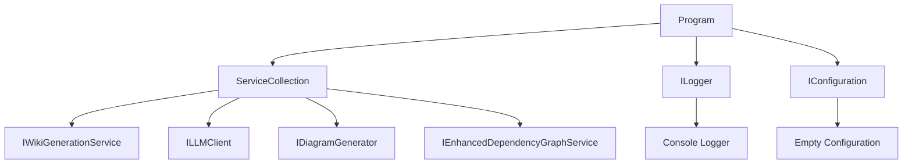

# Root

## 1. Overview (For Everyone)

The Root module serves as a testing and validation component for the codeMRI documentation generation system. It provides a console-based entry point for setting up and testing the documentation generation services in a controlled environment.

**Key problems it solves:**
- Provides a testing framework for documentation generation functionality
- Enables validation of service wiring and dependency injection
- Offers a sandbox environment for testing documentation output without full system deployment

**Primary capabilities:**
- Service collection setup for dependency injection
- Configuration management initialization
- Integration point for documentation generation services including WikiGenerationService, LLMClient, DiagramGenerator, and DependencyGraphService

## 2. User Guide (For End Users)

### How to Use
The Root module is a console application designed for testing purposes. Currently, it serves as a setup template rather than a fully functional end-user tool.

### Configuration Options
The module uses Microsoft.Extensions.Configuration with an empty configuration builder:
```csharp
var configuration = new ConfigurationBuilder().Build(); // Empty config
```

### Common Use Cases
- **Service Testing**: Developers can use this module to test the integration of various documentation generation services
- **Dependency Validation**: Validates that all required services can be properly wired together
- **Output Verification**: Provides a platform to verify documentation generation output

## 3. Technical Architecture (For Developers)

### Architectural Pattern
- **Pattern**: Dependency Injection with Service Collection
- **Framework**: Microsoft.Extensions.DependencyInjection

### Metrics
- **Cohesion**: 1.00 (Highly focused on testing setup)
- **Coupling**: 0.00 (Minimal external dependencies)
- **Complexity**: 2.0 (Simple service configuration)

### Class/Component Structure
The module consists of a single `Program` class that:
- Initializes a ServiceCollection
- Configures logging with console output
- Sets up an empty configuration
- Provides placeholders for service mocking and implementation

### Key Relationships
```
Program
├── ServiceCollection (DI container)
├── ILogger (Console logging)
├── IConfiguration (Empty configuration)
└── Service Dependencies (Referenced but not implemented):
    ├── IWikiGenerationService
    ├── ILLMClient
    ├── IDiagramGenerator
    └── IEnhancedDependencyGraphService
```

### Important Public Interfaces
- `static async Task Main(string[] args)`: Entry point for the console application

### Mermaid Component Diagram


## 4. Operations & Deployment (For DevOps)

### External Dependencies
- **None detected**: The module currently uses only built-in .NET libraries and Microsoft.Extensions packages

### Configuration
- **Environment Variables**: None explicitly required
- **Settings Files**: None used (empty configuration builder)
- **Required Packages**:
  - Microsoft.Extensions.DependencyInjection
  - Microsoft.Extensions.Logging
  - Microsoft.Extensions.Configuration
  - System.CommandLine
  - System.Text.Json

### Troubleshooting and Logs
- **Logging**: Configured for console output using Microsoft.Extensions.Logging
- **Common Issues**:
  - Service registration failures due to missing implementations
  - Configuration issues if environment variables are expected but not provided
- **Debug Information**: Console logging provides visibility into service setup and execution

## 5. API Reference

### Key Methods
- `static async Task Main(string[] args)`
  - **Purpose**: Entry point for the documentation testing application
  - **Parameters**: `args` - Command line arguments (currently unused)
  - **Returns**: `Task` - Asynchronous operation
  - **Note**: Currently contains setup code but no complete implementation

### Referenced Services (Not Implemented in this File)
- `IWikiGenerationService`: Interface for wiki documentation generation
- `ILLMClient`: Interface for Large Language Model client interactions
- `IDiagramGenerator`: Interface for generating diagrams
- `IEnhancedDependencyGraphService`: Interface for dependency graph analysis

<details>
<summary>Relevant source files</summary>

- [DocumentationTester.cs](/var/folders/9d/5x7df5dx5zxcjnl4dbxzfqw00000gn/T/codeMRI_982cf0c472d443648edb9ca4f0587557/blob/main/DocumentationTester.cs)
</details>
