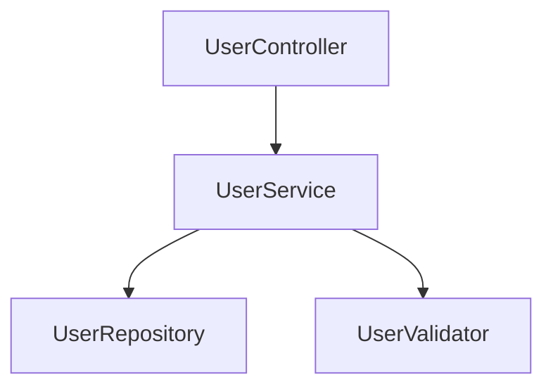

# NaturalLanguageModel Original Purpose

## TL;DR

`NaturalLanguageModel` was designed to generate **non-technical documentation** for **Testers and DevOps** audiences, focusing on:

- ✅ **User-friendly guides** (no code jargon)
- ✅ **Configuration and deployment** (how to use, not how it works)
- ✅ **Operational requirements** (dependencies, troubleshooting)
- ❌ **NOT** code structure or architectural patterns

---

## Original Design Intent

### The Audience-Based Model Routing System

The system was designed with **three distinct audiences**, each requiring different documentation styles:

| Audience | Model Used | Documentation Focus |
|----------|------------|---------------------|
| **Developer** | `CodeAnalysisModel` | Code structure, architecture, design patterns |
| **Tester** | `NaturalLanguageModel` | Testing capabilities, configuration, troubleshooting |
| **DevOps** | `NaturalLanguageModel` | Deployment, operations, external dependencies |

### The Selection Logic

**Location:** `WikiGenerationService.GenerateEnhancedPageAsync()` (Lines 487-490)

```csharp
// Fallback to single model if orchestration service not available
var taskType = audience == AudienceType.Developer
    ? DocumentationTaskType.CodeAnalysis      // ← Use CodeAnalysisModel
    : DocumentationTaskType.NaturalLanguage;  // ← Use NaturalLanguageModel
var selectedModel = _routingService?.SelectModelForTask(taskType) ?? _documentationModel;
```

**Logic:**

- If `audience == Developer` → Use `CodeAnalysisModel` (technical, code-focused)
- If `audience == Tester` or `DevOps` → Use `NaturalLanguageModel` (user-friendly, operational)

---

## NaturalLanguageModel's Intended Use Cases

### 1. **Tester Documentation** (QA Engineers)

**Prompt Template:** `TesterGuidePagePrompt()` (Lines 371-424)

**Focus Areas:**

```csharp
sb.AppendLine("Write a user-friendly guide covering the following aspects:");
sb.AppendLine("1. **Overview**: What is this component and what problem does it solve? (No code jargon)");
sb.AppendLine("2. **Key Capabilities**: specific features available to the tester/admin.");
sb.AppendLine("3. **Configuration**: Look for environment variables, config files, or settings classes.");
sb.AppendLine("4. **Operational Requirements**: External dependencies (DBs, APIs) found in connection strings.");
sb.AppendLine("5. **Troubleshooting**: Common error messages or failure scenarios visible in exceptions/logging.");
```

**Strict Rules:**

```csharp
- Tone: Professional, concise, actionable.
- NO class diagrams.
- NO code metrics (cohesion/coupling).
- NO architectural pattern discussions unless relevant to deployment.
- Focus on "How to use/deploy/configure" vs "How it works internally".
```

### 2. **DevOps Documentation** (System Administrators)

**Same Template, Different Role:**

```csharp
var role = audience == AudienceType.DevOps ? "DevOps Engineer" : "QA Engineer";
var audienceDesc = audience == AudienceType.DevOps
    ? "System Administrators and DevOps"
    : "QA Engineers and Testers";
```

**Focus Areas:**

- Deployment architecture
- External dependencies (databases, APIs, queues)
- Configuration (environment variables, settings files)
- Troubleshooting and logs

### 3. **Parent Page Synthesis for Non-Developers**

**Prompt Template:** `TesterGuideSynthesisPrompt()` (Lines 509-544)

**Focus:**

```csharp
return $"""
    Synthesize a System Overview for "{parentModule.Name}" for a {audience} audience.
    
    ## Instructions
    1. **System Overview**: What is the complete system? What value does it deliver?
    2. **Deployment Architecture**: How do these components fit together in a deployment?
    3. **Integration Points**: External APIs or systems involved.
    4. **Getting Started**: Steps to deploy, configure, or run the system.
    
    STRICT RULES:
    - Focus on value proposition and operations.
    - Ignore internal code structure/refactoring details.
    """;
```

---

## Example: Developer vs Tester Documentation

### For `UserService` Module

#### **Developer Documentation** (CodeAnalysisModel)

```markdown
# UserService

## Architecture
The UserService follows a layered architecture pattern with:
- **Cohesion**: 0.85
- **Coupling**: 0.42
- **Complexity**: 7.3

## Components
- `UserRepository`: Data access layer using Entity Framework
- `UserValidator`: Input validation using FluentValidation
- `UserMapper`: DTO mapping using AutoMapper

## Class Diagram


## Technical Details

The `UserService` class implements the `IUserService` interface...

```

#### **Tester Documentation** (NaturalLanguageModel)

```markdown
# UserService

## Overview
The UserService manages user accounts and authentication. It allows you to create, update, and delete user accounts.

## Key Capabilities
- Create new user accounts
- Update user profile information
- Reset user passwords
- Deactivate user accounts

## Configuration
Set these environment variables:
- `DATABASE_CONNECTION`: Connection string to user database
- `PASSWORD_MIN_LENGTH`: Minimum password length (default: 8)
- `SESSION_TIMEOUT`: Session timeout in minutes (default: 30)

## Operational Requirements
**Database:** Requires PostgreSQL 12+ with `users` table
**External APIs:** Sends emails via SendGrid API

## Troubleshooting
**Error:** "Invalid password format"
- **Cause:** Password doesn't meet minimum requirements
- **Solution:** Ensure password is at least 8 characters

**Error:** "Database connection failed"
- **Cause:** PostgreSQL server is not accessible
- **Solution:** Check `DATABASE_CONNECTION` environment variable
```

---

## Why NaturalLanguageModel Was Important

### 1. **Different Expertise Levels**

Not everyone reading documentation is a developer:

- **Testers** need to know **what to test**, not **how it's implemented**
- **DevOps** need to know **how to deploy**, not **class hierarchies**

### 2. **Different Information Needs**

| Developer Needs | Tester/DevOps Needs |
|-----------------|---------------------|
| Class structure | Feature capabilities |
| Design patterns | Configuration options |
| Code metrics | External dependencies |
| Implementation details | Troubleshooting steps |
| API signatures | Deployment requirements |

### 3. **Different Language Style**

**Developer (Technical):**
> "The `UserRepository` implements the Repository pattern with Unit of Work, providing CRUD operations through Entity Framework Core with lazy loading disabled for performance."

**Tester/DevOps (Natural):**
> "The user database stores account information. You can configure the connection string using the `DATABASE_CONNECTION` environment variable."

---

## Current Status: Bypassed by Ensemble

### The Problem

When `EnableEnsembleGeneration: true`, the audience-based routing is **completely bypassed**:

```csharp
// Use ensemble generation if available to reduce variance
if (_orchestrationService != null)  // ← TRUE when ensemble enabled
{
    // ... use ensemble for ALL audiences ...
    var ensembleResult = await _orchestrationService.GenerateWithEnsembleAsync(...);
    content = ensembleResult.SynthesizedContent;
}
else  // ← This path is NEVER reached
{
    // Fallback to single model if orchestration service not available
    var taskType = audience == AudienceType.Developer
        ? DocumentationTaskType.CodeAnalysis
        : DocumentationTaskType.NaturalLanguage;  // ← NaturalLanguageModel selected HERE
    var selectedModel = _routingService?.SelectModelForTask(taskType) ?? _documentationModel;
}
```

**Result:**

- ✅ Ensemble generates documentation for **all audiences**
- ❌ `NaturalLanguageModel` is **never used**
- ❌ Audience-specific model selection is **bypassed**

---

## Impact Analysis

### What Was Lost

1. **Specialized Model for Non-Technical Docs**
   - `NaturalLanguageModel` was likely chosen for its ability to write **clear, jargon-free** documentation
   - Ensemble uses **all 10 models**, which may include very technical models

2. **Audience-Aware Documentation**
   - Original design: Different models for different audiences
   - Current: Same ensemble for everyone

3. **Cost Optimization**
   - Original: Use smaller, specialized model for simple docs
   - Current: Use 10 models + judge for everything

### What Was Gained

1. **Higher Quality Through Consensus**
   - Ensemble reduces variance
   - Multiple perspectives improve accuracy

2. **Consistency Across Audiences**
   - All documentation uses the same high-quality process
   - No "second-class" docs for non-developers

---

## Recommendations

### Option 1: Restore Audience-Based Ensemble

Modify ensemble to use **different model sets** based on audience:

```csharp
// In WikiGenerationService
var ensembleModels = audience == AudienceType.Developer
    ? _config.DeveloperEnsembleModels  // Technical models
    : _config.OperationalEnsembleModels;  // User-friendly models

var ensembleResult = await _orchestrationService.GenerateWithEnsembleAsync(
    systemPrompt: GetAudienceSpecificPrompt(audience),
    userPrompt: prompt,
    history: new List<ChatMessage>(),
    baseOptions: new MessageCompositionOptions 
    { 
        ModelName = null,  // Let ensemble select
        Metadata = new Dictionary<string, object>
        {
            ["Audience"] = audience.ToString()
        }
    },
    cancellationToken: default);
```

**Config:**

```json
{
  "DeveloperEnsembleModels": [
    "devstral-2:123b-cloud",
    "qwen3-coder:480b-cloud",
    "deepseek-v3.1:671b-cloud"
  ],
  "OperationalEnsembleModels": [
    "mistral-large-3:675b-cloud",
    "ministral-3:14b-cloud",
    "gemma3:27b-cloud"
  ]
}
```

### Option 2: Use Audience-Aware Prompts

Keep single ensemble but use **different prompts** based on audience:

```csharp
var prompt = audience == AudienceType.Developer
    ? PromptTemplates.EnhancedPagePrompt(module, context, sourceFiles, language, humanContext)
    : PromptTemplates.TesterGuidePagePrompt(module, context, sourceFiles, audience, language, humanContext);
```

**Pros:**

- ✅ Simpler (no config changes)
- ✅ Still uses ensemble quality
- ✅ Audience-appropriate content

**Cons:**

- ⚠️ All models process all audiences (less specialized)

### Option 3: Disable Ensemble for Non-Developers

Use ensemble **only for developer docs**, fallback for others:

```csharp
if (_orchestrationService != null && audience == AudienceType.Developer)
{
    // Use ensemble for technical docs
    var ensembleResult = await _orchestrationService.GenerateWithEnsembleAsync(...);
}
else
{
    // Use specialized model for operational docs
    var taskType = audience == AudienceType.Developer
        ? DocumentationTaskType.CodeAnalysis
        : DocumentationTaskType.NaturalLanguage;
    var selectedModel = _routingService?.SelectModelForTask(taskType) ?? _documentationModel;
    
    var llmResponse = await _llmFacade.ExecuteAsync(...);
}
```

**Pros:**

- ✅ Best of both worlds
- ✅ Ensemble quality for complex technical docs
- ✅ Specialized models for user-friendly docs
- ✅ Cost optimization

**Cons:**

- ⚠️ Inconsistent quality across audiences

---

## Summary

### NaturalLanguageModel's Original Purpose

**Primary Role:** Generate **user-friendly, operational documentation** for **Testers and DevOps**

**Key Characteristics:**

- ✅ No code jargon
- ✅ Focus on capabilities, not implementation
- ✅ Configuration and deployment emphasis
- ✅ Troubleshooting and operational requirements
- ❌ No class diagrams or code metrics
- ❌ No architectural pattern discussions

### Current Status

| Aspect | Original Design | Current (Ensemble Enabled) |
|--------|----------------|---------------------------|
| **Model Selection** | Audience-based routing | Same ensemble for all |
| **Developer Docs** | CodeAnalysisModel | 10 ensemble models |
| **Tester Docs** | NaturalLanguageModel | 10 ensemble models |
| **DevOps Docs** | NaturalLanguageModel | 10 ensemble models |
| **Specialization** | Different models per audience | One-size-fits-all |

### The Trade-off

**Lost:**

- Audience-specific model specialization
- Cost optimization for simple docs
- Clear separation of technical vs operational content

**Gained:**

- Higher quality through consensus
- Reduced variance across all docs
- Consistent quality regardless of audience

---

**Date:** 2025-12-30  
**Status:** ✅ Analysis Complete  
**Recommendation:** Consider audience-aware prompts (Option 2) or selective ensemble (Option 3)
