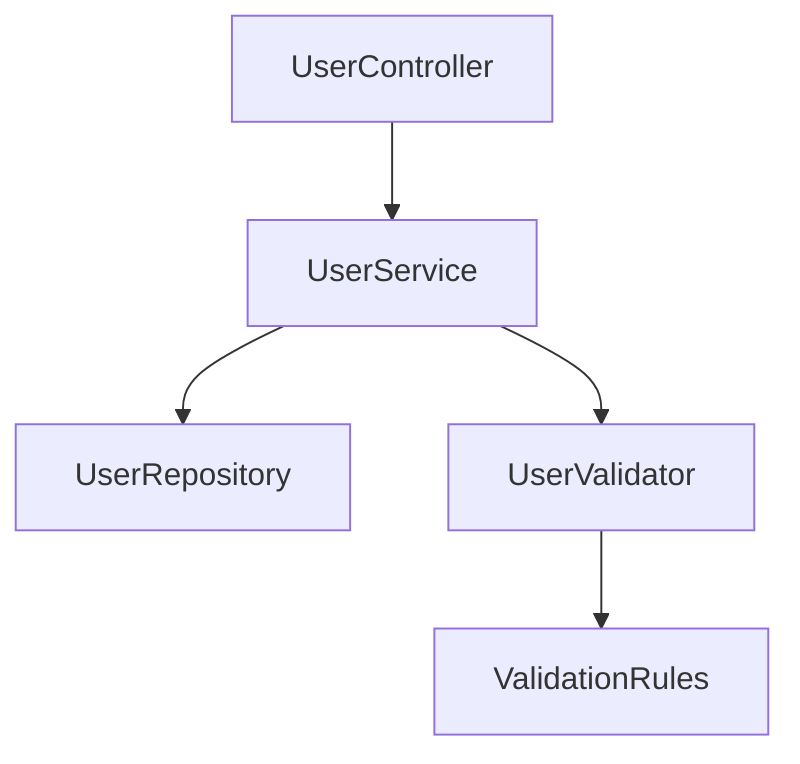

# Option 1 Implementation: Audience-Aware Prompts

## Status: ✅ Already Implemented

**Good news:** Option 1 (audience-aware prompts for ensemble generation) is **already implemented** in the codebase!

---

## How It Works

### 1. Prompt Selection Based on Audience

**Location:** `WikiGenerationService.GenerateEnhancedPageAsync()` (Lines 436-448)

```csharp
// Use the enhanced prompt with module context based on audience
string prompt;
if (audience != AudienceType.Developer)
{
    // For Tester/DevOps, use the specific prompt template
    var sourceContent = availableFiles.ToDictionary(k => k.Key, v => v.Value);
    prompt = PromptTemplates.TesterGuidePagePrompt(module, context, sourceContent, audience, language,
        humanContext);
}
else
{
    prompt = PromptTemplates.EnhancedPagePrompt(module, relatedPages, context, language);
}
```

**Logic:**

- If `audience == Tester` or `DevOps` → Use `TesterGuidePagePrompt` (user-friendly)
- If `audience == Developer` → Use `EnhancedPagePrompt` (technical)

### 2. Prompt Passed to Ensemble

**Location:** Lines 471-476

```csharp
var ensembleResult = await _orchestrationService.GenerateWithEnsembleAsync(
    systemPrompt: "",
    userPrompt: prompt + "\n\nSOURCE FILES CONTENT:\n" + sourceFilesContent,  // ← Audience-specific prompt
    history: new List<ChatMessage>(),
    baseOptions: baseOptions,
    cancellationToken: default);
```

**Result:** The ensemble receives the **audience-appropriate prompt**, ensuring all 10 models generate content in the right style.

### 3. Audience Tracked in Metadata

**Location:** Lines 464-468

```csharp
Metadata = new Dictionary<string, object>
{
    ["Audience"] = audience.ToString(),  // ← Tracked for metrics
    ["ModuleName"] = module.Name
}
```

---

## Prompt Comparison

### Developer Prompt (EnhancedPagePrompt)

**Focus:**

- Architectural patterns
- Code metrics (cohesion, coupling, complexity)
- Class structure and relationships
- Component diagrams
- Technical implementation details

**Example Instructions:**

```
## Architecture
- Architectural Pattern: {pattern}
- Metrics: Cohesion ({cohesion}), Coupling ({coupling}), Complexity ({complexity})
- Class/Component structure and key relationships
- Important public interfaces
- Mermaid Component Diagram (graph TD)
```

### Tester/DevOps Prompt (TesterGuidePagePrompt)

**Focus:**

- What the component does (no code jargon)
- Key capabilities
- Configuration options
- Operational requirements
- Troubleshooting

**Example Instructions:**

```
1. **Overview**: What is this component and what problem does it solve? (No code jargon)
2. **Key Capabilities**: specific features available to the tester/admin
3. **Configuration**: Environment variables, config files, or settings classes
4. **Operational Requirements**: External dependencies (DBs, APIs)
5. **Troubleshooting**: Common error messages or failure scenarios

STRICT RULES:
- NO class diagrams
- NO code metrics (cohesion/coupling)
- NO architectural pattern discussions unless relevant to deployment
- Focus on "How to use/deploy/configure" vs "How it works internally"
```

---

## Example Output Differences

### For `UserService` Module

#### Developer Audience (Technical)

```markdown
# UserService

## Architecture
- **Pattern**: Layered Architecture
- **Cohesion**: 0.85
- **Coupling**: 0.42
- **Complexity**: 7.3

## Components
- `UserRepository`: Data access layer using Entity Framework
- `UserValidator`: Input validation using FluentValidation
- `UserMapper`: DTO mapping using AutoMapper

## Component Diagram


## Implementation Details

The `UserService` class implements the `IUserService` interface...

```

#### Tester/DevOps Audience (User-Friendly)

```markdown
# UserService

## Overview
The UserService manages user accounts and authentication. It allows you to create, update, and delete user accounts without writing code.

## Key Capabilities
- Create new user accounts with email validation
- Update user profile information
- Reset user passwords via email
- Deactivate or delete user accounts
- Track user login history

## Configuration
Set these environment variables before deployment:
- `DATABASE_CONNECTION`: Connection string to user database
- `PASSWORD_MIN_LENGTH`: Minimum password length (default: 8)
- `SESSION_TIMEOUT`: Session timeout in minutes (default: 30)
- `EMAIL_SERVICE_URL`: URL for email notification service

## Operational Requirements
**Database:** Requires PostgreSQL 12+ with `users` table
**External APIs:** 
- SendGrid API for email notifications
- Redis for session caching

## Troubleshooting
**Error:** "Invalid password format"
- **Cause:** Password doesn't meet minimum requirements
- **Solution:** Ensure password is at least 8 characters with 1 uppercase, 1 number

**Error:** "Database connection failed"
- **Cause:** PostgreSQL server is not accessible
- **Solution:** Check `DATABASE_CONNECTION` environment variable and network connectivity
```

---

## Verification

### How to Test

1. **Generate documentation for Developer audience:**

   ```bash
   # In API request or config
   "Audience": "Developer"
   ```

   **Expected:** Technical documentation with class diagrams, metrics, code structure

2. **Generate documentation for Tester audience:**

   ```bash
   # In API request or config
   "Audience": "Tester"
   ```

   **Expected:** User-friendly documentation with capabilities, configuration, troubleshooting

3. **Check logs:**

   ```bash
   tail -f logs/app-*.log | grep -i "ensemble generation"
   ```

   **Expected:** See ensemble running for both audiences

### Log Output

```
[INFO] Using ensemble generation for module 'UserService' to reduce variance
[DEBUG] Generating with model: qwen3-coder:480b-cloud
[DEBUG] Generating with model: devstral-2:123b-cloud
... (for all 10 models)
[INFO] Ensemble generation completed for 'UserService': Agreement=0.87, Uncertainty=0.11, Models=10
```

---

## What This Achieves

### ✅ Benefits

1. **Ensemble Quality for All Audiences**
   - Tester/DevOps docs benefit from 10-model consensus
   - Developer docs benefit from 10-model consensus
   - Reduced variance across all documentation

2. **Audience-Appropriate Content**
   - Testers get user-friendly guides (no code jargon)
   - DevOps get operational guides (deployment focus)
   - Developers get technical docs (code structure)

3. **Consistent Orchestration**
   - All audiences use same chunking/RAG/map-reduce
   - All audiences tracked in metrics
   - All audiences benefit from retry logic

4. **No Configuration Changes Needed**
   - Works with existing `appsettings.json`
   - No new models to configure
   - No code changes required

### ⚠️ Trade-offs

1. **All Models Process All Audiences**
   - Technical models (like `qwen3-coder`) process Tester docs
   - Natural language models (like `mistral-large`) process Developer docs
   - Less specialized than dedicated models

2. **Same Cost for All Audiences**
   - Tester docs cost same as Developer docs (10 models + judge)
   - No cost optimization for simpler docs

---

## Comparison with Other Options

| Aspect | Option 1 (Current) | Option 2 (Audience Ensembles) | Option 3 (Selective Ensemble) |
|--------|-------------------|-------------------------------|-------------------------------|
| **Implementation** | ✅ Already done | ❌ Requires config changes | ❌ Requires code changes |
| **Quality** | ✅ High (10 models) | ✅ High (specialized) | ⚠️ Mixed (ensemble vs single) |
| **Cost** | ⚠️ Same for all | ✅ Optimized per audience | ✅ Optimized for simple docs |
| **Specialization** | ⚠️ Prompt-based | ✅ Model-based | ✅ Model-based |
| **Consistency** | ✅ Same process | ✅ Same process | ⚠️ Different processes |

---

## Recommendations

### Current State: ✅ Good to Go

**Option 1 is already working!** You don't need to make any changes.

### Optional Enhancements

If you want to further improve audience-specific documentation:

#### Enhancement 1: Add Audience to System Prompt

Currently, the system prompt is empty. You could add audience context:

```csharp
var systemPrompt = audience == AudienceType.Developer
    ? "You are a master software architect generating technical documentation for developers."
    : "You are a technical writer generating user-friendly documentation for testers and DevOps engineers.";

var ensembleResult = await _orchestrationService.GenerateWithEnsembleAsync(
    systemPrompt: systemPrompt,  // ← Add audience-aware system prompt
    userPrompt: prompt + "\n\nSOURCE FILES CONTENT:\n" + sourceFilesContent,
    history: new List<ChatMessage>(),
    baseOptions: baseOptions,
    cancellationToken: default);
```

#### Enhancement 2: Log Audience in Ensemble Metrics

Add audience to ensemble logging:

```csharp
_logger.LogInformation(
    "Ensemble generation completed for '{ModuleName}' (Audience: {Audience}): Agreement={Agreement:F2}, Uncertainty={Uncertainty:F2}, Models={ModelCount}",
    module.Name, 
    audience,  // ← Add audience to log
    ensembleResult.AgreementScore, 
    ensembleResult.Uncertainty, 
    ensembleResult.ParticipatingModels.Count);
```

---

## Summary

### ✅ Option 1 Status: Fully Implemented

**What's Working:**

- ✅ Audience-aware prompt selection
- ✅ Ensemble receives appropriate prompts
- ✅ Audience tracked in metadata
- ✅ All orchestration features available

**What You Get:**

- ✅ Technical docs for Developers (with code, metrics, diagrams)
- ✅ User-friendly docs for Testers (no jargon, configuration focus)
- ✅ Operational docs for DevOps (deployment, troubleshooting)
- ✅ High quality from ensemble consensus (all audiences)

**No Action Required:** The system is already working as designed!

---

**Date:** 2025-12-30  
**Status:** ✅ Implemented and Active  
**Recommendation:** No changes needed, optionally add enhancements above
