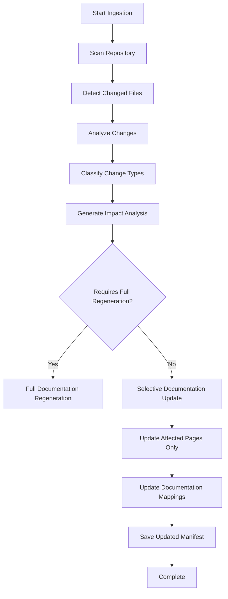

# Plan Update Mechanism: Change-Aware Documentation Ingestion

## Overview
This document describes the enhanced ingestion process that provides intelligent, change-aware documentation updates. The system analyzes code changes to determine their impact on documentation, allowing for selective updates that only regenerate affected documentation pages.

## Problem Statement
The current ingestion system provides resumable, idempotent processing but has limitations:
- **File-level granularity**: Only detects that a file changed, not what specifically changed
- **No impact analysis**: Doesn't understand how code changes affect documentation
- **Inefficient updates**: Re-generates documentation for changed files without considering dependencies

## Solution Architecture

### 1. Enhanced Dependency Analysis
**Objective**: Build a comprehensive dependency graph to understand relationships between code components.

**Implementation**:
- **Dependency Graph Service**: Enhance `IEnhancedDependencyGraphService` to build detailed dependency graphs
- **Component Relationships**: Track various types of relationships:
  ```mermaid
  graph TD
    A[File A] -->|imports| B[File B]
    C[Class X] -->|inherits| D[Class Y]
    E[Function P] -->|calls| F[Function Q]
    G[Module M] -->|contains| H[Component C]
  ```
- **AST Integration**: Use the existing AST service to extract precise dependency information

### 2. Documentation Mapping System
**Objective**: Create a mapping between documentation pages and the code components they describe.

**Implementation**:
- **Enhanced WikiPage Model**:
  ```csharp
  public class WikiPage
  {
      // Existing properties...
      public List<string> ReferencedComponentIds { get; set; } = new();
      public List<string> DependencyComponentIds { get; set; } = new();
      public DateTime LastUpdated { get; set; } = DateTime.UtcNow;
      public string ChangeReason { get; set; } = string.Empty;
  }
  ```
- **Mapping Storage**: Store in SQLite database with new tables:
  ```sql
  CREATE TABLE DocumentationMappings (
      RepoId INTEGER NOT NULL,
      PageId TEXT NOT NULL,
      ComponentId TEXT NOT NULL,
      RelationshipType TEXT NOT NULL, -- "references", "depends_on", "describes"
      PRIMARY KEY (RepoId, PageId, ComponentId, RelationshipType),
      FOREIGN KEY(RepoId) REFERENCES Repositories(Id) ON DELETE CASCADE
  );

  CREATE TABLE DependencyGraphs (
      RepoId INTEGER PRIMARY KEY,
      JsonContent TEXT NOT NULL,
      FOREIGN KEY(RepoId) REFERENCES Repositories(Id) ON DELETE CASCADE
  );
  ```

### 3. Impact Analysis Service
**Objective**: Analyze which documentation pages are affected by specific code changes.

**Interface**:
```csharp
public interface IImpactAnalysisService
{
    /// <summary>
    /// Analyzes which documentation pages are affected by changed files
    /// </summary>
    /// <param name="repoPath">Repository path</param>
    /// <param name="changedFiles">List of changed file paths</param>
    /// <returns>List of affected documentation page IDs</returns>
    Task<List<string>> GetAffectedDocumentationPagesAsync(string repoPath, List<string> changedFiles);

    /// <summary>
    /// Determines if a specific documentation page is affected by changes
    /// </summary>
    Task<bool> IsDocumentationAffectedAsync(string pageId, List<string> changedFiles);

    /// <summary>
    /// Generates an update plan without executing it
    /// </summary>
    Task<DocumentationUpdatePlan> GenerateUpdatePlanAsync(string repoPath, List<string> changedFiles);

    /// <summary>
    /// Classifies the type of change for a file
    /// </summary>
    Task<ChangeType> ClassifyChangeAsync(string filePath, string oldContent, string newContent);
}

public enum ChangeType
{
    None,
    ApiChange,        // Method signatures, interfaces, public contracts
    Implementation,   // Internal logic changes
    Documentation,    // Comments, docstrings, metadata
    Dependency,       // Import/using changes
    Structural,       // Class hierarchy, module organization
    Test,            // Test file changes
    Configuration    // Configuration file changes
}

public class DocumentationUpdatePlan
{
    public List<string> FilesToProcess { get; set; } = new();
    public List<string> AffectedDocumentationPages { get; set; } = new();
    public Dictionary<string, ChangeType> ChangeClassifications { get; set; } = new();
    public Dictionary<string, List<string>> ImpactAnalysis { get; set; } = new();
    public DateTime GeneratedAt { get; set; } = DateTime.UtcNow;
    public bool RequiresFullRegeneration { get; set; } = false;
}
```

### 4. Enhanced Change Detection
**Objective**: Move beyond simple file hashing to semantic change detection.

**Implementation**:
- **Semantic Hashing**: Calculate hashes based on semantic elements rather than entire files
- **Change Classification**: Classify changes by type using AST analysis
- **Selective Processing**: Only process documentation affected by the changes
- **Change Detection Algorithm**:
  ```csharp
  public class SemanticChangeDetector
  {
      public async Task<FileChangeAnalysis> AnalyzeFileChangesAsync(
          string filePath,
          string oldContent,
          string newContent)
      {
          // Use AST service to parse both versions
          var oldAst = await _astService.ParseAsync(oldContent, filePath);
          var newAst = await _astService.ParseAsync(newContent, filePath);

          // Compare AST nodes to determine what changed
          var changes = CompareAstNodes(oldAst, newAst);

          return new FileChangeAnalysis
          {
              FilePath = filePath,
              ChangeType = DetermineChangeType(changes),
              AffectedComponents = ExtractAffectedComponents(changes),
              ChangedElements = changes
          };
      }

      private ChangeType DetermineChangeType(List<AstChange> changes)
      {
          // Logic to determine change type based on AST changes
          // ...
      }
  }
  ```

### 5. Selective Documentation Update Pipeline
**Objective**: Modify the ingestion pipeline to only update affected documentation.

**Enhanced Pipeline**:


**Implementation**:
- Modify `DocumentationGenerationPipeline` to accept an update plan
- Add selective processing methods:
  ```csharp
  public class DocumentationGenerationPipeline : IDocumentationGenerationPipeline
  {
      // Existing methods...

      /// <summary>
      /// Generates documentation using an update plan (selective update)
      /// </summary>
      public async Task<WikiStructure> GenerateDocumentationAsync(
          string repositoryPath,
          DocumentationOptions options,
          DocumentationUpdatePlan updatePlan)
      {
          if (updatePlan.RequiresFullRegeneration)
          {
              return await GenerateDocumentationAsync(repositoryPath, options);
          }

          // Process only affected documentation pages
          foreach (var pageId in updatePlan.AffectedDocumentationPages)
          {
              var page = await _wikiRepo.GetPageAsync(repositoryPath, pageId);
              if (page != null)
              {
                  // Regenerate only this page
                  var updatedPage = await RegeneratePageAsync(page, repositoryPath);
                  await _wikiRepo.SavePageAsync(repositoryPath, updatedPage);
              }
          }

          // Return updated structure
          return await BuildUpdatedStructureAsync(repositoryPath);
      }
  }
  ```

### 6. API Enhancements
**Objective**: Provide API endpoints for the new functionality.

**New Endpoints**:
- **Generate Update Plan**:
  ```http
  POST /api/ingest/plan
  Content-Type: application/json

  {
      "RepoPath": "/path/to/repository",
      "ChangedFiles": ["file1.cs", "file2.cs"] // Optional - if not provided, detects changes
  }
  ```

- **Execute Update Plan**:
  ```http
  POST /api/ingest/execute-plan
  Content-Type: application/json

  {
      "RepoPath": "/path/to/repository",
      "PlanId": "guid-of-plan" // Optional - if not provided, generates plan first
  }
  ```

- **Enhanced Status Endpoint**:
  ```http
  GET /api/ingest/status?repoPath=/path/to/repository
  ```

  **Response**:
  ```json
  {
      "Status": "completed",
      "TotalFiles": 150,
      "ProcessedFiles": 150,
      "AffectedDocumentationPages": 42,
      "ChangeAnalysis": {
          "ApiChanges": 5,
          "ImplementationChanges": 12,
          "DependencyChanges": 3
      },
      "LastUpdate": "2025-12-04T20:29:11Z",
      "CanResume": false,
      "UpdatePlanAvailable": true
  }
  ```

## Database Schema Enhancements

### New Tables
```sql
-- Documentation to component mappings
CREATE TABLE DocumentationMappings (
    RepoId INTEGER NOT NULL,
    PageId TEXT NOT NULL,
    ComponentId TEXT NOT NULL,
    RelationshipType TEXT NOT NULL, -- "references", "depends_on", "describes"
    PRIMARY KEY (RepoId, PageId, ComponentId, RelationshipType),
    FOREIGN KEY(RepoId) REFERENCES Repositories(Id) ON DELETE CASCADE
);

-- Enhanced dependency graphs
CREATE TABLE DependencyGraphs (
    RepoId INTEGER PRIMARY KEY,
    JsonContent TEXT NOT NULL,
    LastUpdated DATETIME NOT NULL,
    FOREIGN KEY(RepoId) REFERENCES Repositories(Id) ON DELETE CASCADE
);

-- Update plans
CREATE TABLE UpdatePlans (
    PlanId TEXT PRIMARY KEY,
    RepoId INTEGER NOT NULL,
    JsonContent TEXT NOT NULL,
    GeneratedAt DATETIME NOT NULL,
    ExecutedAt DATETIME,
    Status TEXT NOT NULL, -- "pending", "executing", "completed", "failed"
    FOREIGN KEY(RepoId) REFERENCES Repositories(Id) ON DELETE CASCADE
);
```

### Enhanced Existing Tables
```sql
-- Enhanced IngestionManifests to include semantic hashes
CREATE TABLE IF NOT EXISTS IngestionManifests (
    RepoId INTEGER PRIMARY KEY,
    FileHashes TEXT NOT NULL,       -- Dictionary of file paths and their hashes
    SemanticHashes TEXT NOT NULL,   -- Dictionary of component IDs and their semantic hashes
    LastUpdated DATETIME NOT NULL,
    FOREIGN KEY(RepoId) REFERENCES Repositories(Id) ON DELETE CASCADE
);

-- Enhanced WikiPages to include component references
CREATE TABLE IF NOT EXISTS WikiPages (
    RepoId INTEGER NOT NULL,
    PageId TEXT NOT NULL,
    Title TEXT NOT NULL,
    JsonContent TEXT NOT NULL,
    ReferencedComponents TEXT,      -- JSON array of component IDs
    LastUpdated DATETIME NOT NULL,
    PRIMARY KEY (RepoId, PageId),
    FOREIGN KEY(RepoId) REFERENCES Repositories(Id) ON DELETE CASCADE
);
```

## Implementation Roadmap

### Phase 1: Foundation (Core Infrastructure)
- [ ] Implement enhanced dependency graph service
- [ ] Create documentation mapping infrastructure
- [ ] Design and implement database schema enhancements
- [ ] Implement basic impact analysis service

### Phase 2: Integration (Pipeline Enhancement)
- [ ] Modify documentation generation pipeline to use impact analysis
- [ ] Implement selective documentation update logic
- [ ] Enhance change detection with semantic analysis
- [ ] Create API endpoints for plan generation and execution

### Phase 3: Testing & Optimization
- [ ] Develop comprehensive test suite for impact analysis
- [ ] Optimize performance of dependency analysis
- [ ] Implement caching for frequently accessed dependency data
- [ ] Create documentation for the new features

## Key Benefits

1. **Efficiency**: Only update documentation that's actually affected by changes
2. **Accuracy**: Better understanding of how code changes impact documentation
3. **Performance**: Reduced processing time by avoiding unnecessary documentation regeneration
4. **Scalability**: Can handle large codebases with many interdependent components
5. **Traceability**: Clear understanding of why documentation was updated
6. **Resilience**: Maintains existing resumable ingestion capabilities

## Example Workflow

### Initial Ingestion
1. Full repository scan and documentation generation
2. Build dependency graph and documentation mappings
3. Store semantic hashes for all components
4. Generate complete documentation set

### Subsequent Update
1. Developer modifies a utility class (`StringHelper.cs`)
2. System detects file change and analyzes impact:
   - Utility class documentation needs updating
   - All classes that depend on this utility need their "Dependencies" section updated
   - The architecture diagram needs updating
3. Impact analysis determines 8 documentation pages are affected
4. System generates update plan targeting only those 8 pages
5. Selective update regenerates only the affected documentation
6. Documentation mappings and semantic hashes are updated

## Error Handling and Recovery

- **Partial Failures**: If some documentation updates fail, the system can retry just those updates
- **State Recovery**: Processing state is checkpointed and can be resumed
- **Consistency Checks**: Regular validation of documentation mappings and dependency graphs
- **Fallback Mechanism**: If impact analysis fails, fall back to full regeneration

## Performance Considerations

- **Caching**: Cache frequently accessed dependency graphs and mappings
- **Incremental Updates**: Only update what's necessary when dependencies change
- **Parallel Processing**: Process independent documentation updates in parallel
- **Batch Processing**: Group related updates for efficiency

## Testing Strategy

### Unit Tests
- Dependency graph construction and analysis
- Change classification algorithms
- Impact analysis logic
- Documentation mapping updates

### Integration Tests
- End-to-end selective update workflows
- API endpoint functionality
- Database schema migrations
- Error handling and recovery

### Performance Tests
- Large codebase ingestion
- Impact analysis performance
- Selective update efficiency
- Memory usage optimization

## Future Enhancements

1. **Change Impact Visualization**: Visual representation of how changes affect documentation
2. **Predictive Analysis**: Predict which documentation will be affected before changes are made
3. **Automated Documentation Suggestions**: Suggest documentation updates based on code changes
4. **Cross-Repository Analysis**: Analyze impact across multiple related repositories
5. **Custom Impact Rules**: Allow users to define custom impact analysis rules
